# Mundo de Kaboo — Jornadas e Arquitetura

> Documentação gerada com screenshots reais do app em viewport 390×844 (mobile).

---

## Índice

1. [Visão Geral do Fluxo de Autenticação](#1-visão-geral-do-fluxo-de-autenticação)
2. [Máquina de Estados — LoginScreen](#2-máquina-de-estados--loginscreen)
3. [Jornada 1A — Novo usuário com voucher](#3-jornada-1a--novo-usuário-com-voucher)
4. [Jornada 1B — Usuário existente com voucher](#4-jornada-1b--usuário-existente-com-voucher)
5. [Jornada 2 — Login direto (sem voucher)](#5-jornada-2--login-direto-sem-voucher)
6. [Telas Capturadas](#6-telas-capturadas)
7. [Arquitetura de Componentes — LoginScreen](#7-arquitetura-de-componentes--loginscreen)
8. [Fluxo de Dados — API Calls](#8-fluxo-de-dados--api-calls)
9. [Arquitetura Geral — Módulos do App](#9-arquitetura-geral--módulos-do-app)
10. [Fluxo de Acesso Pós-Login](#10-fluxo-de-acesso-pós-login)

---

## 1. Visão Geral do Fluxo de Autenticação

O app tem dois pontos de entrada principais na tela de login:

- **"Tenho um código de acesso"** → Fluxo de voucher (cadastro ou login + resgate)
- **"Já tenho conta"** → Login direto

| Entry Screen |
|:---:|
|  |

---

## 2. Máquina de Estados — LoginScreen

A `LoginScreen` implementa uma máquina de estados linear com 6 passos. Cada transição é controlada pelos handlers `goBack()` e pelos fluxos de submit.

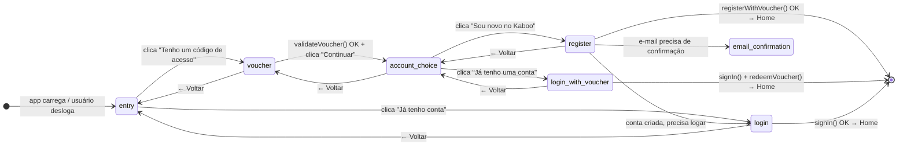

### Estados

| Estado | Descrição | Step Dots |
|--------|-----------|-----------|
| `entry` | Tela inicial — dois botões de escolha | — |
| `voucher` | Digitar e validar o código | 1/3 |
| `account_choice` | Novo ou usuário existente? | 2/3 |
| `register` | Formulário de cadastro | 3/3 |
| `login_with_voucher` | Login para resgatar o voucher | 3/3 |
| `login` | Login direto sem voucher | — |

---

## 3. Jornada 1A — Novo usuário com voucher

Fluxo completo de um usuário que recebeu um código de acesso (voucher) via escola/gráfica e quer criar sua conta pela primeiro vez.

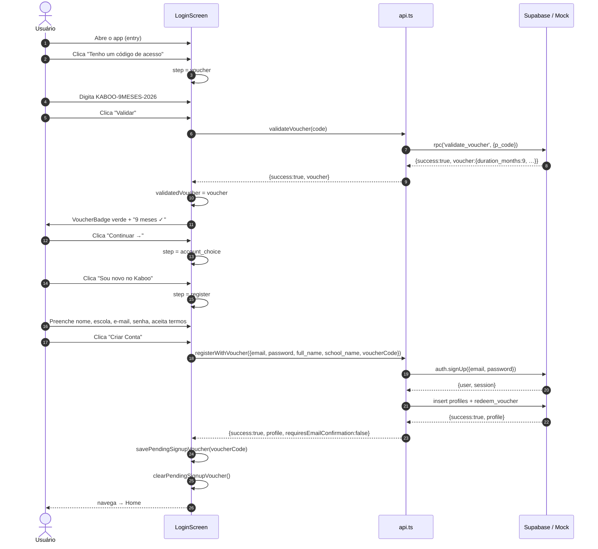

### Screenshots — Jornada 1A

| Voucher vazio | Voucher validado | Escolha do perfil | Formulário de cadastro |
|:---:|:---:|:---:|:---:|
|  |  | 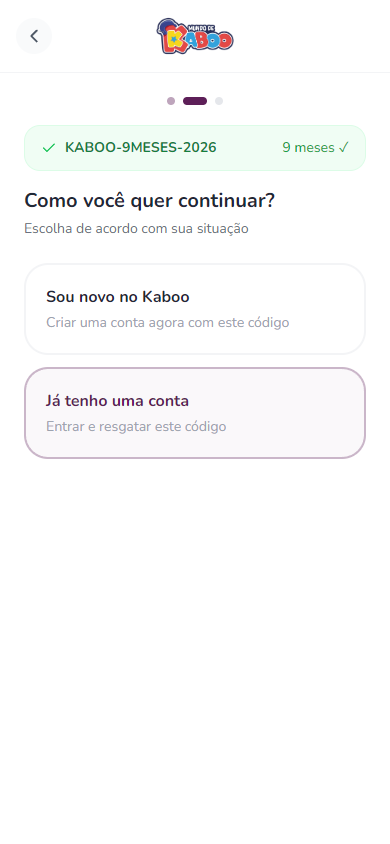 |  |

---

## 4. Jornada 1B — Usuário existente com voucher

Fluxo de um usuário que já tem conta no Kaboo e recebeu um novo voucher para resgatar.

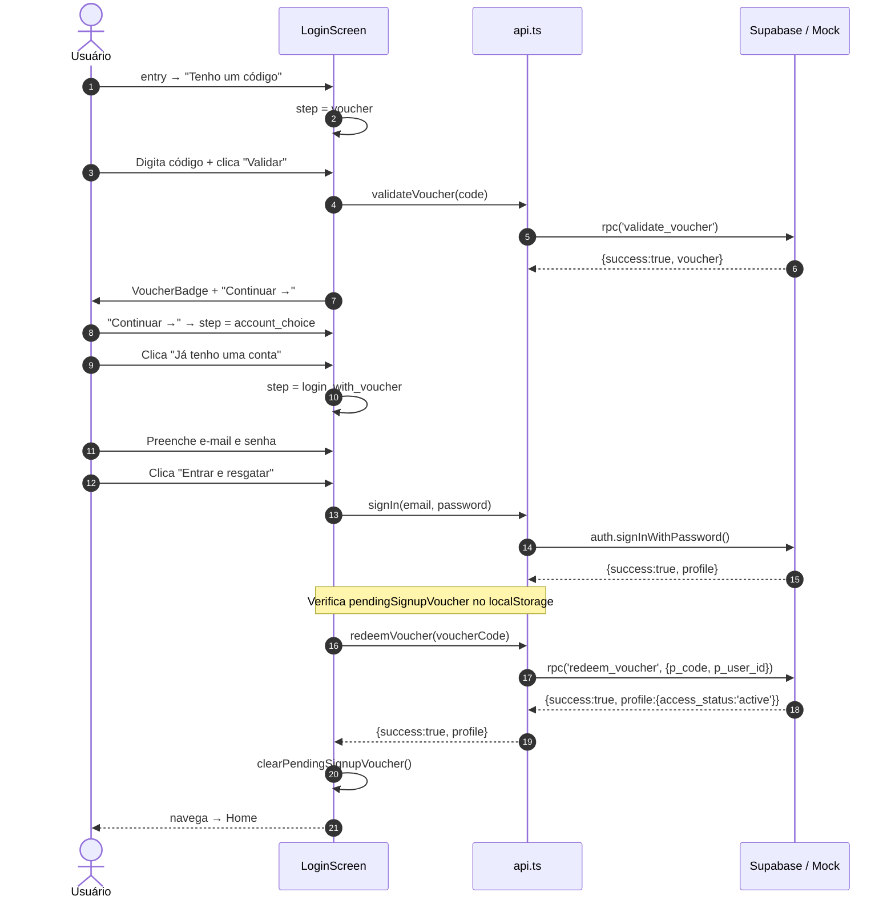

### Screenshot — Jornada 1B

| Login com voucher |
|:---:|
| 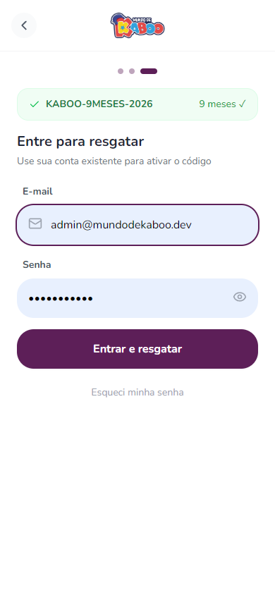 |

---

## 5. Jornada 2 — Login direto (sem voucher)

Fluxo de usuário com conta ativa que acessa o app normalmente.

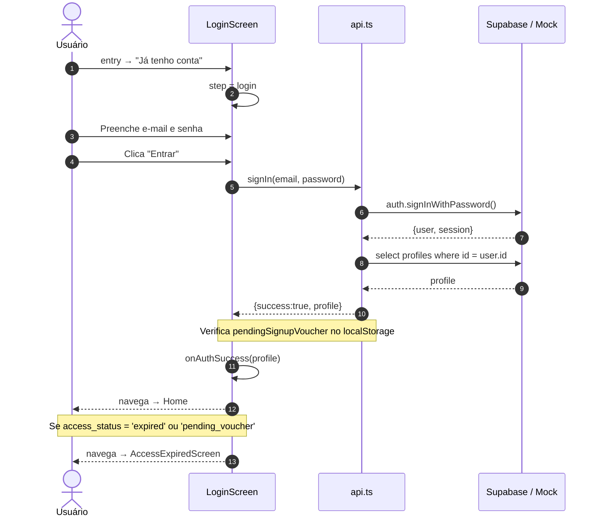

### Screenshot — Jornada 2

| Login direto |
|:---:|
|  |

---

## 6. Telas Capturadas

Todas as telas abaixo foram capturadas em viewport **390 × 844 px** (iPhone 14 Pro).

### Autenticação

| Entry | Voucher (vazio) | Voucher (validado) | Escolha |
|:---:|:---:|:---:|:---:|
|  |  |  |  |

| Cadastro | Login c/ Voucher | Login Direto |
|:---:|:---:|:---:|
|  |  |  |

### App Principal

| Home | Admin | Perfil |
|:---:|:---:|:---:|
|  | 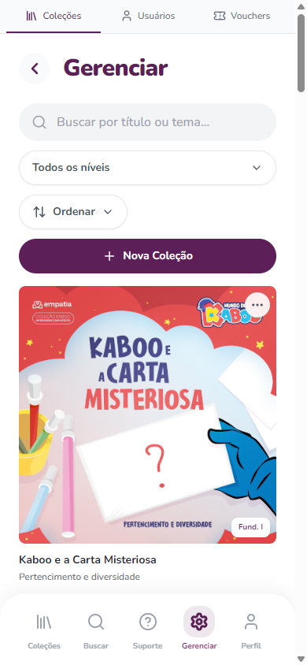 |  |

---

## 7. Arquitetura de Componentes — LoginScreen

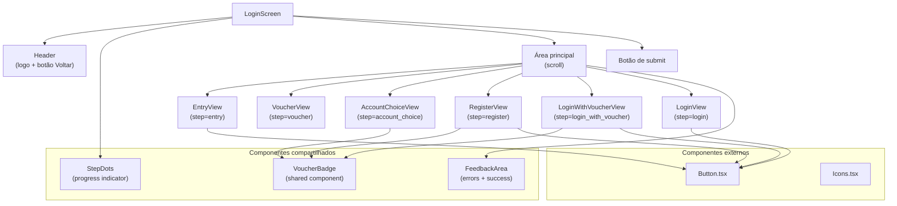

### Estado local do componente

| Estado | Tipo | Descrição |
|--------|------|-----------|
| `step` | `LoginStep` | Controla qual view é renderizada |
| `validatedVoucher` | `Voucher \| null` | Resultado de `validateVoucher()` |
| `loading` | `boolean` | Bloqueia double-submit |
| `errorMsg` | `string \| null` | Mensagem de erro da FeedbackArea |
| `successMsg` | `string \| null` | Mensagem de sucesso da FeedbackArea |
| `voucherValidationMsg` | `string \| null` | Label de duração após validação |
| `showContinueToHome` | `boolean` | Link safety net após falha de resgate |
| `email, password, fullName, schoolName, voucherCode, confirmPassword` | `string` | Campos de formulário |
| `acceptedTerms` | `boolean` | Checkbox de política de privacidade |
| `showPassword, showConfirmPassword` | `boolean` | Toggle de visibilidade de senha |

### Persistência localStorage

| Chave | Valor | Propósito |
|-------|-------|-----------|
| `kaboo_pending_signup_voucher` | código do voucher | Preserva o voucher entre cadastro e confirmação de e-mail |

---

## 8. Fluxo de Dados — API Calls

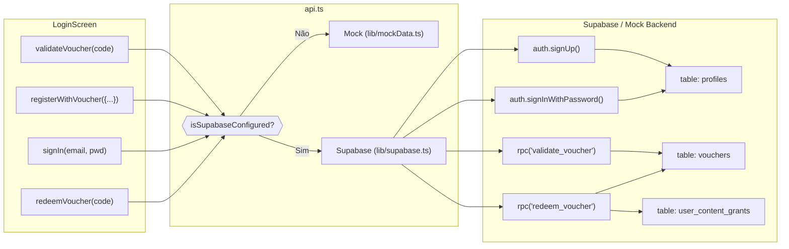

### Tratamento de erros

A `api.ts` prioriza mensagens em português via `getVoucherErrorMessage()` antes de expor strings brutas do Supabase. A `LoginScreen` normaliza adicionalmente com `normalizeAuthError()`:

| Erro Supabase bruto | Mensagem exibida |
|---------------------|-----------------|
| `Invalid login credentials` | "E-mail ou senha incorretos." |
| `User already registered` | "Este e-mail já está cadastrado." |
| `Email not confirmed` | "Confirme seu e-mail para entrar…" → redireciona para `EmailConfirmationScreen` |
| `security purposes` / `rate limit` | "Muitas tentativas. Por segurança, aguarde…" |

---

## 9. Arquitetura Geral — Módulos do App

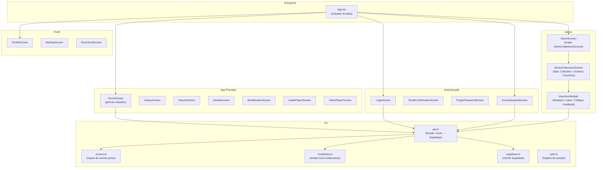

---

## 10. Fluxo de Acesso Pós-Login

Após qualquer autenticação bem-sucedida, o `App.tsx` verifica o `access_status` do perfil e roteia adequadamente:

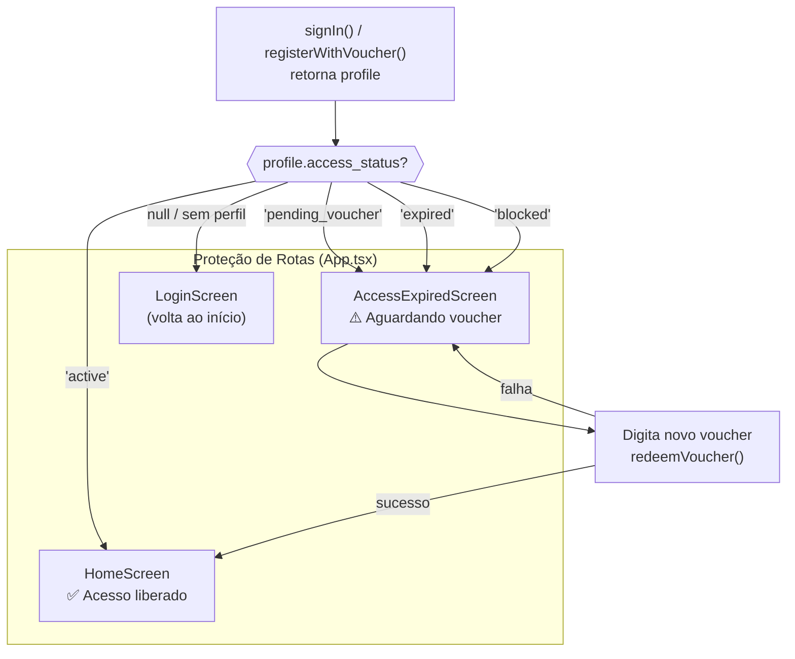

### Status de acesso

| `access_status` | Tela exibida | Ação disponível |
|----------------|-------------|-----------------|
| `active` | HomeScreen | Acesso total ao conteúdo |
| `pending_voucher` | AccessExpiredScreen | Inserir voucher |
| `expired` | AccessExpiredScreen | Inserir voucher de renovação |
| `blocked` | AccessExpiredScreen | Apenas visualização da mensagem |
| `null` / indefinido | LoginScreen | Autenticar novamente |

---

## Referências Técnicas

| Arquivo | Responsabilidade |
|---------|----------------|
| `screens/LoginScreen.tsx` | Toda a UX de autenticação (state machine + formulários) |
| `lib/api.ts` | Facade que abstrai mock vs. Supabase |
| `lib/access.ts` | Regras puras de status de acesso (sem side-effects) |
| `lib/mockData.ts` | Auth local multiusuário + catálogo em memória |
| `lib/mockVoucherData.ts` | Content grants para o modo mock |
| `types.ts` | Tipos compartilhados (`UserProfile`, `Voucher`, `LoginStep`, …) |
| `supabase/migrations/` | Migration SQL: tabela `vouchers`, RPCs, `user_content_grants` |

---

*Documentação gerada em abril/2026 — branch `fix/quality-improvements`.*
