# Mundo de Kaboo — Jornadas e Arquitetura

> Documentação gerada com screenshots reais do app em viewport **1440×900 (desktop)**.

---

## Índice

### Autenticação
1. [Visão Geral do Fluxo de Autenticação](#1-visão-geral-do-fluxo-de-autenticação)
2. [Máquina de Estados — LoginScreen](#2-máquina-de-estados--loginscreen)
3. [Jornada 1A — Novo usuário com voucher](#3-jornada-1a--novo-usuário-com-voucher)
4. [Jornada 1B — Usuário existente com voucher](#4-jornada-1b--usuário-existente-com-voucher)
5. [Jornada 2 — Login direto (sem voucher)](#5-jornada-2--login-direto-sem-voucher)

### Pós-Login
6. [Jornada 3 — Acesso expirado / Renovação](#6-jornada-3--acesso-expirado--renovação)
7. [Jornada 4 — Navegação principal (Home → Coleção)](#7-jornada-4--navegação-principal-home--coleção)
8. [Jornada 5 — Busca](#8-jornada-5--busca)
9. [Jornada 6 — Perfil e Meus Dados](#9-jornada-6--perfil-e-meus-dados)
10. [Jornada 7 — Recuperação de senha](#10-jornada-7--recuperação-de-senha)
11. [Jornada 8 — Admin CMS](#11-jornada-8--admin-cms)

### Referência
12. [Telas Capturadas](#12-telas-capturadas)
13. [Arquitetura de Componentes — LoginScreen](#13-arquitetura-de-componentes--loginscreen)
14. [Fluxo de Dados — API Calls](#14-fluxo-de-dados--api-calls)
15. [Arquitetura Geral — Módulos do App](#15-arquitetura-geral--módulos-do-app)
16. [Fluxo de Acesso Pós-Login](#16-fluxo-de-acesso-pós-login)

---

## 1. Visão Geral do Fluxo de Autenticação

O app abre diretamente na tela de login e organiza a entrada em três saídas objetivas:

- **"Entrar"** → Login direto para quem já tem conta ativa.
- **"Inserir código de acesso"** → Inicia o cadastro e coleta o voucher dentro do próprio formulário.
- **"Entender como funciona e comprar meu acesso"** → CTA secundário para visitantes que ainda não receberam voucher.

### CTA para quem ainda não tem voucher

Esse link deve evoluir para uma rota dedicada do produto, com uma página que explique como o acesso funciona, para quem o voucher é indicado e como comprar.

Enquanto essa rota não existe, a implementação usa `LEAD_CAPTURE_URL` e aponta para a loja externa.

### CTA contextual para quem precisa de ajuda com o código

O suporte não deve competir com o CTA de compra na tela inicial. Ele aparece apenas nas etapas em que o usuário está lidando com o código de acesso, como `voucher` e `register`.

Hoje a implementação usa `SUPPORT_CONTACT_URL` com contato direto por e-mail.

| Entry Screen |
|:---:|
| 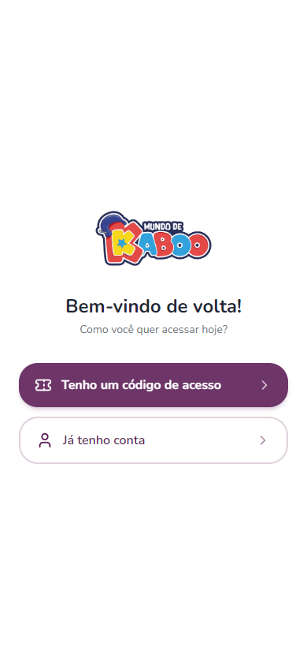 |

---

## 2. Máquina de Estados — LoginScreen

A `LoginScreen` hoje opera com dois estados principais visíveis na jornada atual e uma etapa auxiliar de validação de voucher que permanece disponível no código.

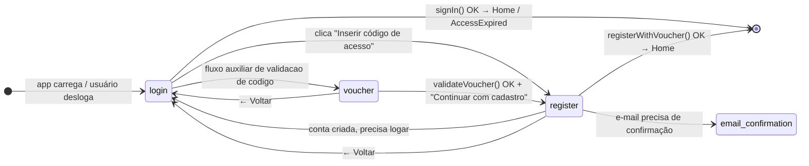
```mermaid
stateDiagram-v2
    direction LR

    [*] --> login : app carrega / usuário desloga

    login --> register : clica "Inserir código de acesso"
    login --> voucher : fluxo auxiliar de validacao de codigo
    login --> [*] : signIn() OK → Home / AccessExpired

    voucher --> register : validateVoucher() OK + "Continuar com cadastro"
    voucher --> login : ← Voltar

    register --> [*] : registerWithVoucher() OK → Home
    register          --> email_confirmation : e-mail precisa de confirmação
    register --> login : conta criada, precisa logar
    register --> login : ← Voltar
```

### Estados

| Estado | Descrição | Step Dots |
|--------|-----------|-----------|
| `login` | Tela inicial atual, com login direto e CTA de primeiro acesso | — |
| `register` | Cadastro com nome, e-mail, senha e código de acesso | — |
| `voucher` | Etapa auxiliar de validação prévia do código | 1/2 |

---

## 3. Jornada 1A — Novo usuário com voucher

Fluxo completo de um usuário que recebeu um código de acesso e quer criar sua conta pela primeira vez.

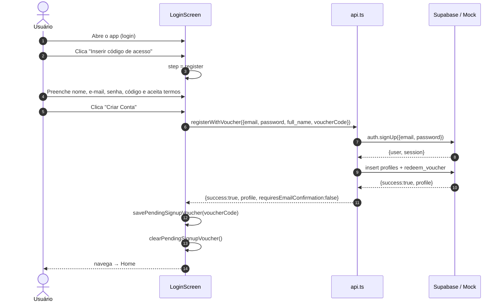
```mermaid
sequenceDiagram
    autonumber
    actor U as Usuário
    participant LS as LoginScreen
    participant API as api.ts
    participant SB as Supabase / Mock

    U->>LS: Abre o app (login)
    U->>LS: Clica "Inserir código de acesso"
    LS->>LS: step = register

    U->>LS: Preenche nome, e-mail, senha, código e aceita termos
    U->>LS: Clica "Criar Conta"
    LS->>API: registerWithVoucher({email, password, full_name, voucherCode})
    API->>SB: auth.signUp({email, password})
    SB-->>API: {user, session}
    API->>SB: insert profiles + redeem_voucher
    SB-->>API: {success:true, profile}
    API-->>LS: {success:true, profile, requiresEmailConfirmation:false}

    LS->>LS: savePendingSignupVoucher(voucherCode)
    LS->>LS: clearPendingSignupVoucher()
    LS-->>U: navega → Home
```

### Screenshots — Jornada 1A

| Voucher vazio | Voucher validado | Formulário de cadastro |
|:---:|:---:|:---:|
| 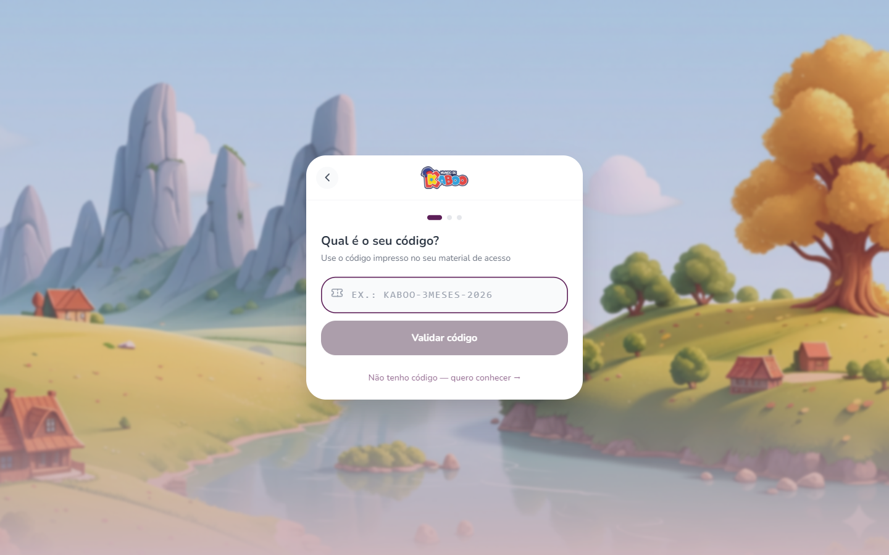 | 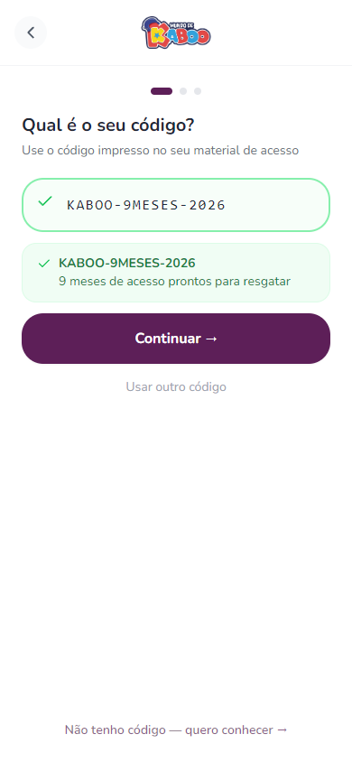 | 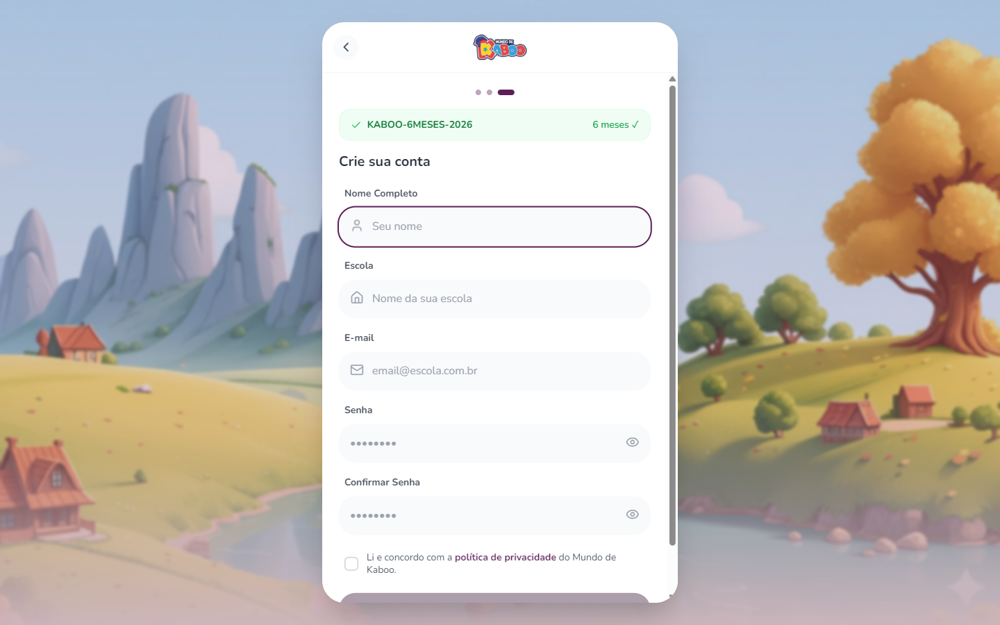 |

---

## 4. Jornada 1B — Usuário existente com voucher

Não existe mais uma etapa dedicada de pré-login para esse caso.

- O usuário entra pela tela padrão de login.
- Se houver voucher pendente salvo do cadastro, o app tenta resgatar automaticamente no primeiro login.
- Se ele precisar informar um novo código com o acesso bloqueado, o resgate acontece na AccessExpiredScreen.

---

## 5. Jornada 2 — Login direto (sem voucher)

Fluxo de usuário com conta ativa que acessa o app normalmente.

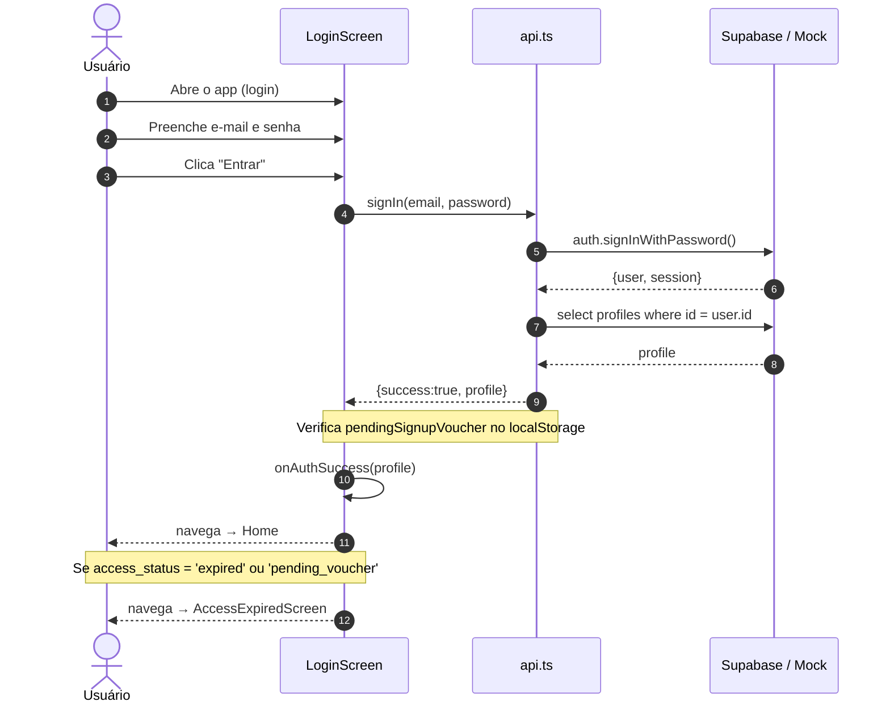
```mermaid
sequenceDiagram
    autonumber
    actor U as Usuário
    participant LS as LoginScreen
    participant API as api.ts
    participant SB as Supabase / Mock

    U->>LS: Abre o app (login)

    U->>LS: Preenche e-mail e senha
    U->>LS: Clica "Entrar"
    LS->>API: signIn(email, password)
    API->>SB: auth.signInWithPassword()
    SB-->>API: {user, session}
    API->>SB: select profiles where id = user.id
    SB-->>API: profile
    API-->>LS: {success:true, profile}

    note over LS,API: Verifica pendingSignupVoucher no localStorage
    LS->>LS: onAuthSuccess(profile)
    LS-->>U: navega → Home

    note over U,LS: Se access_status = 'expired' ou 'pending_voucher'
    LS-->>U: navega → AccessExpiredScreen
```

### Screenshot — Jornada 2

| Login direto |
|:---:|
| 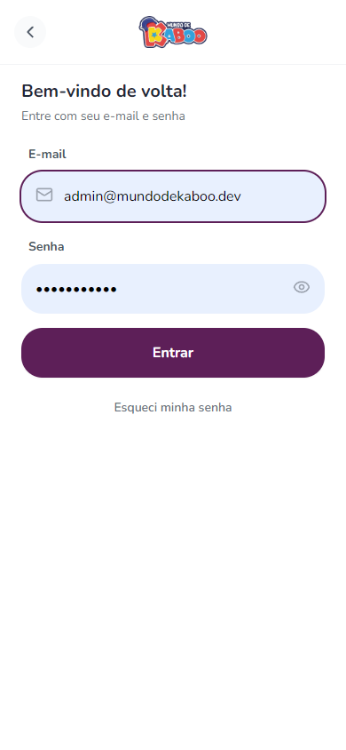 |

---

## 5A. Jornada 2A — Usuário sem voucher

Fluxo do visitante que não recebeu um código e precisa entender o modelo de acesso antes de comprar.

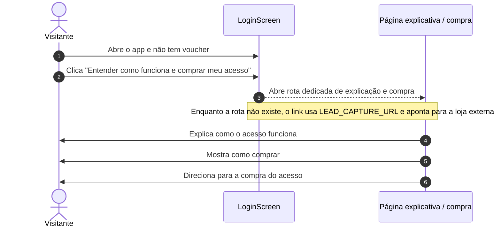
```mermaid
sequenceDiagram
    autonumber
    actor U as Visitante
    participant LS as LoginScreen
    participant LP as Página explicativa / compra

    U->>LS: Abre o app e não tem voucher
    U->>LS: Clica "Entender como funciona e comprar meu acesso"
    LS-->>LP: Abre rota dedicada de explicação e compra

    note over LS,LP: Enquanto a rota não existe, o link usa LEAD_CAPTURE_URL e aponta para a loja externa

    LP->>U: Explica como o acesso funciona
    LP->>U: Mostra como comprar
    LP->>U: Direciona para a compra do acesso
```

---

## 6. Jornada 3 — Acesso expirado / Renovação

Fluxo de um usuário cujo acesso expirou (ou nunca teve voucher) e precisa informar um novo código para continuar.

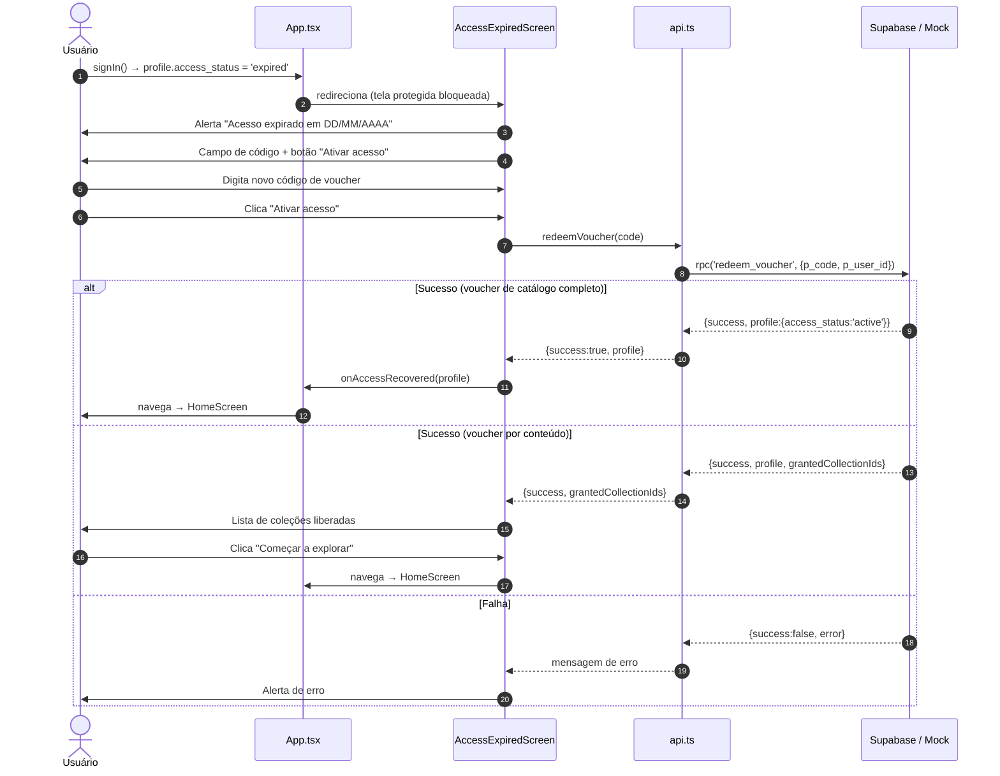
```mermaid
sequenceDiagram
    autonumber
    actor U as Usuário
    participant App as App.tsx
    participant AE as AccessExpiredScreen
    participant API as api.ts
    participant SB as Supabase / Mock

    U->>App: signIn() → profile.access_status = 'expired'
    App->>AE: redireciona (tela protegida bloqueada)

    AE->>U: Alerta "Acesso expirado em DD/MM/AAAA"
    AE->>U: Campo de código + botão "Ativar acesso"

    U->>AE: Digita novo código de voucher
    U->>AE: Clica "Ativar acesso"
    AE->>API: redeemVoucher(code)
    API->>SB: rpc('redeem_voucher', {p_code, p_user_id})

    alt Sucesso (voucher de catálogo completo)
        SB-->>API: {success, profile:{access_status:'active'}}
        API-->>AE: {success:true, profile}
        AE->>App: onAccessRecovered(profile)
        App->>U: navega → HomeScreen
    else Sucesso (voucher por conteúdo)
        SB-->>API: {success, profile, grantedCollectionIds}
        API-->>AE: {success, grantedCollectionIds}
        AE->>U: Lista de coleções liberadas
        U->>AE: Clica "Começar a explorar"
        AE->>App: navega → HomeScreen
    else Falha
        SB-->>API: {success:false, error}
        API-->>AE: mensagem de erro
        AE->>U: Alerta de erro
    end
```

### Screenshot — Jornada 3

| Acesso expirado |
|:---:|
| 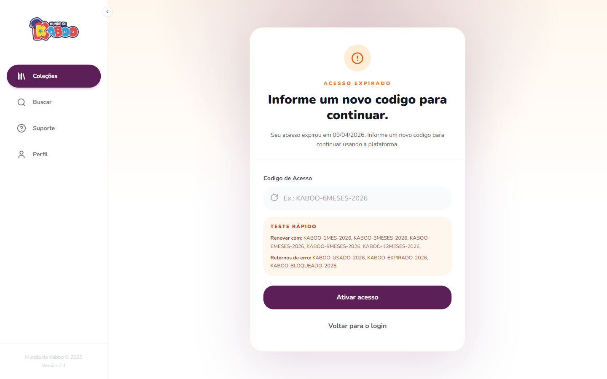 |

---

## 7. Jornada 4 — Navegação principal (Home → Coleção)

Fluxo do professor navegando nas coleções, filtrando por nível, e abrindo o detalhe de uma coleção.

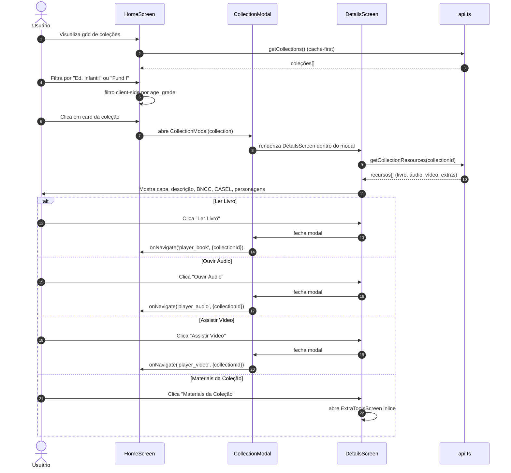
```mermaid
sequenceDiagram
    autonumber
    actor U as Usuário
    participant HS as HomeScreen
    participant CM as CollectionModal
    participant DS as DetailsScreen
    participant API as api.ts

    U->>HS: Visualiza grid de coleções
    HS->>API: getCollections() (cache-first)
    API-->>HS: coleções[]

    U->>HS: Filtra por "Ed. Infantil" ou "Fund I"
    HS->>HS: filtro client-side por age_grade

    U->>HS: Clica em card da coleção
    HS->>CM: abre CollectionModal(collection)

    CM->>DS: renderiza DetailsScreen dentro do modal
    DS->>API: getCollectionResources(collectionId)
    API-->>DS: recursos[] (livro, áudio, vídeo, extras)

    DS->>U: Mostra capa, descrição, BNCC, CASEL, personagens

    alt Ler Livro
        U->>DS: Clica "Ler Livro"
        DS->>CM: fecha modal
        CM->>HS: onNavigate('player_book', {collectionId})
    else Ouvir Áudio
        U->>DS: Clica "Ouvir Áudio"
        DS->>CM: fecha modal
        CM->>HS: onNavigate('player_audio', {collectionId})
    else Assistir Vídeo
        U->>DS: Clica "Assistir Vídeo"
        DS->>CM: fecha modal
        CM->>HS: onNavigate('player_video', {collectionId})
    else Materiais da Coleção
        U->>DS: Clica "Materiais da Coleção"
        DS->>DS: abre ExtraToolsScreen inline
    end
```

### Screenshots — Jornada 4

| Home (grid de coleções) | Detalhe da coleção (modal) |
|:---:|:---:|
| 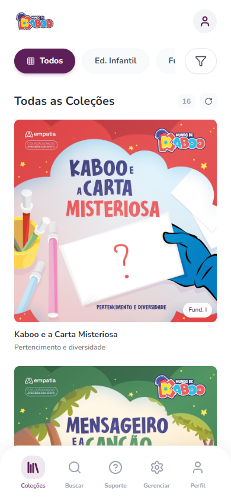 | 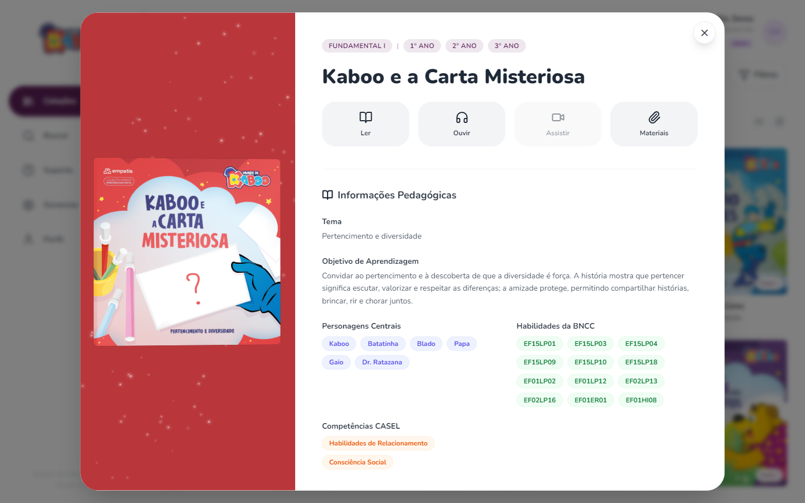 |

---

## 8. Jornada 5 — Busca

Busca client-side unificada por título, personagem, BNCC, CASEL e competências.

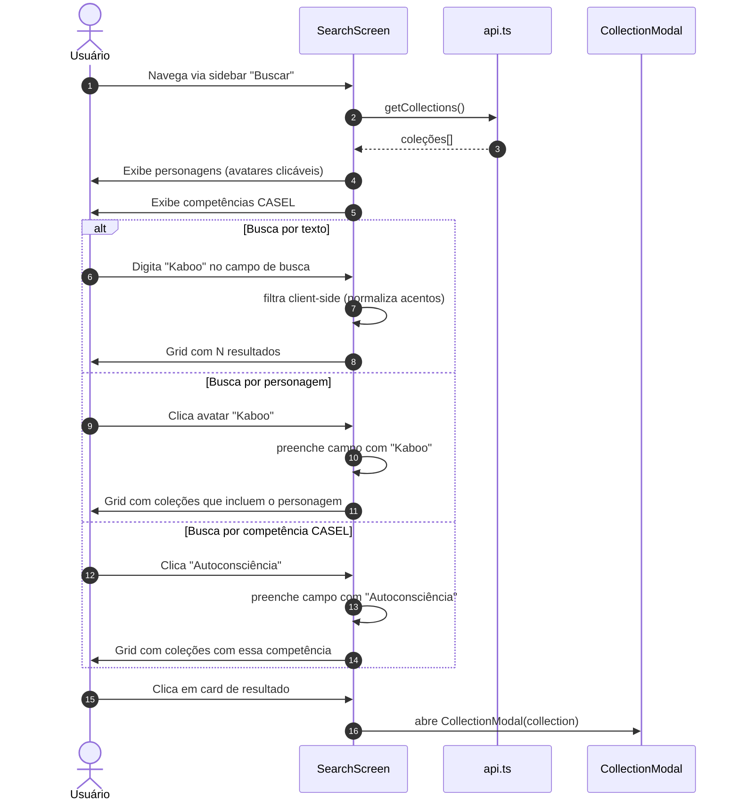
```mermaid
sequenceDiagram
    autonumber
    actor U as Usuário
    participant SS as SearchScreen
    participant API as api.ts
    participant CM as CollectionModal

    U->>SS: Navega via sidebar "Buscar"
    SS->>API: getCollections()
    API-->>SS: coleções[]

    SS->>U: Exibe personagens (avatares clicáveis)
    SS->>U: Exibe competências CASEL

    alt Busca por texto
        U->>SS: Digita "Kaboo" no campo de busca
        SS->>SS: filtra client-side (normaliza acentos)
        SS->>U: Grid com N resultados
    else Busca por personagem
        U->>SS: Clica avatar "Kaboo"
        SS->>SS: preenche campo com "Kaboo"
        SS->>U: Grid com coleções que incluem o personagem
    else Busca por competência CASEL
        U->>SS: Clica "Autoconsciência"
        SS->>SS: preenche campo com "Autoconsciência"
        SS->>U: Grid com coleções com essa competência
    end

    U->>SS: Clica em card de resultado
    SS->>CM: abre CollectionModal(collection)
```

### Screenshots — Jornada 5

| Busca (padrão) | Busca com resultados |
|:---:|:---:|
| 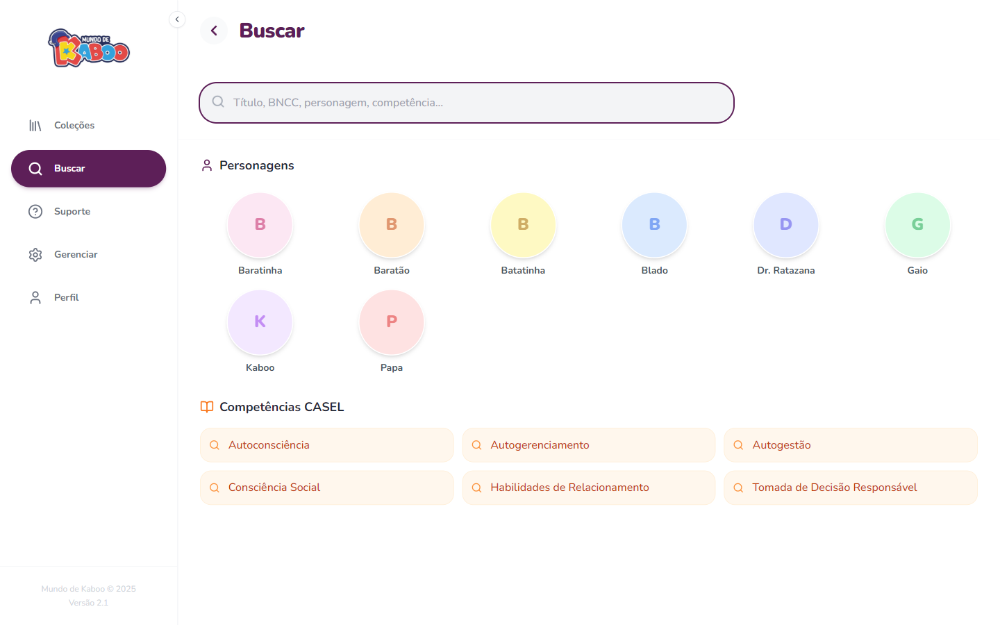 | 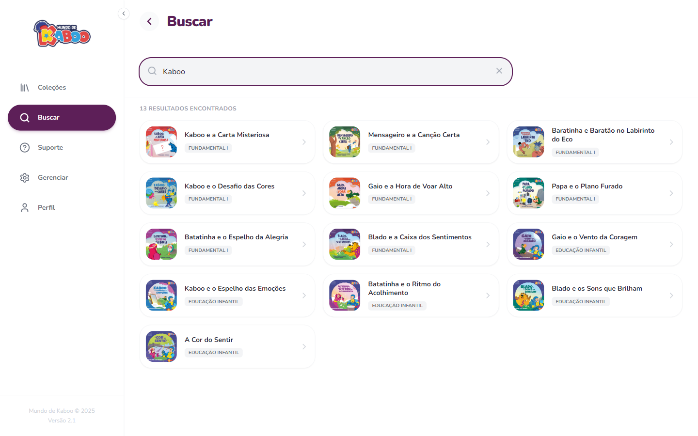 |

---

## 9. Jornada 6 — Perfil e Meus Dados

Fluxo do professor visualizando e editando seus dados pessoais.

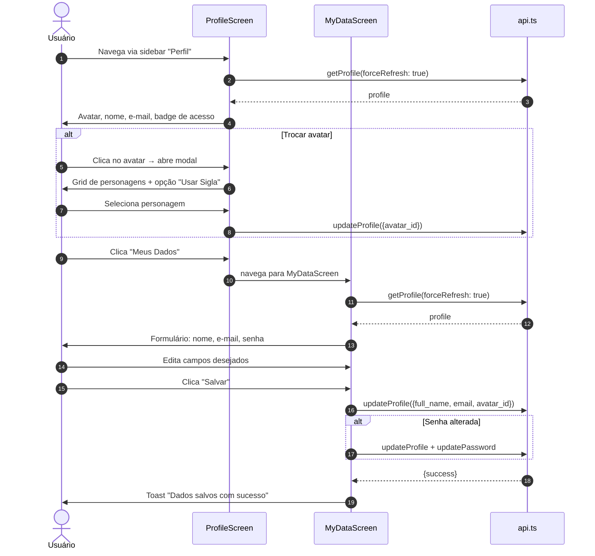
```mermaid
sequenceDiagram
    autonumber
    actor U as Usuário
    participant PS as ProfileScreen
    participant MD as MyDataScreen
    participant API as api.ts

    U->>PS: Navega via sidebar "Perfil"
    PS->>API: getProfile(forceRefresh: true)
    API-->>PS: profile

    PS->>U: Avatar, nome, e-mail, badge de acesso

    alt Trocar avatar
        U->>PS: Clica no avatar → abre modal
        PS->>U: Grid de personagens + opção "Usar Sigla"
        U->>PS: Seleciona personagem
        PS->>API: updateProfile({avatar_id})
    end

    U->>PS: Clica "Meus Dados"
    PS->>MD: navega para MyDataScreen

    MD->>API: getProfile(forceRefresh: true)
    API-->>MD: profile

    MD->>U: Formulário: nome, e-mail, senha
    U->>MD: Edita campos desejados
    U->>MD: Clica "Salvar"
    MD->>API: updateProfile({full_name, email, avatar_id})

    alt Senha alterada
        MD->>API: updateProfile + updatePassword
    end

    API-->>MD: {success}
    MD->>U: Toast "Dados salvos com sucesso"
```

### Screenshots — Jornada 6

| Perfil | Meus Dados |
|:---:|:---:|
| 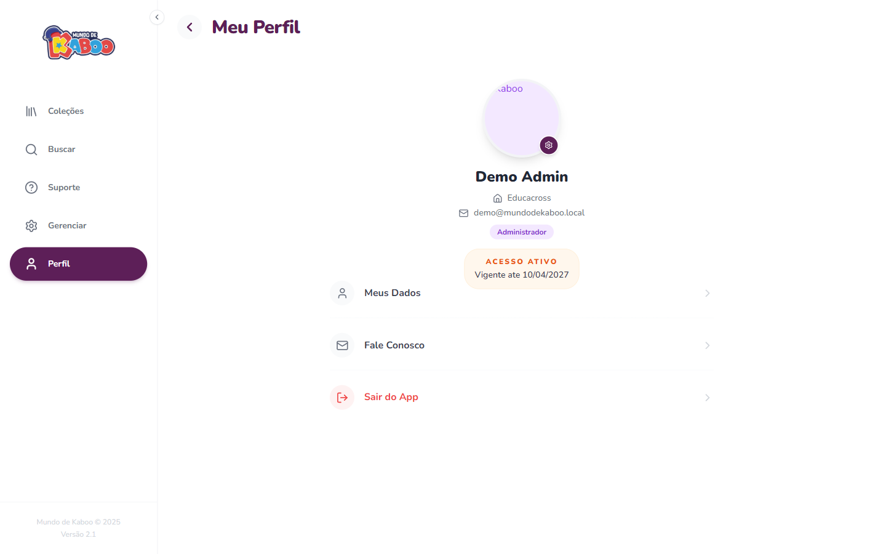 | 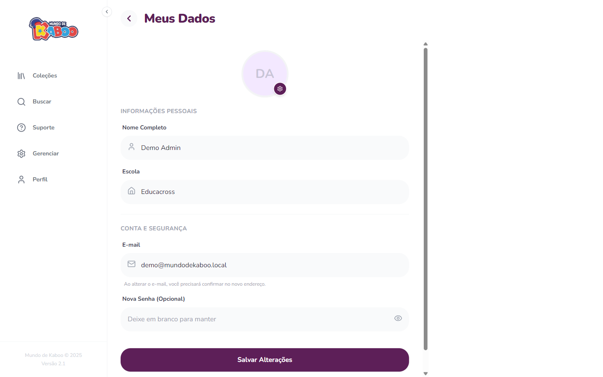 |

---

## 10. Jornada 7 — Recuperação de senha

Fluxo quando o usuário esquece a senha.

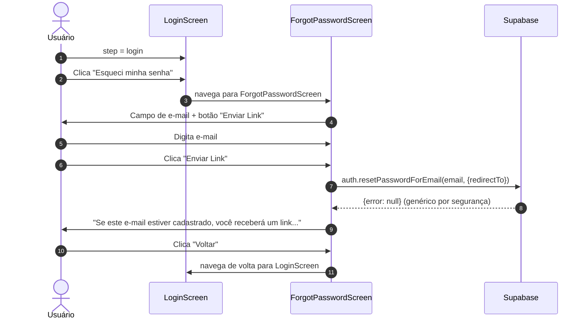
```mermaid
sequenceDiagram
    autonumber
    actor U as Usuário
    participant LS as LoginScreen
    participant FP as ForgotPasswordScreen
    participant SB as Supabase

    U->>LS: step = login
    U->>LS: Clica "Esqueci minha senha"
    LS->>FP: navega para ForgotPasswordScreen

    FP->>U: Campo de e-mail + botão "Enviar Link"

    U->>FP: Digita e-mail
    U->>FP: Clica "Enviar Link"
    FP->>SB: auth.resetPasswordForEmail(email, {redirectTo})

    SB-->>FP: {error: null} (genérico por segurança)
    FP->>U: "Se este e-mail estiver cadastrado, você receberá um link..."

    U->>FP: Clica "Voltar"
    FP->>LS: navega de volta para LoginScreen
```

### Screenshot — Jornada 7

| Recuperação de senha |
|:---:|
| 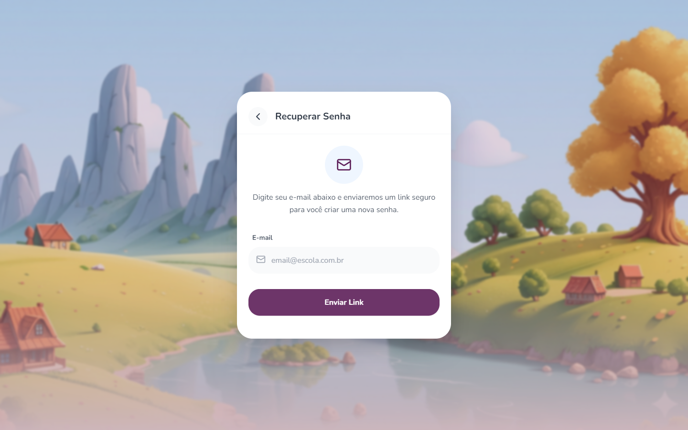 |

---

## 11. Jornada 8 — Admin CMS

Fluxo do administrador gerenciando o app: coleções, usuários e vouchers.

### Navegação do Admin

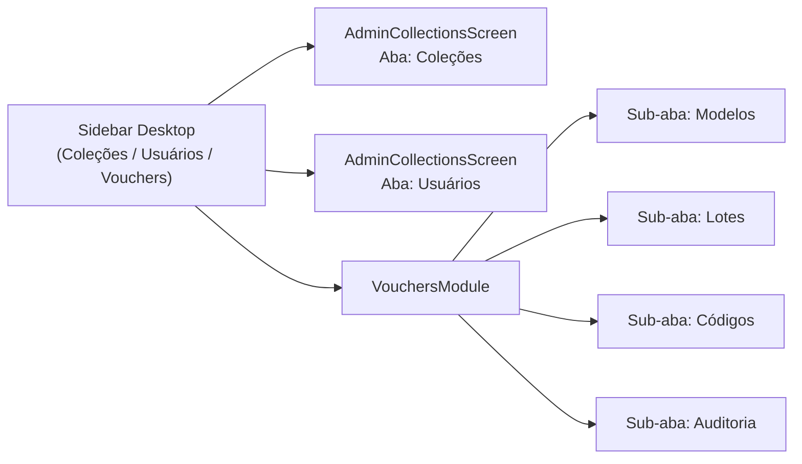
```mermaid
flowchart LR
    Sidebar["Sidebar Desktop\n(Coleções / Usuários / Vouchers)"]
    
    Sidebar --> Collections["AdminCollectionsScreen\nAba: Coleções"]
    Sidebar --> Users["AdminCollectionsScreen\nAba: Usuários"]
    Sidebar --> Vouchers["VouchersModule"]

    Vouchers --> Models["Sub-aba: Modelos"]
    Vouchers --> Batches["Sub-aba: Lotes"]
    Vouchers --> Codes["Sub-aba: Códigos"]
    Vouchers --> Audit["Sub-aba: Auditoria"]
```

### 11.1 Gerenciamento de Coleções

O admin pode criar, editar e excluir coleções. O formulário de edição possui abas para Identificação (título, descrição, tema, competências, BNCC) e Mídia (capa, materiais extras).

### 11.2 Gerenciamento de Usuários

Visualização de todos os usuários com resumo de status de acesso (total, ativos, pendentes, expirados). O admin pode: buscar por e-mail/nome, ver badges de vigência e editar perfis.

### 11.3 Módulo de Vouchers

Fluxo completo de distribuição de vouchers:

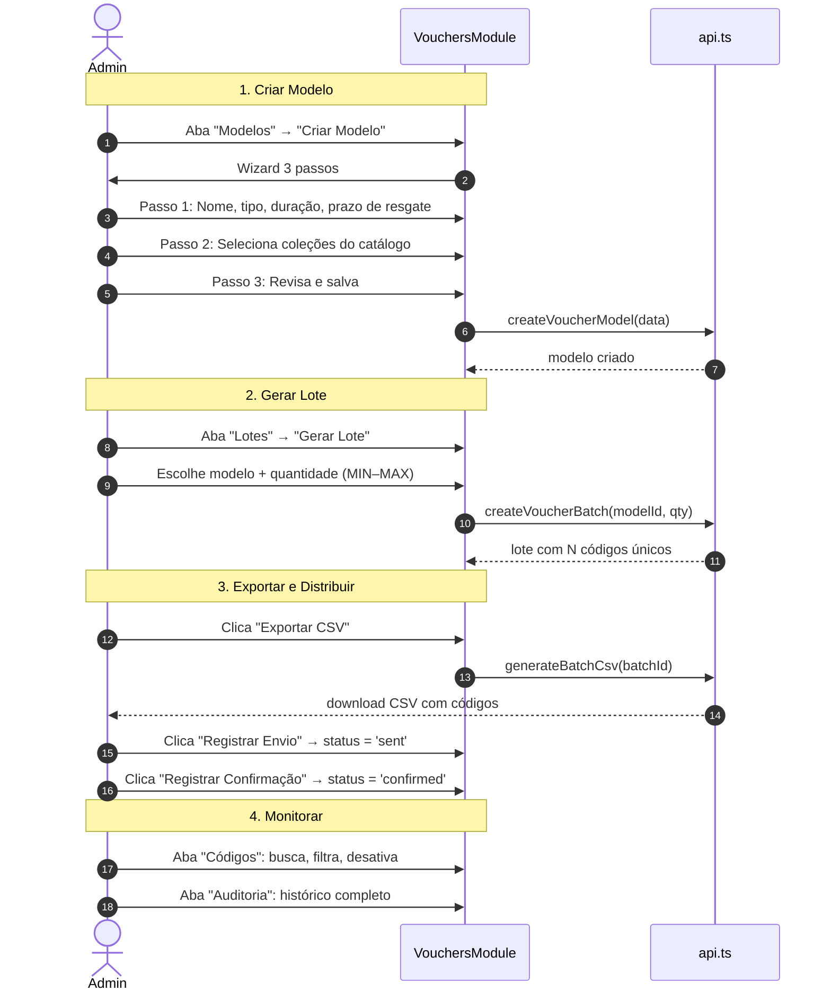
```mermaid
sequenceDiagram
    autonumber
    actor A as Admin
    participant VM as VouchersModule
    participant API as api.ts

    note over A,VM: 1. Criar Modelo
    A->>VM: Aba "Modelos" → "Criar Modelo"
    VM->>A: Wizard 3 passos
    A->>VM: Passo 1: Nome, tipo, duração, prazo de resgate
    A->>VM: Passo 2: Seleciona coleções do catálogo
    A->>VM: Passo 3: Revisa e salva
    VM->>API: createVoucherModel(data)
    API-->>VM: modelo criado

    note over A,VM: 2. Gerar Lote
    A->>VM: Aba "Lotes" → "Gerar Lote"
    A->>VM: Escolhe modelo + quantidade (MIN–MAX)
    VM->>API: createVoucherBatch(modelId, qty)
    API-->>VM: lote com N códigos únicos

    note over A,VM: 3. Exportar e Distribuir
    A->>VM: Clica "Exportar CSV"
    VM->>API: generateBatchCsv(batchId)
    API-->>A: download CSV com códigos
    A->>VM: Clica "Registrar Envio" → status = 'sent'
    A->>VM: Clica "Registrar Confirmação" → status = 'confirmed'

    note over A,VM: 4. Monitorar
    A->>VM: Aba "Códigos": busca, filtra, desativa
    A->>VM: Aba "Auditoria": histórico completo
```

### Screenshots — Jornada 8

| Coleções | Usuários | Vouchers |
|:---:|:---:|:---:|
|  | 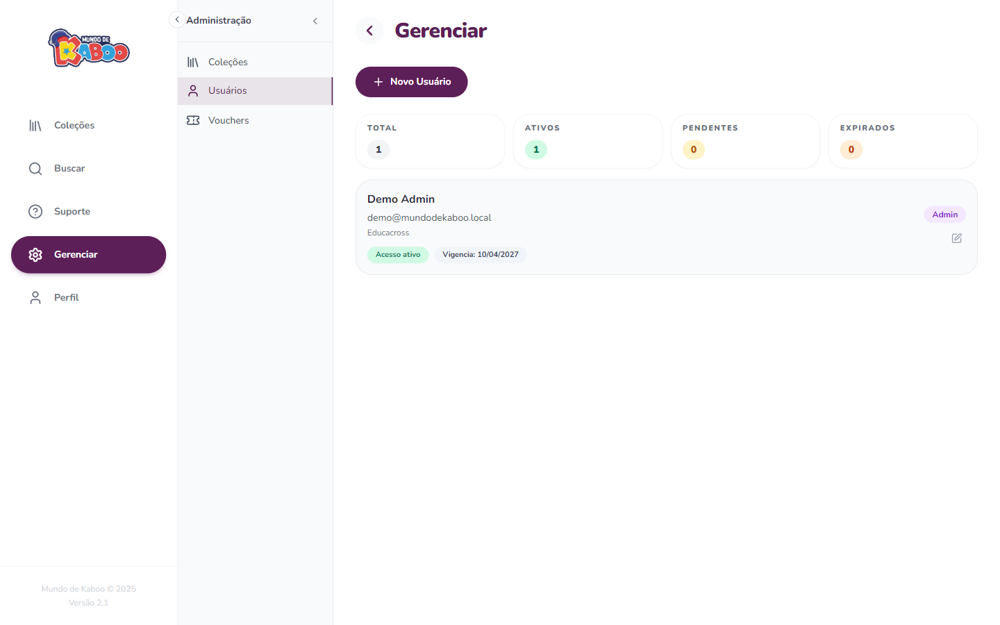 | 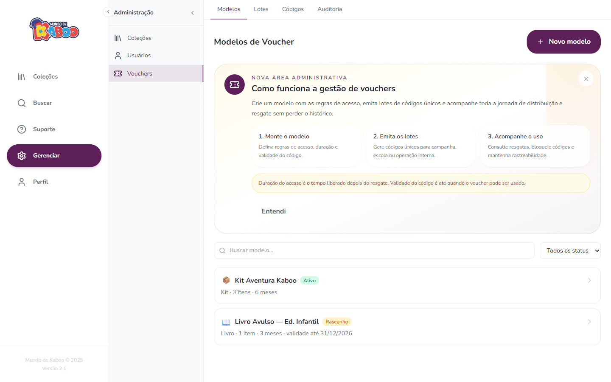 |

---

## 12. Telas Capturadas

Todas as telas abaixo foram capturadas em viewport **1440 × 900 px** (desktop).

### Autenticação

| Entry | Voucher (vazio) | Voucher (validado) |
|:---:|:---:|:---:|
|  |  |  |

| Cadastro | Login Direto | Esqueci Senha |
|:---:|:---:|:---:|
|  |  |  |

### App Principal

| Home | Modal Coleção | Busca | Busca (resultados) |
|:---:|:---:|:---:|:---:|
|  |  |  |  |

| Perfil | Meus Dados | Acesso Expirado |
|:---:|:---:|:---:|
|  |  |  |

### Admin

| Coleções | Usuários | Vouchers |
|:---:|:---:|:---:|
|  |  |  |

---

## 13. Arquitetura de Componentes — LoginScreen

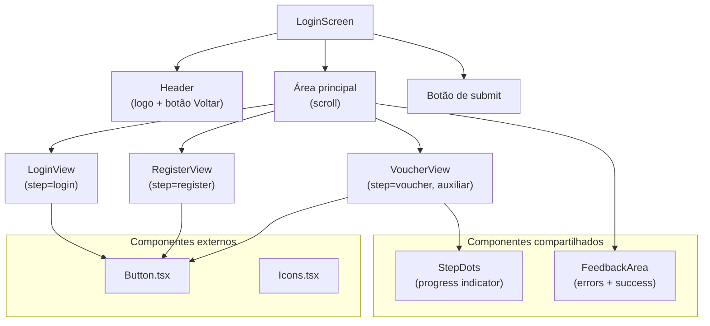
```mermaid
graph TD
    LS["LoginScreen"]

    LS --> Header["Header\n(logo + botão Voltar)"]
    LS --> Body["Área principal\n(scroll)"]
    LS --> Footer["Botão de submit"]

    Body --> VoucherView["VoucherView\n(step=voucher, auxiliar)"]
    Body --> RegisterView["RegisterView\n(step=register)"]
    Body --> LoginView["LoginView\n(step=login)"]

    VoucherView --> StepDots["StepDots\n(progress indicator)"]

    Body --> FeedbackArea["FeedbackArea\n(errors + success)"]

    subgraph Shared["Componentes compartilhados"]
        FeedbackArea
        StepDots
    end

    subgraph External["Componentes externos"]
        Button["Button.tsx"]
        Icons["Icons.tsx"]
    end

    VoucherView --> Button
    RegisterView --> Button
    LoginView --> Button
```

### Estado local do componente

| Estado | Tipo | Descrição |
|--------|------|-----------|
| `step` | `LoginStep` | Controla qual view é renderizada |
| `validatedVoucher` | `Voucher \| null` | Resultado de `validateVoucher()` |
| `loading` | `boolean` | Bloqueia double-submit |
| `errorMsg` | `string \| null` | Mensagem de erro da FeedbackArea |
| `successMsg` | `string \| null` | Mensagem de sucesso da FeedbackArea |
| `voucherValidationMsg` | `string \| null` | Label de duração após validação |
| `showContinueToHome` | `boolean` | Link safety net após falha de resgate |
| `email, password, fullName, schoolName, voucherCode, confirmPassword` | `string` | Campos de formulário |
| `acceptedTerms` | `boolean` | Checkbox de política de privacidade |
| `showPassword, showConfirmPassword` | `boolean` | Toggle de visibilidade de senha |

### Persistência localStorage

| Chave | Valor | Propósito |
|-------|-------|-----------|
| `kaboo_pending_signup_voucher` | código do voucher | Preserva o voucher entre cadastro e confirmação de e-mail |

---

## 14. Fluxo de Dados — API Calls

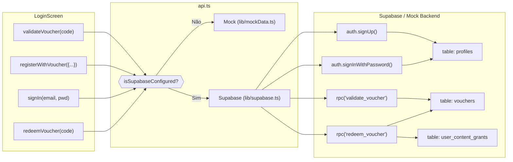
```mermaid
flowchart LR
    subgraph "LoginScreen"
        validateVoucher["validateVoucher(code)"]
        registerWithVoucher["registerWithVoucher({...})"]
        signIn["signIn(email, pwd)"]
        redeemVoucher["redeemVoucher(code)"]
    end

    subgraph "api.ts"
        direction TB
        isSupabase{{"isSupabaseConfigured?"}}
        mockPath["Mock (lib/mockData.ts)"]
        supabasePath["Supabase (lib/supabase.ts)"]
    end

    subgraph "Supabase / Mock Backend"
        validate_voucher_rpc["rpc('validate_voucher')"]
        auth_signUp["auth.signUp()"]
        auth_signIn["auth.signInWithPassword()"]
        redeem_voucher_rpc["rpc('redeem_voucher')"]
        profiles_table["table: profiles"]
        vouchers_table["table: vouchers"]
        grants_table["table: user_content_grants"]
    end

    validateVoucher --> isSupabase
    registerWithVoucher --> isSupabase
    signIn --> isSupabase
    redeemVoucher --> isSupabase

    isSupabase -- Não --> mockPath
    isSupabase -- Sim --> supabasePath

    supabasePath --> validate_voucher_rpc --> vouchers_table
    supabasePath --> auth_signUp --> profiles_table
    supabasePath --> auth_signIn --> profiles_table
    supabasePath --> redeem_voucher_rpc --> vouchers_table
    redeem_voucher_rpc --> grants_table
```

### Tratamento de erros

A `api.ts` prioriza mensagens em português via `getVoucherErrorMessage()` antes de expor strings brutas do Supabase. A `LoginScreen` normaliza adicionalmente com `normalizeAuthError()`:

| Erro Supabase bruto | Mensagem exibida |
|---------------------|-----------------|
| `Invalid login credentials` | "E-mail ou senha incorretos." |
| `User already registered` | "Este e-mail já está cadastrado." |
| `Email not confirmed` | "Confirme seu e-mail para entrar…" → redireciona para `EmailConfirmationScreen` |
| `security purposes` / `rate limit` | "Muitas tentativas. Por segurança, aguarde…" |

---

## 15. Arquitetura Geral — Módulos do App

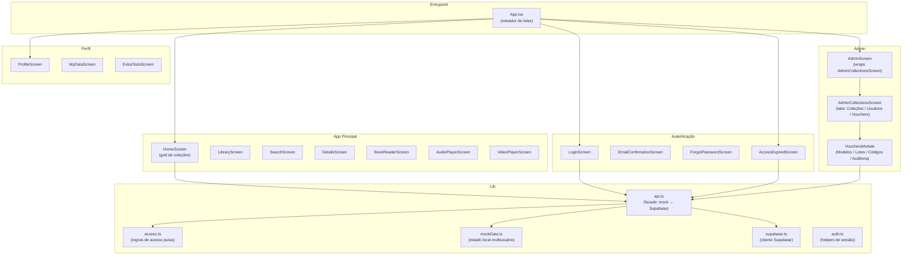
```mermaid
graph TD
    subgraph "Entrypoint"
        App["App.tsx\n(roteador de telas)"]
    end

    subgraph "Autenticação"
        LoginScreen
        EmailConfirmationScreen
        ForgotPasswordScreen
        AccessExpiredScreen
    end

    subgraph "App Principal"
        HomeScreen["HomeScreen\n(grid de coleções)"]
        LibraryScreen
        SearchScreen
        DetailsScreen
        BookReaderScreen
        AudioPlayerScreen
        VideoPlayerScreen
    end

    subgraph "Admin"
        AdminScreen["AdminScreen\n(wraps AdminCollectionsScreen)"]
        AdminCollectionsScreen["AdminCollectionsScreen\n(tabs: Coleções / Usuários / Vouchers)"]
        VouchersModule["VouchersModule\n(Modelos / Lotes / Códigos / Auditoria)"]
    end

    subgraph "Perfil"
        ProfileScreen
        MyDataScreen
        ExtraToolsScreen
    end

    subgraph "Lib"
        API["api.ts\n(facade: mock ↔ Supabase)"]
        Access["access.ts\n(regras de acesso puras)"]
        MockData["mockData.ts\n(estado local multiusuário)"]
        Supabase["supabase.ts\n(cliente Supabase)"]
        Auth["auth.ts\n(helpers de sessão)"]
    end

    App --> LoginScreen
    App --> HomeScreen
    App --> AdminScreen
    App --> ProfileScreen
    App --> AccessExpiredScreen

    AdminCollectionsScreen --> VouchersModule
    AdminScreen --> AdminCollectionsScreen

    HomeScreen --> API
    LoginScreen --> API
    AccessExpiredScreen --> API
    VouchersModule --> API

    API --> MockData
    API --> Supabase
    API --> Access
```

---

## 16. Fluxo de Acesso Pós-Login

Após qualquer autenticação bem-sucedida, o `App.tsx` verifica o `access_status` do perfil e roteia adequadamente:

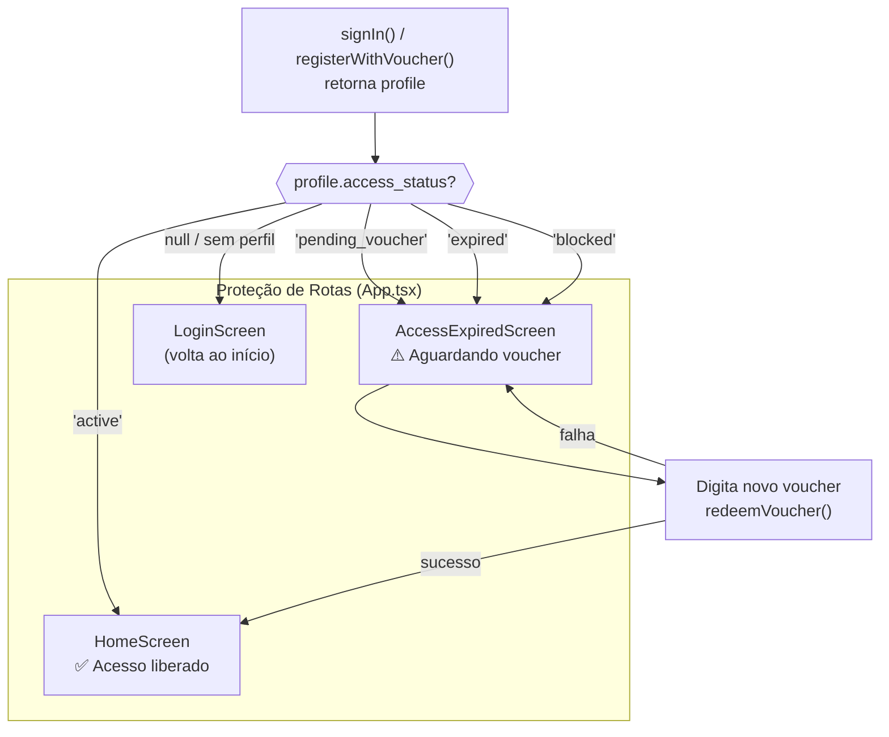
```mermaid
flowchart TD
    Auth["signIn() / registerWithVoucher()\nretorna profile"] --> Check{{"profile.access_status?"}}

    Check -- "'active'" --> Home["HomeScreen\n✅ Acesso liberado"]
    Check -- "'pending_voucher'" --> Expired["AccessExpiredScreen\n⚠️ Aguardando voucher"]
    Check -- "'expired'" --> Expired
    Check -- "'blocked'" --> Expired
    Check -- "null / sem perfil" --> Login["LoginScreen\n(volta ao início)"]

    Expired --> Redeem["Digita novo voucher\nredeemVoucher()"]
    Redeem -- "sucesso" --> Home
    Redeem -- "falha" --> Expired

    subgraph "Proteção de Rotas (App.tsx)"
        Home
        Expired
        Login
    end
```

### Status de acesso

| `access_status` | Tela exibida | Ação disponível |
|----------------|-------------|-----------------|
| `active` | HomeScreen | Acesso total ao conteúdo |
| `pending_voucher` | AccessExpiredScreen | Inserir voucher |
| `expired` | AccessExpiredScreen | Inserir voucher de renovação |
| `blocked` | AccessExpiredScreen | Apenas visualização da mensagem |
| `null` / indefinido | LoginScreen | Autenticar novamente |

---

## Referências Técnicas

| Arquivo | Responsabilidade |
|---------|----------------|
| `screens/LoginScreen.tsx` | Toda a UX de autenticação (state machine + formulários) |
| `lib/api.ts` | Facade que abstrai mock vs. Supabase |
| `lib/access.ts` | Regras puras de status de acesso (sem side-effects) |
| `lib/mockData.ts` | Auth local multiusuário + catálogo em memória |
| `lib/mockVoucherData.ts` | Content grants para o modo mock |
| `types.ts` | Tipos compartilhados (`UserProfile`, `Voucher`, `LoginStep`, …) |
| `supabase/migrations/` | Migration SQL: tabela `vouchers`, RPCs, `user_content_grants` |

---

*Documentação gerada em abril/2026 — branch `fix/quality-improvements`.*
