# Benchmark - fluxo de criação e envio de vouchers físicos para gráfica

Status: benchmark operacional  
Data: 08/04/2026  
Projeto: Mundo de Kaboo  
Documentos relacionados:
- [PRD de vouchers por conteúdo](./prd-vouchers-por-conteudo.md)
- [Wireframe textual do CMS administrativo](./wireframe-cms-admin.md)

Este benchmark consolida padrões de mercado e boas práticas operacionais para orientar como o Mundo de Kaboo deve estruturar o fluxo de criação, emissão e envio de vouchers físicos para gráfica dentro do CMS administrativo unificado do app. O foco aqui é processo, UX operacional e governança de entrega, não design visual do card.

## Fluxo visual (Mermaid)

```mermaid
flowchart LR
	subgraph ADMIN["Admin interno"]
		A1["Acessa o CMS administrativo"]
		A2["Cria ou duplica modelo de voucher"]
		A3["Seleciona conteudos, duracao e validade"]
		A4["Revisa preview operacional"]
		A5{"Aprovar para emissao?"}
		A6["Informa quantidade e finalidade do lote"]
		A7["Confere lote e amostra de codigos"]
		A8{"Lote correto?"}
		A9["Exporta arquivo mestre do lote"]
		A10["Registra envio para grafica"]
		A11["Registra confirmacao de recebimento"]
		A12["Cancela lote ou ajusta modelo"]
	end

	subgraph SISTEMA["Sistema Kaboo"]
		S1["Valida campos obrigatorios do modelo"]
		S2["Salva modelo em rascunho ou ativo"]
		S3["Congela snapshot do modelo aprovado"]
		S4["Gera lote transacional com N vouchers unicos"]
		S5["Monta resumo do lote e contagem total"]
		S6["Exporta CSV versionado por lote"]
		S7["Registra trilha de auditoria"]
		S8["Ativa vigencia e grants de conteudo no resgate"]
	end

	subgraph GRAFICA["Grafica"]
		G1["Recebe arquivo e instrucoes de producao"]
		G2{"Arquivo e variante de arte corretos?"}
		G3["Solicita novo envio ou correcoes"]
		G4["Confirma recebimento"]
		G5["Produz os cards fisicos"]
	end

	subgraph USUARIO["Usuario final"]
		U1["Recebe card fisico"]
		U2["Resgata codigo no app"]
		U3["Acessa o pacote liberado"]
	end

	A1 --> A2 --> A3 --> S1 --> S2 --> A4 --> A5
	A5 -- "Nao" --> A2
	A5 -- "Sim" --> A6 --> S3 --> S4 --> S5 --> A7 --> A8
	A8 -- "Nao" --> A12 --> A2
	A8 -- "Sim" --> A9 --> S6 --> S7 --> A10 --> G1 --> G2
	G2 -- "Nao" --> G3 --> A10
	G2 -- "Sim" --> G4 --> A11 --> G5 --> U1 --> U2 --> S8 --> U3

	style A5 fill:#FFF4CC,stroke:#B78B00,color:#3A2A00
	style A8 fill:#FFF4CC,stroke:#B78B00,color:#3A2A00
	style G2 fill:#FFF4CC,stroke:#B78B00,color:#3A2A00
	style S8 fill:#DDF6E8,stroke:#2D7A46,color:#143D22
```

## 1. Objetivo do benchmark

O objetivo deste benchmark é definir um fluxo operacional simples, rastreável e escalável para vouchers físicos no Mundo de Kaboo, considerando três camadas que precisam ficar separadas desde o início:

- modelo de voucher: define o que será vendido ou distribuído operacionalmente;
- lote de emissão: define a tiragem produzida em uma rodada específica;
- voucher individual: define o código único que será impresso e resgatado.

Na prática, o benchmark precisa responder quatro perguntas:

- como o mercado normalmente congela regras antes de gerar códigos em escala;
- como a operação evita erro entre conteúdo prometido, arquivo exportado e arte produzida;
- quais hand-offs precisam existir entre time interno e gráfica;
- qual é o menor processo confiável que o Kaboo deve adotar no v1.

## 2. Quais referências de mercado e padrões operacionais foram consideradas

Foram consideradas referências em nível de padrão operacional, não de marca específica:

- gift cards e cartões-presente físicos: usados como referência para produção em lote, associação entre variante de card e arquivo de códigos, e rastreabilidade de remessa;
- cupons promocionais em lote: usados como referência para geração massiva, exportação em CSV, filtros operacionais e controle por campanha ou família de códigos;
- licensing keys e activation cards de software: usados como referência para congelamento de entitlement antes da emissão, unicidade do código e impossibilidade de edição do item individual após geração;
- operações editoriais com gráfica: usadas como referência para prova, conferência de tiragem, versionamento de arquivo e confirmação formal de envio;
- impressão sob demanda e reprint controlado: usadas como referência para tratar exceções, reimpressões e necessidade de diferenciar tiragem original de reposição.

Leitura consolidada do benchmark:

- o padrão mais aderente ao Kaboo não é o de cupom promocional puro;
- o núcleo do problema do Kaboo se parece mais com licensing key com embalagem física;
- para a etapa de gráfica, o melhor complemento é o padrão editorial de lote fechado com conferência e comprovante de envio.

## 3. Benchmark comparativo

| Padrão de mercado | Como o fluxo normalmente funciona | Benefícios | Riscos | Aplicabilidade ao Kaboo |
| --- | --- | --- | --- | --- |
| Gift cards físicos pré-codificados | Um programa de card é definido, um lote de códigos é gerado, a operação exporta o arquivo com identificador de arte e tiragem, a gráfica produz e o operador registra envio e recebimento | Escala bem, é familiar para operação, facilita controle por lote físico | Se a arte e o código forem desacoplados, o card pode sair com mensagem errada; também há risco de vazamento de arquivo | Alta para a lógica de produção física, desde que o Kaboo trate lote como unidade oficial de envio |
| Cupons promocionais em lote | A operação cria uma campanha, gera milhares de códigos, exporta por filtros e distribui em canais diversos | Simples para bulk export, rápido de operar, bom para relatórios | Normalmente tem governança fraca de conteúdo prometido; não foi desenhado para entitlement complexo nem para card físico permanente | Média; ajuda em exportação e filtros, mas isoladamente é fraco para o caso do Kaboo |
| Licensing keys e activation cards | Um template define direitos de acesso, a emissão congela esse pacote, as chaves são geradas de forma imutável e distribuídas com auditoria | É o modelo mais forte para separar template, lote e código individual; reduz ambiguidade do que cada código libera | Exige disciplina de snapshot e versionamento; reimpressão sem controle vira problema operacional | Muito alta; é o padrão mais aderente à regra do Kaboo de liberar um ou mais conteúdos por período |
| Operação editorial com gráfica | Existe um pedido de produção, uma versão aprovada do material, conferência de tiragem, arquivo mestre versionado e aceite da gráfica | Reduz erro humano entre revisão e impressão; cria hand-offs claros; facilita tratar exceções | Se for pesado demais, burocratiza o dia a dia e atrasa tiragens pequenas | Alta para a etapa de revisão, conferência e envio; deve ser simplificado no v1 |
| Impressão sob demanda e reprint controlado | Cada rodada de impressão recebe seu próprio identificador de produção, mesmo quando deriva de uma arte já conhecida | Organiza reposição, perda, extravio e reimpressão sem misturar histórico | Pode induzir excesso de micro-lotes e complexidade desnecessária | Média; útil para exceções e reposição, não precisa ser o fluxo principal do v1 |

Síntese comparativa:

- para criação e emissão, o Kaboo deve se inspirar em licensing keys;
- para conferência e hand-off com a gráfica, o Kaboo deve se inspirar em operações editoriais;
- para exportação e filtros, o Kaboo pode reaproveitar padrões de cupons em lote;
- para exceções, o Kaboo deve tratar reimpressão como novo evento controlado, não como reaproveitamento informal de planilha antiga.

## 4. Fluxo recomendado para o Kaboo ponta a ponta, da criação até o envio para gráfica

Fluxo macro recomendado:

Rascunho de modelo -> revisão operacional -> aprovação para emissão -> geração de lote -> conferência de lote -> exportação versionada -> envio para gráfica -> confirmação de recebimento

| Etapa | Responsável principal | Como deve funcionar no Kaboo | Saída da etapa | Regra operacional crítica |
| --- | --- | --- | --- | --- |
| 1. Criar modelo | Admin interno | O admin cria um modelo com nome interno, nome comercial, tipo de pacote, conteúdos liberados, duração de acesso, validade do código e referência de arte ou variante do card | Modelo em rascunho com preview operacional | Nenhum código é gerado nesta etapa |
| 2. Revisar modelo | Admin interno | O admin revisa o preview completo, valida conteúdo, contagem de itens, nomenclatura, texto operacional e compatibilidade com a arte que será usada na gráfica | Modelo revisado | A revisão precisa deixar explícita a diferença entre validade do código e duração do acesso |
| 3. Aprovar para emissão | Admin interno | O sistema exige confirmação final antes de permitir emissão. No v1, isso pode ser uma aprovação simples, sem workflow complexo de múltiplas alçadas | Modelo apto para emissão | A aprovação deve congelar os campos críticos que serão herdados pelo lote naquele momento |
| 4. Gerar lote | Admin interno | O admin escolhe o modelo aprovado, informa quantidade, identifica a finalidade da tiragem e gera um lote transacional com N vouchers únicos | Lote gerado com snapshot do modelo | Se houver falha, nenhum voucher do lote deve ser criado parcialmente |
| 5. Conferir lote | Admin interno | O sistema exibe resumo do lote, amostra de códigos, quantidade total, validade, resumo do conteúdo e referência de arte para conferência antes da exportação | Lote conferido | Divergência de conteúdo, quantidade ou arte deve bloquear exportação e levar a cancelamento ou regeneração |
| 6. Exportar para gráfica | Admin interno | O sistema exporta o lote em arquivo padrão, com versão, data, responsável e campos estáveis para a produção | Pacote de exportação pronto | A exportação para produção deve ser preferencialmente por lote, não por filtro solto |
| 7. Confirmar envio à gráfica | Admin interno | Após enviar o arquivo pelo canal combinado, o admin registra data, hora, destinatário, canal de envio e observações | Lote marcado como enviado | Não deve haver edição manual do arquivo depois do envio; qualquer ajuste precisa gerar nova versão de exportação |
| 8. Confirmar recebimento da gráfica | Gráfica com registro pelo admin | A gráfica confirma recebimento e entendimento da tiragem; no v1, essa confirmação pode ser manualmente registrada pelo admin | Lote com confirmação de recebimento | Se a gráfica pedir novo arquivo, isso deve gerar novo evento de exportação e novo comprovante |

Decisões operacionais recomendadas para o v1:

- o lote deve ser a unidade oficial de produção física;
- exportação por filtros pode existir para auditoria e suporte, mas não deve ser o caminho principal de envio à gráfica;
- reimpressão não deve reaproveitar informalmente um CSV antigo sem registro; deve haver novo evento de exportação ou um sublote de reposição;
- a aprovação do modelo deve ser leve, mas obrigatória, para evitar emissão direta a partir de rascunho;
- depois que um lote for exportado, a operação deve tratar aquele snapshot como contrato entre CMS e gráfica.

## 5. Hand-offs entre admin interno e gráfica

| Momento do hand-off | O que o admin entrega | O que a gráfica devolve ou confirma | Objetivo do hand-off |
| --- | --- | --- | --- |
| Modelo pronto para produção | Identificação do modelo, variante de arte, quantidade prevista e janela de produção | Sinalização de viabilidade operacional quando necessário | Alinhar se a tiragem e a variante fazem sentido antes do arquivo final |
| Lote exportado | CSV mestre do lote e resumo de produção | Confirmação de recebimento do arquivo correto | Garantir que a gráfica está usando a versão certa do lote |
| Prova ou validação de primeira tiragem | Quando aplicável, referência da arte e do posicionamento do código | Aprovação de prova ou retorno com ajuste | Reduzir erro em primeira execução de um modelo novo |
| Envio final para produção | Confirmação de que aquela versão do arquivo está liberada para impressão | Aceite formal de produção | Transformar arquivo exportado em ordem operacional executável |
| Exceção ou reimpressão | Nova versão do arquivo ou novo sublote aprovado | Confirmação de descarte da versão anterior e uso da nova | Evitar coexistência de arquivos conflitantes |

Recomendação pragmática para o v1:

- não dar acesso direto da gráfica ao CMS;
- tratar a gráfica como ator externo sem login;
- registrar no CMS os eventos de envio e confirmação mesmo quando o canal real for e-mail, WhatsApp corporativo ou pasta compartilhada;
- exigir prova apenas na primeira tiragem de um modelo ou quando houver mudança de arte, formato ou acabamento.

## 6. Artefatos mínimos por etapa

| Etapa | Artefato mínimo | Formato sugerido | Finalidade |
| --- | --- | --- | --- |
| Criação do modelo | Registro de modelo com preview operacional | Registro no CMS | Centralizar regra de negócio do voucher |
| Revisão e aprovação | Confirmação de revisão com data, responsável e snapshot visível | Evento de auditoria no CMS | Mostrar quem aprovou o que seria emitido |
| Geração de lote | Registro de lote com quantidade, snapshot do modelo e responsável | Registro no CMS | Representar a tiragem oficial |
| Conferência | Resumo de conferência do lote | Tela e evento de confirmação no CMS | Reduzir risco antes da exportação |
| Exportação | Arquivo CSV versionado e evento de exportação | CSV + log no CMS | Produção física e rastreabilidade |
| Envio à gráfica | Comprovante de envio | Evento de status no CMS | Saber quando, por quem e para quem o arquivo foi enviado |
| Confirmação da gráfica | Registro de recebimento ou aceite | Evento manual no CMS | Fechar o hand-off operacional |
| Exceção ou reimpressão | Novo evento de exportação ou sublote de reposição | Novo CSV e novo log | Evitar reuso informal de arquivo antigo |

Observação importante:

- o v1 não precisa gerar um pacote complexo de arquivos;
- o mínimo confiável é um CSV mestre de lote mais um log operacional robusto dentro do CMS.

## 7. Campos mínimos de exportação e arquivo para gráfica

Recomendação para o v1: tratar o pacote de envio como um arquivo mestre por lote, com convenção estável de nome e colunas fixas.

Formato mínimo recomendado:

- CSV em UTF-8;
- uma linha por voucher individual;
- cabeçalho fixo;
- nome de arquivo versionado por lote;
- sem dados pessoais de usuário final;
- sem fórmulas, macros ou necessidade de edição manual antes do envio.

Exemplo de convenção de nome de arquivo:

KABOO_VOUCHERS_{batch_id}_{model_slug}_{yyyymmdd}_{vNN}.csv

Campos mínimos recomendados:

| Campo | Obrigatório | Uso operacional |
| --- | --- | --- |
| batch_id | Sim | Identifica a tiragem oficial |
| batch_name ou batch_label | Sim | Ajuda a operação e a gráfica a reconhecerem o lote |
| export_version | Sim | Diferencia reenvios e correções |
| row_number | Sim | Facilita conferência de quantidade e rastreio de linha |
| voucher_code | Sim | Dado principal a ser impresso ou incorporado ao card |
| voucher_model_id | Sim | Amarra cada linha ao modelo de origem |
| voucher_model_name | Sim | Facilita conferência humana |
| artwork_id ou card_variant | Sim | Garante correspondência entre código e arte correta |
| package_type | Sim | Indica se é livro, coleção, kit ou conjunto curado |
| content_summary_short | Sim | Permite checagem rápida do pacote prometido |
| content_count | Sim | Ajuda a validar se o agrupamento bate com o esperado |
| access_duration_months | Sim | Informa o período de acesso prometido |
| redeem_by_date | Sim, quando existir validade | Evita impressão de lote com validade errada |
| redeem_url ou qr_payload | Condicional | Necessário se a gráfica imprimir QR ou instrução de resgate variável |
| generated_at | Sim | Apoia rastreabilidade e conferência |
| generated_by | Sim | Apoia auditoria operacional |

Campos que não devem ir para a gráfica no v1:

- dados de usuário final;
- histórico de resgate;
- observações internas sensíveis;
- qualquer coluna que só exista para uso analítico e aumente risco de confusão na produção.

## 8. Checklists operacionais antes do envio

Checklist recomendado para o time interno:

- [ ] O modelo correto foi selecionado e não está em rascunho.
- [ ] O preview do modelo foi revisado e o pacote de conteúdo corresponde ao prometido no card.
- [ ] Duração do acesso e validade do código foram conferidas separadamente.
- [ ] A variante de arte ou identificador do card está preenchido e corresponde ao modelo.
- [ ] A quantidade do lote bate com a solicitação operacional.
- [ ] O lote foi gerado sem erro e com snapshot congelado.
- [ ] A contagem total de linhas do arquivo bate com a quantidade do lote.
- [ ] Foi feita conferência por amostragem de códigos e colunas principais.
- [ ] Não existem códigos duplicados no arquivo exportado.
- [ ] O nome do arquivo segue a convenção versionada do lote.
- [ ] O arquivo foi aberto e validado antes do envio, sem quebra de colunas.
- [ ] O destinatário da gráfica e o canal de envio foram confirmados.
- [ ] O envio será registrado no CMS com responsável, data e observações.
- [ ] O time sabe qual é o procedimento caso a gráfica peça reenvio ou correção.

## 9. Riscos operacionais comuns e mitigação

| Risco operacional | Onde costuma acontecer | Impacto | Mitigação recomendada |
| --- | --- | --- | --- |
| Modelo aprovado com conteúdo incorreto | Criação ou revisão fraca do modelo | Card promete uma coisa e o sistema libera outra | Preview obrigatório, checklist de revisão e snapshot visível antes da emissão |
| Arquivo enviado com arte errada ou variante incorreta | Conferência insuficiente antes do envio | Gráfica imprime card correto com código do produto errado, ou o inverso | Tornar artwork_id obrigatório no modelo e no CSV; bloquear exportação sem esse vínculo |
| Uso de arquivo desatualizado pela gráfica | Reenvio informal por e-mail ou pasta compartilhada | Produção em cima de versão antiga | Versionar exportações, registrar comprovante de envio e exigir confirmação de recebimento da versão correta |
| Reaproveitamento manual de planilha antiga | Operação de reimpressão ou urgência | Mistura de lotes, duplicidade de códigos ou tiragem fora do controle | Tratar reimpressão como novo evento de exportação ou sublote de reposição |
| Código duplicado ou inválido | Geração técnica do lote | Quebra do resgate e perda de confiança operacional | Geração transacional com unicidade garantida e validação automatizada antes da exportação |
| Quantidade produzida diferente da solicitada | Falha de conferência entre lote e arquivo | Sobra ou falta de cards | row_number, contagem total no resumo e conferência antes do envio |
| Alteração do modelo depois da emissão | Governança fraca do CMS | Histórico perde consistência com o que foi impresso | Congelar snapshot por lote e bloquear edição retroativa de campos críticos |
| Vazamento do arquivo de códigos | Compartilhamento inseguro | Risco de uso indevido antes da distribuição física | Restringir acesso interno, evitar circulação desnecessária e registrar destinatário do envio |
| QR ou instrução de resgate inconsistentes | Falha entre conteúdo do card e exportação | Usuário final não consegue resgatar como esperado | Validar payload de QR e instrução de resgate no lote antes de exportar |

## 10. Recomendação final de qual modelo seguir no v1 e por quê

A recomendação para o v1 do Mundo de Kaboo é seguir um modelo híbrido com base principal em licensing keys e camada operacional de hand-off inspirada em produção editorial com gráfica.

Em termos práticos, isso significa:

- modelo de voucher como definição reutilizável do entitlement;
- lote de emissão como unidade oficial de produção física e envio para gráfica;
- voucher individual como código imutável, sem edição manual após geração;
- revisão e aprovação simples antes da emissão, sem workflow burocrático de múltiplas aprovações no v1;
- exportação principal por lote, em CSV versionado, com log de envio e confirmação manual de recebimento pela gráfica;
- reimpressão tratada como novo evento controlado, nunca como reaproveitamento silencioso de arquivo antigo.

Esse é o melhor modelo para o v1 por cinco razões:

- encaixa exatamente na necessidade do negócio de configurar um modelo e gerar listas de códigos para produção física;
- respeita a arquitetura do PRD, que já separa modelo, lote e voucher individual;
- reduz risco operacional sem exigir integração complexa com a gráfica;
- dá clareza de UX para o admin, porque cada etapa tem uma decisão e uma saída objetiva;
- cria a trilha mínima de auditoria necessária para suporte, operação e evolução futura.

O que não vale a pena fazer no v1:

- liberar emissão direta a partir de rascunho;
- tratar exportação por filtros como fluxo principal de produção física;
- depender de planilha manual como fonte de verdade da tiragem;
- introduzir workflow pesado de aprovação em múltiplas alçadas;
- integrar diretamente com sistema externo da gráfica antes de consolidar o processo interno.

Conclusão objetiva para o v1:

O Kaboo deve operar vouchers físicos como produto configurável com lote fechado de produção. O CMS administrativo deve ser a fonte única de verdade do modelo e do lote, e a gráfica deve receber um arquivo mestre versionado por lote, com confirmação de envio registrada. Esse é o menor processo confiável para lançar o fluxo com baixa ambiguidade e boa governança operacional.