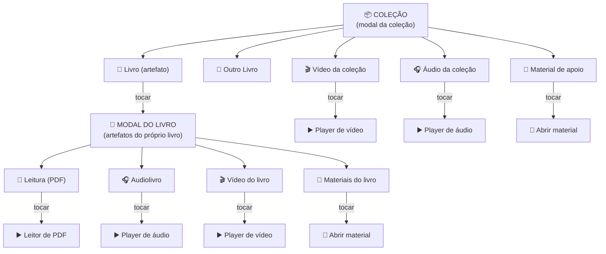

# Regra de Negócio — Coleção × Artefatos

> Referência oficial do modelo de **Coleção**, seus **artefatos** e a navegação até os players.
> Fonte: alinhamento de produto (2026-06-13).

## Conceito

Uma **Coleção** é um agrupamento temático. Dentro dela existem **artefatos**:

- **Livros** (pode ter mais de um),
- **Vídeos** da coleção,
- **Áudios** da coleção,
- **Materiais de apoio**.

Ao **tocar num artefato**, abre-se **o artefato dele**:

- Artefatos de **mídia direta** (vídeo/áudio/material da coleção) → abrem o **player/visualizador** correspondente.
- Um **Livro** → abre **o modal do livro**, que por sua vez contém a **hierarquia de artefatos do próprio livro**: **Leitura (PDF)**, **Audiolivro**, **Vídeo do livro** e **Materiais**. Cada um, ao ser tocado, abre seu player.

Ou seja: **os assets de um livro viajam com o livro**. Eles **não** ficam soltos no nível da coleção — aparecem **dentro do modal do livro**.

## Diagrama

## Estado atual × esperado (gap conhecido)

| Etapa | Esperado (esta regra) | App hoje |
|---|---|---|
| Abrir a coleção | Modal da coleção mostrando o livro | ✅ |
| Tocar no livro | Abre **o modal do livro** (Leitura · Audiolivro · Vídeo · Materiais) | ❌ pula o modal do livro e abre **direto o leitor de PDF** |
| Resultado | Usuário escolhe ler / ouvir / assistir | ❌ audiolivro e vídeo do livro ficam inacessíveis nesse fluxo |

**Correção:** o toque no livro dentro da coleção deve abrir **o modal do livro** (este nível intermediário do diagrama), de onde o usuário escolhe o formato.

## Atenção de UX — evitar modal-sobre-modal

Abrir o modal do livro **por cima** do modal da coleção gera **modal empilhado** (ruim: z-index, "voltar" confuso, escurecimento sobre escurecimento).

Solução adotada como direção: **modal deslizante (drill-down)** no mesmo container — ao aprofundar (coleção → livro → player) a tela **desliza da direita pra esquerda**; ao voltar, desliza de volta. É o padrão que a Apple usa no iPad (push de navegação dentro de um sheet, não modais empilhados). Detalhamento e plano em [Backlog — Modal deslizante](../roadmap/backlog-modal-deslizante).
