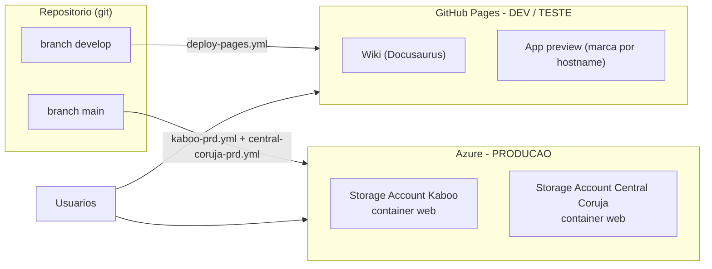
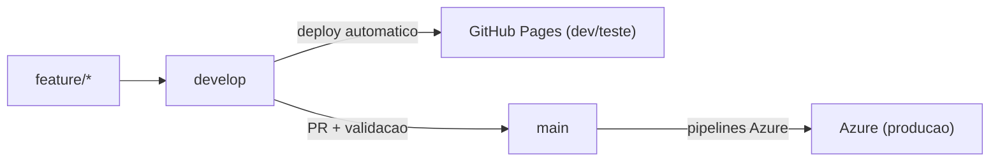
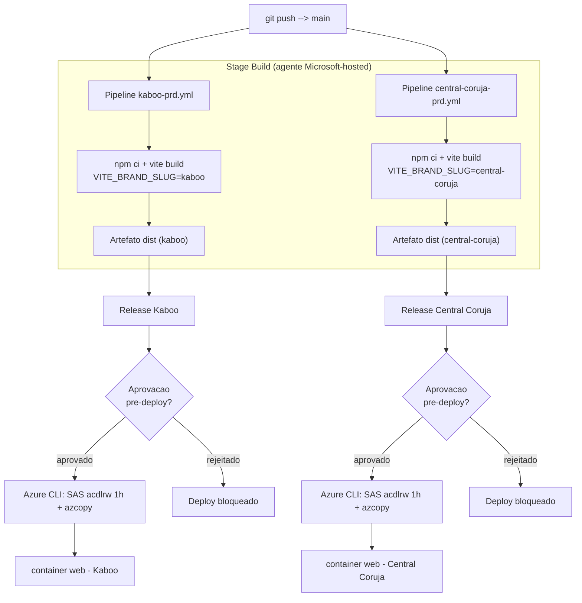
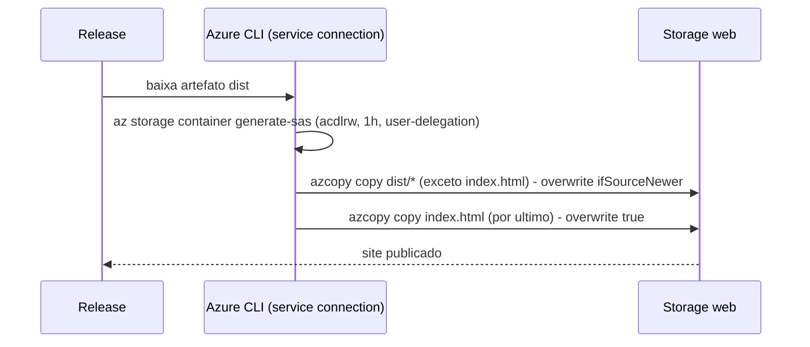
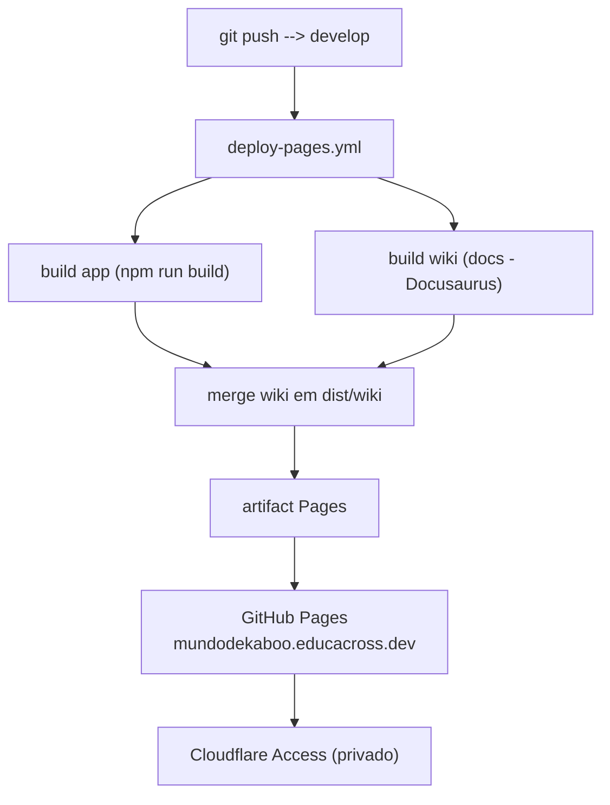
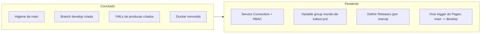

Estratégia de ambientes para a migração a produção.

Decisão de negócio: **GitHub Pages** cobre desenvolvimento, teste e a wiki;
**Azure Storage (static website)** hospeda **apenas produção** das duas marcas.

O app é uma **SPA estática** (Vite + React). A marca é resolvida em **tempo de
build** por `VITE_BRAND_SLUG` (`kaboo` | `central-coruja`) — mesmo código, dois
artefatos. Não há servidor de aplicação nem Docker.

## Visão geral (topologia)

| Ambiente | Onde | Branch | Trigger | Acesso |
|---|---|---|---|---|
| **Wiki** | GitHub Pages | `develop` | push | Cloudflare Access |
| **DEV / Teste** | GitHub Pages | `develop` | push | Cloudflare Access |
| **Produção — Kaboo** | Azure Storage `$web` | `main` | pipeline → Release | público |
| **Produção — Central Coruja** | Azure Storage `$web` | `main` | pipeline → Release | público |

## Estratégia de branches

- **`develop`** — branch de trabalho. Todo push publica no GitHub Pages
  (dev/teste + wiki). Pode conter artefatos de debug locais (ignorados).
- **`main`** — branch de produção, **limpa** (higienizada). Cada push dispara o
  build de produção no Azure DevOps. Promoção real ao `$web` passa por
  aprovação no Release.

## Fluxo de produção (Azure)

Push na `main` → pipeline faz o build e **publica o artefato** (não sobe nada
direto). Um **Release com aprovação** consome o artefato e faz o deploy.

**Por que separar build (pipeline) de deploy (Release)?** O artefato é o gate:
nada chega em produção sem aprovação explícita no Release.

## Detalhe do deploy (Release → `$web`)

A task **Azure CLI** do Release roda `release-deploy-web.sh`. A ordem do azcopy
é proposital: o `index.html` sobe **por último**, garantindo que ele só passe a
ser servido depois que todos os assets que referencia já estejam no storage.

:::note
SAS de **user-delegation** (`--auth-mode login --as-user`): sem account key.
Requisito: o Service Principal da Service Connection precisa do papel
**Storage Blob Data Contributor** no Storage Account.
:::

## Fluxo dev/teste (GitHub Pages)

No Pages o app e a wiki convivem no mesmo site (wiki em `/wiki/`). A marca é
resolvida por hostname (preview cai em `kaboo` por padrão).

## Variáveis de build por ambiente

| Variável | DEV/Teste (Pages) | Produção (Azure) |
|---|---|---|
| `VITE_BRAND_SLUG` | resolvido por hostname | `kaboo` / `central-coruja` (fixo no pipeline) |
| `VITE_PUBLIC_BASE` | `./` | `/` (raiz do `$web`) |
| `VITE_SUPABASE_URL` | secret do GitHub | variable group `mundo-de-kaboo-prd` |
| `VITE_SUPABASE_ANON_KEY` | secret do GitHub | variable group `mundo-de-kaboo-prd` |
| `VITE_PUBLIC_APP_URL` | domínio do Pages | domínio público da marca |

## Estado da transição

:::warning
O trigger do Pages só deve mudar para `develop` **após** o Azure prod estar
validado — senão um push na `main` deixa de atualizar o Pages enquanto o Azure
ainda não publica (gap em produção).
:::

## Arquivos no repositório

Os pipelines e o script de deploy ficam em `azure-pipelines/`:

- `azure-pipelines/README.md` — setup detalhado (Service Connection, RBAC, variable group, Release)
- `azure-pipelines/kaboo-prd.yml` / `azure-pipelines/central-coruja-prd.yml` — pipelines de build por marca
- `azure-pipelines/templates/build-app.yml` — build Vite reutilizável
- `azure-pipelines/release-deploy-web.sh` — deploy do Release (SAS + azcopy)
