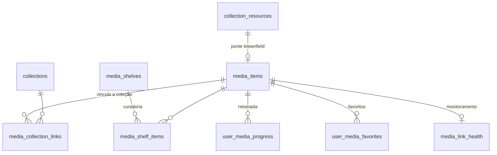

{/* Backbone de mídia privada — o "mini YouTube / mini Spotify" do produto. Fonte: supabase/migrations/20260425000100_private_media_backbone.sql e lib/api.ts. Vale para as duas marcas. */}

O backbone de mídia é a fundação que transforma o produto num **mini YouTube / mini Spotify privado**: catálogo próprio de vídeos, áudios, formações e materiais, com trilhos (shelves) curados, favoritos e retomada de reprodução — tudo atrás de RLS. Foi introduzido em `supabase/migrations/20260425000100_private_media_backbone.sql`.

> Estratégia de rollout (comentário da própria migration, `:1-8`): manter compatibilidade com `collection_resources` e `user_content_grants`, permitir mídia **com ou sem** vínculo a coleção, e introduzir catálogo, trilhos, favoritos e progresso por item.

## O item de mídia — `media_items`

`media_items` (`:88-124`) é a entidade central. Todo item pertence a um **hub**, tem um **kind**, um **provider** e um **access_mode**. Os enums definem o vocabulário fechado do sistema (`:11-87`):

| Enum | Valores | Significado |
|------|---------|-------------|
| `media_hub` | `videos`, `music`, `formations`, `materials` | Seção do app onde o item vive |
| `media_kind` | `video`, `audio`, `document`, `training` | Natureza do conteúdo |
| `media_provider` | `internal`, `youtube`, `external_audio` | Onde o arquivo está hospedado |
| `media_access_mode` | `active_subscription`, `linked_collection_grant` | Como o acesso é liberado |
| `media_status` | `draft`, `published`, `archived`, `failed` | Ciclo de vida |

### Restrições que garantem coerência da fonte

Dois CHECKs impedem itens inconsistentes (`:116-123`):

- `internal` **exige** `storage_bucket` + `storage_path` (arquivo no Supabase Storage privado);
- `youtube`/`external_audio` **exigem** `external_url`.

O vínculo opcional com o catálogo legado é `collection_resource_id` (`:94`), com índice único parcial garantindo no máximo um item por recurso (`:132-134`) — é a ponte brownfield para conteúdo que já existia em `collection_resources`.

## Modelo de dados

| Tabela | Papel | Fonte |
|--------|-------|-------|
| `media_items` | Catálogo de mídia | `:88-124` |
| `media_collection_links` | Vínculo N:N opcional item↔coleção, com `link_type` | `:135-147` |
| `media_shelves` | Trilhos/prateleiras curadas por hub (`hero`, `rail`, `playlist`, `continue_watching`) | `:148-163` |
| `media_shelf_items` | Itens dentro de um trilho, ordenados | `:164-174` |
| `user_media_progress` | Checkpoint de reprodução por usuário+item (posição, %, timestamps) | `:175-191` |
| `user_media_favorites` | Favoritos por usuário | `:192-200` |
| `media_link_health` | Saúde de links externos (status, http_code, latência) | `:201-211` |

### Trilhos (shelves) — a curadoria da vitrine

`media_shelves` + `media_shelf_items` são o que monta a home de cada hub. O `shelf_type` (`:73`) define o layout: `hero` (destaque), `rail` (carrossel), `playlist` e `continue_watching`. Só trilhos com `is_published = true` são visíveis a usuários comuns (`:348-352`).

### Progresso e favoritos — dados pessoais

`user_media_progress` guarda `last_position_seconds` e `progress_percent` (0-100) com constraint de faixa (`:180`), permitindo "continuar assistindo". A unicidade é por `(user_id, media_item_id)` (`:186`), então cada usuário tem no máximo um checkpoint por item — o registro é atualizado, não duplicado.

## Vínculo com coleção — o que `access_mode` significa na prática

O `access_mode` do item decide como o acesso é liberado, e conecta o backbone de mídia ao modelo de acesso por coleção/voucher:

- **`active_subscription`** — qualquer usuário com acesso temporal ativo vê o item. É o modo "conteúdo geral do hub".
- **`linked_collection_grant`** — o item só é liberado se o usuário tiver um `user_content_grants` **não expirado** para uma coleção vinculada via `media_collection_links`.

Essa lógica é enforçada na RLS de leitura (`:249-285`) e **repetida** na RLS de INSERT de progresso (`:418-445`), garantindo que ninguém registre progresso num item ao qual não tem acesso. Os detalhes completos da autorização estão documentado em [Acesso e RLS](../regras-negocio/tecnico-acesso-e-rls.md).

## Segurança de arquivo: storage privado e URLs

O design da migration é explícito (`:521-522`): `storage_bucket`/`storage_path` apontam para bucket **privado** do Supabase Storage e "URLs assinadas devem ser geradas em runtime". A intenção arquitetural é **signed URLs** de curta duração, nunca links públicos permanentes.

> Nota de estado atual: a resolução de URL de mídia em `lib/api.ts` (→ `getMediaHubCards()`) **já usa signed URLs**, em linha com a intenção de "signed URLs em runtime" da migration. Cada card resolve `getSignedUrl(item.storage_bucket, item.storage_path)` para o arquivo e `getSignedUrl(item.thumbnail_bucket, item.thumbnail_path)` para a thumbnail. `getSignedUrl` (`lib/storage.ts`) chama `supabase.storage.from(bucket).createSignedUrl(...)`, gerando URLs de curta duração a partir do bucket privado — não há `getPublicUrl` no caminho de mídia.

## RLS — resumo por tabela

Todas as sete tabelas têm RLS habilitada (`:241-247`). O padrão geral:

| Tabela | Leitura (usuário comum) | Escrita | Bypass |
|--------|------------------------|---------|--------|
| `media_items` | Só `published` + acesso satisfeito (`:249-285`) | admin/editor (`:286-305`) | service_role |
| `media_collection_links` | Se o item estiver `published` (`:312-323`) | admin/editor | service_role |
| `media_shelves` / `media_shelf_items` | Só `is_published` (`:348-352,377-388`) | admin/editor | service_role |
| `user_media_progress` | `user_id = auth.uid()` (`:413-462`) | próprio usuário (INSERT valida acesso ao item) | service_role |
| `user_media_favorites` | `user_id = auth.uid()` (`:463-483`) | próprio usuário | service_role |
| `media_link_health` | admin/editor apenas (`:484-494`) | admin/editor | service_role |

Ponto-chave: **catálogo** (`media_items`, links, shelves) tem bypass de admin/editor; **dados pessoais** (progress, favorites) não têm — são estritamente do dono. Isso é o mesmo princípio aplicado no resto do produto.

## Índices que sustentam a vitrine

Os índices foram desenhados para as queries de home e de retomada (`:125-200`):

- `idx_media_items_hub_status_published (hub, status, published_at DESC)` — listar itens publicados de um hub, mais recentes primeiro.
- `idx_media_shelves_hub_published_order (hub, is_published, order_index)` — montar os trilhos de um hub em ordem.
- `idx_user_media_progress_user_id (user_id, last_played_at DESC)` — "continuar assistindo" do usuário.
- Índice único parcial em `(storage_bucket, storage_path)` (`:129-131`) — evita dois itens apontando para o mesmo arquivo.

## Diferença entre marcas

O backbone é **idêntico** para Kaboo e Central Coruja — mesmas tabelas, mesma RLS. A diferença aparece só na **superfície**: a Central Coruja desabilita o hub de músicas via feature flag `menu.music` (ver [Modelo White-Label](./white-label-model.md)). O conteúdo e o esquema são compartilhados; o que muda é qual hub o menu expõe.

## Referências de código

- `supabase/migrations/20260425000100_private_media_backbone.sql:11-87` — enums do domínio
- `supabase/migrations/20260425000100_private_media_backbone.sql:88-134` — `media_items` + índices
- `supabase/migrations/20260425000100_private_media_backbone.sql:135-211` — links, shelves, progress, favorites, link_health
- `supabase/migrations/20260425000100_private_media_backbone.sql:249-285` — RLS de leitura de `media_items`
- `supabase/migrations/20260425000100_private_media_backbone.sql:418-445` — RLS de INSERT de progresso (revalida acesso)
- `lib/api.ts` → `getMediaHubCards()` — resolução de URL de mídia via `getSignedUrl` (arquivo e thumbnail)
- `lib/storage.ts` → `getSignedUrl()` — gera signed URL via `createSignedUrl` do bucket privado
