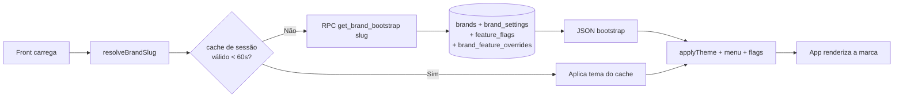
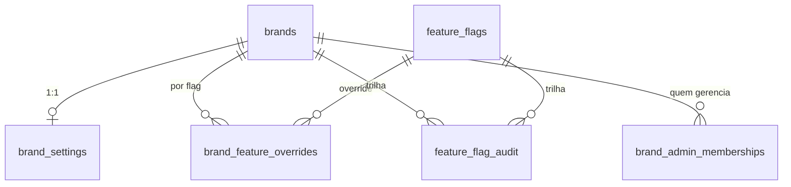

{/* Arquitetura white-label. Fonte: hooks/useBrandConfig.ts, lib/whiteLabelBranding.ts, supabase/migrations/20260426000100_white_label_brands.sql e 20260429000100_white_label_access_control.sql. */}

O produto é **um único código-fonte** servido como múltiplas marcas. Hoje existem duas marcas canônicas — **Kaboo** (`kaboo`, "Mundo de Kaboo") e **Central Coruja** (`central-coruja`) — e ambas rodam exatamente o mesmo produto. A diferença entre elas se resume a **tema visual + feature flags + menu**. Nada de bifurcação de código por marca.

> Princípio central: **single-brand deployment.** Cada deploy de front serve **uma** marca fixa. Não há troca de marca em runtime para o usuário final; a marca é resolvida uma vez, no bootstrap.

## Visão geral



## Resolução do slug da marca

A marca é resolvida por uma cadeia de precedência em `resolveBrandSlug` (`hooks/useBrandConfig.ts:147-179`). A ordem importa:

| Prioridade | Fonte | Uso |
|-----------|-------|-----|
| 1 | `?brand=` na querystring | Preview / teste pontual (`resolveBrandSlugFromSearch`) |
| 2 | **`VITE_BRAND_SLUG`** (env de build) | **Autoritativo em produção** — cada front é de uma marca |
| 3 | Preview override (localStorage) | Sessão de preview do admin white-label |
| 4 | Pathname (`resolveBrandSlugFromPathname`) | Roteamento por caminho, quando usado |
| 5 | Hostname (`coruja.` / contém `central-coruja`) | Fallback por domínio |
| 6 | `'kaboo'` | Default final |

Detalhe deliberado (`hooks/useBrandConfig.ts:155-159`): `VITE_BRAND_SLUG` fica **acima** do preview override justamente para que uma sessão de preview antiga não troque a marca silenciosamente num deploy de produção. Em produção o Azure injeta `VITE_BRAND_SLUG` fixo; a querystring só vence para debug consciente.

## O contrato de bootstrap — `get_brand_bootstrap`

Toda a identidade da marca chega em **uma chamada RPC** `get_brand_bootstrap(p_brand_slug)` (`supabase/migrations/20260426000100_white_label_brands.sql:186-263`). A função é `SECURITY DEFINER` e **segura para chamada anônima** — só retorna marcas com `is_active = true` e nunca expõe dados sensíveis.

O JSON retornado agrega quatro fontes:

```json
{
  "brand":    { "id": "...", "slug": "kaboo", "name": "Mundo de Kaboo" },
  "settings": { "display_name": "...", "primary_color": "#5D1F58", "...": "..." },
  "menu":     [ { "key": "videos", "label": "Vídeos", "route": "videos", "enabled": true, "order": 30 } ],
  "features": { "menu.music": { "enabled": false, "config": {} }, "...": {} },
  "version":  1,
  "updated_at": "..."
}
```

O cálculo dos flags efetivos é o coração da função (`:220-236`): para cada `feature_flags` global, aplica-se o override da marca se existir, senão o default global.

```sql
-- supabase/migrations/20260426000100_white_label_brands.sql:221-229
SELECT
    ff.key,
    COALESCE(bfo.enabled, ff.default_enabled) AS enabled,
    COALESCE(bfo.config,  ff.default_config)  AS config
FROM public.feature_flags ff
LEFT JOIN public.brand_feature_overrides bfo
       ON bfo.feature_flag_id = ff.id
      AND bfo.brand_id        = v_brand.id
```

## Cache de 60 segundos

O front cacheia o bootstrap em `sessionStorage` por **60 segundos**, chaveado por slug (`hooks/useBrandConfig.ts:354-374`). O cache serve para **eliminar o flash de tema** no boot: se houver cache válido, o tema é aplicado imediatamente e só depois o RPC revalida em background.

- Chave: `kaboo:brand_bootstrap_cache` (`:85`).
- Invalidação por slug: se o slug do cache não bate com o resolvido, ignora (`:359`).
- Invalidação por tempo: `Date.now() - ts > 60_000` (`:360-361`).
- Invalidação manual: `invalidateBrandBootstrapCache()` remove o cache e dispara o evento `kaboo:brand-bootstrap-refresh` (`:394-406`) — usado quando o admin publica novas settings.

Quando não há Supabase configurado ou a sessão está em modo mock, o bootstrap vem de `buildMockBootstrap` (`:284-325`), com defaults por slug em `MOCK_BRAND_OVERRIDES` (`:112-142`). O RPC real também degrada graciosamente para o mock em caso de erro (`fetchBootstrap`, `:376-392`).

## Modelo de dados white-label



| Tabela | Papel | Fonte |
|--------|-------|-------|
| `brands` | Marca (slug único, `is_active`) | `20260426000100:8-16` |
| `brand_settings` | Identidade visual + `menu_config` + `version` (1:1 com brand) | `:19-34` |
| `feature_flags` | Catálogo global de flags + defaults | `:37-45` |
| `brand_feature_overrides` | Estado efetivo por marca (upsert único por par marca/flag) | `:48-56` |
| `feature_flag_audit` | Trilha append-only de mudanças de flag | `:59-70` |
| `brand_admin_memberships` | Quem pode gerenciar qual marca | `:73-79` |
| `white_label_super_admins` | Super admin global (todas as marcas) | `20260429000100:2-8` |

### `menu_config` como saco de extensões

`brand_settings.menu_config` (JSONB) guarda mais do que o menu. `lib/whiteLabelBranding.ts` trata três sub-objetos convencionais dentro dele, cada um com seus extractors/mergers:

- `visual_identity` — `login_background_url`, `home_hero_image_url` (`whiteLabelBranding.ts:71-111`);
- `visual_identity.design_tokens` — `green_color`, `radius_xl/2xl/3xl` (`:80-92,113-130`);
- `brand_links` — `store_url`, `lead_capture_url`, `support_contact_url` (`:138-165`).

Esse padrão evita adicionar coluna nova a cada token de marca — extensões visuais entram como chaves no JSONB, normalizadas por `normalizeBrandSettings` (`useBrandConfig.ts:186-211`).

## Escrita segura de flags — `set_brand_feature_flag`

Alterar um flag de marca **nunca** é um UPDATE solto. Passa pela RPC transacional `set_brand_feature_flag` (`20260426000100:267-346`), que:

1. valida permissão via `can_manage_brand(p_brand_id)` (`:287-289`);
2. faz upsert do override (`:311-316`);
3. grava a auditoria obrigatória em `feature_flag_audit` com before/after (`:319-329`);
4. incrementa `brand_settings.version` (`:332-335`) — o que naturalmente invalida caches de 60s na próxima leitura.

## Autoridade: quem gerencia qual marca

`can_manage_brand` foi endurecida em `20260429000100:24-40`. Passa quem for **super admin white-label** (`is_white_label_super_admin`, `:12-23`) **ou** membro de `brand_admin_memberships` com `role IN ('admin','editor')`:

```sql
-- supabase/migrations/20260429000100_white_label_access_control.sql:30-39
SELECT
    public.is_white_label_super_admin(auth.uid())
    OR EXISTS (
        SELECT 1
        FROM public.brand_admin_memberships bam
        JOIN public.profiles p ON p.id = auth.uid()
        WHERE bam.brand_id = p_brand_id
          AND bam.user_id = auth.uid()
          AND p.role IN ('admin', 'editor')
    );
```

`list_white_label_manageable_brands` (`:73-112`) devolve as marcas que o usuário atual pode administrar, marcando o `access_scope` como `super_admin` ou `brand_admin` — é o que popula o seletor de marca no admin.

## Diferença concreta Kaboo × Central Coruja

Tudo abaixo é **dado**, não código. Vem do seed da migration (`20260426000100:347-426`) e dos defaults de mock (`useBrandConfig.ts:112-142`):

| Aspecto | Kaboo | Central Coruja |
|---------|-------|----------------|
| `primary_color` (seed) | `#5D1F58` | `#1B5E20` |
| `menu.music` | habilitado | **desabilitado** (override, `:406-416`) |
| `hero.parallax` | `false` | `true` com `{"mode":"subtle"}` (`:417-426`) |
| Hero default | — | `/coruja-hero-banner-v2.webp` (`useBrandConfig.ts:271-276`) |

> Atenção: há divergência entre as cores do **seed SQL** e os **defaults de mock** da Central Coruja (o mock usa `#0C1A34` como primária — `useBrandConfig.ts:117`). Em produção, a fonte de verdade é o `brand_settings` no banco, servido pelo RPC; o mock só vale sem Supabase.

## Como o app consome tudo isso

O hook `useBrandConfig` (`hooks/useBrandConfig.ts:410-493`) é a única porta de entrada. Ele expõe:

- `bootstrap` — o contrato completo;
- `isFeatureEnabled(key)` — checagem de flag (`:488-490`);
- `enabledMenuItems` — itens de menu filtrados por `enabled` **e** pelo flag `menu.<key>`, ordenados (`:478-486`);
- `loading` — estado de carga.

Regra de composição do menu (`:478-486`): um item aparece se `item.enabled` for verdadeiro **e** — se existir um flag `menu.<key>` — esse flag estiver habilitado. Se o flag não existir, confia-se no campo `enabled` do item.

## Referências de código

- `hooks/useBrandConfig.ts:147-179` — `resolveBrandSlug` (cadeia de precedência)
- `hooks/useBrandConfig.ts:354-374` — cache de 60s em sessionStorage
- `hooks/useBrandConfig.ts:376-392` — `fetchBootstrap` + fallback para mock
- `hooks/useBrandConfig.ts:410-493` — hook `useBrandConfig`
- `lib/whiteLabelBranding.ts:71-165` — extractors/mergers de `visual_identity`, `design_tokens`, `brand_links`
- `supabase/migrations/20260426000100_white_label_brands.sql:186-263` — `get_brand_bootstrap`
- `supabase/migrations/20260426000100_white_label_brands.sql:267-346` — `set_brand_feature_flag`
- `supabase/migrations/20260429000100_white_label_access_control.sql:12-112` — super admin, `can_manage_brand`, `list_white_label_manageable_brands`
