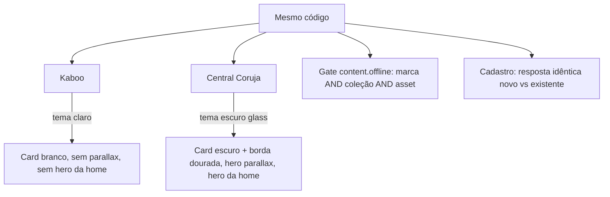

# Sessão 2026-07-08 — Tema Central Coruja + Admin White Label

**PR:** #81 · **Áreas:** consumidor (tema), admin white-label, segurança, testes E2E.

## Contexto

A Central Coruja é a segunda marca sobre o mesmo produto (mesmo código, tema
escuro imersivo + feature flags). Antes desta sessão o consumidor da Coruja tinha
inconsistências visuais entre a barra de busca, os cards e as bibliotecas de
mídia. Em paralelo, a tela de administração white-label acumulava controles
cosméticos e duplicados, e um ajuste anterior havia quebrado a garantia de
anti-enumeração no cadastro por voucher. Esta sessão unifica o tema no
consumidor, enxuga o admin, restaura a segurança do cadastro e cobre os fluxos
com testes BDD.

## 1. Unificação do tema Central Coruja (consumidor)

O objetivo foi que a Coruja usasse **um único card** coerente com as bibliotecas
de mídia escuras (glass), em vez de variações de layout por superfície.

- **Card3D unificado, tone-aware.** O `Card3D` passou a ter a prop
  `tone: 'default' | 'central-coruja'` (`components/Card3D.tsx:15`). O layout é o
  mesmo do Kaboo — capa **quadrada** (`aspect-square`) + textos abaixo dentro do
  card — mas a Coruja recebe card escuro glass e **borda dourada** na moldura da
  capa. A cor da borda é `#EA9A3B` (`components/Card3D.tsx:208`), com fundo
  `rgba(12,26,52,0.55)` e `backdrop-blur-xl` na moldura externa
  (`components/Card3D.tsx:200`). Título e subtítulo (tema/sinopse) ficam
  **dentro** do card, com cor clara `#FFF4E3` / `#D4DCF0` no tom Coruja
  (`components/Card3D.tsx:310`, `components/Card3D.tsx:314`).
- **Barra de busca glass com card stage-shell.** A superfície de busca da Coruja
  passou a usar o mesmo tratamento glass do palco (stage-shell), alinhada às
  bibliotecas de mídia — ver `screens/LibraryHubScreen.tsx` e `screens/HomeScreen.tsx`.
- **Tabs passivas e chips em glass.** As abas de navegação viraram passivas
  (sem competir com o conteúdo) e os chips de filtro **Idade/Ano** adotaram o
  mesmo vidro, mantendo contraste sobre o hero.
- **Título/tema dentro do card.** O overlay de título e tema deixou de flutuar
  sobre a capa e passou a viver na moldura do card (`components/Card3D.tsx:308-318`),
  o que dá contraste consistente independente da imagem de capa.

Ver a referência completa do componente em [Card3D](../components/card-3d.md).

## 2. Admin White Label (tela Configurações)

Arquivo: `screens/AdminWhiteLabelScreen.tsx`. A tela é **single-brand**: edita
sempre a marca desta instância (resolvida por `VITE_BRAND_SLUG`), sem seletor
(`screens/AdminWhiteLabelScreen.tsx:312-318`).

- **`content.offline` como gate autoritativo.** O download offline deixou de ser
  cosmético e virou a fonte de verdade. O toggle "Download Offline" grava a
  feature flag `content.offline` (`screens/AdminWhiteLabelScreen.tsx:921`), lida
  no hidrate em `contentOfflineEnabled` (`screens/AdminWhiteLabelScreen.tsx:280`).
  A decisão real de permitir download é **AND** de três camadas: **marca**
  (feature flag) **E** coleção **E** asset — ver `hooks/useOfflineDownload.ts` e
  `lib/access.ts`. O card não decide mais nada sozinho.
- **Remoção do card "Publicação".** O antigo card de Publicação era apenas
  cosmético e foi removido — a aba **Operações** ficou com Feature Flags
  (`screens/AdminWhiteLabelScreen.tsx:857-964`).
- **Família tipográfica por `<select>`.** Em vez de texto livre, a fonte da marca
  é escolhida num seletor com opções curadas: **Nunito** (padrão), **Poppins**,
  **Inter** e **Baloo 2** (`screens/AdminWhiteLabelScreen.tsx:40-45`,
  `screens/AdminWhiteLabelScreen.tsx:572-588`). Todas são carregadas via Google
  Fonts no `index.html`, então o valor escolhido sempre renderiza. O valor
  gravado é a stack CSS completa em `brand_settings.font_family`, aplicada via a
  variável `--font-family-sans` (ver [Marca / Tema](../marca-tema/index.md)).
- **Hero Parallax + Hero da home só na Central Coruja.** Os controles de
  parallax do hero e a imagem "Hero da home" só têm efeito na Coruja, então são
  escondidos no admin para as demais marcas via `isCentralCorujaBrand`
  (`screens/AdminWhiteLabelScreen.tsx:172`, campo em
  `screens/AdminWhiteLabelScreen.tsx:623`, bloco de modos em
  `screens/AdminWhiteLabelScreen.tsx:872`).
- **Remoção do toggle duplicado "Menu: Músicas".** O controle de menu de Músicas
  vivia em dois lugares; ficou só na aba **Menus**, que é data-driven a partir de
  `brandBootstrap.menu` (`screens/AdminWhiteLabelScreen.tsx:966-1020`).
- **FileUpload com `recommendedSize` + placeholder de preview.** O `FileUpload`
  ganhou a prop `recommendedSize` (`components/FileUpload.tsx:25`), que exibe a
  dimensão recomendada e um **placeholder de pré-visualização** quando ainda não
  há imagem (`components/FileUpload.tsx:200-213`, dica em
  `components/FileUpload.tsx:338-340`). Usado nos campos de Logo (512×512),
  Fundo do login (1920×1080) e Hero da home (2400×1200) —
  `screens/AdminWhiteLabelScreen.tsx:606`, `:619`, `:633`.

As 5 abas resultantes estão documentadas em
[Admin White Label](../screens/admin-white-label.md).

## 3. Fix de segurança — anti-enumeração no cadastro (#59 / C5)

Arquivo: `lib/api.ts` → `registerWithVoucher()`.

A garantia de **byte-identidade anti-enumeração** foi restaurada: um atacante não
pode distinguir "e-mail novo" de "e-mail já cadastrado" pela resposta do cadastro.
Quando o `signUp` do Supabase não abre sessão — tanto para uma conta genuinamente
nova (que exige confirmação de e-mail) quanto para um e-mail já existente (o
Supabase devolve um usuário ofuscado, sem sessão) — o método retorna **a mesma
resposta**: `requiresLogin: true`, `requiresEmailConfirmation: true` e a **mesma
mensagem** ("Conta criada. Confirme seu e-mail...") — as duas respostas byte-idênticas
estão em `lib/api.ts:1949-1955` (e-mail já registrado) e `lib/api.ts:1968-1976`
(signUp sem sessão), ambas dentro de `registerWithVoucher()`.

As duas respostas de cadastro devem ser **idênticas byte a byte**; qualquer
divergência (mensagem, flag ou campo extra) reabriria o vetor de enumeração de
usuários. A cobertura de regressão está em
`tests/consumer-voucher-signup-redeem.spec.ts`.

## 4. Suíte BDD Playwright (5 specs)

Foram adicionados/atualizados specs Playwright em estilo BDD cobrindo os fluxos
críticos das duas marcas. Ver [Testes](../testes/index.md) para a lista completa,
o mapeamento com o CI e como rodar:

- `tests/consumer-navigation-drilldown.spec.ts`
- `tests/player-playback-verification.spec.ts`
- `tests/admin-vouchers-management.spec.ts`
- `tests/consumer-voucher-signup-redeem.spec.ts`
- `tests/voucher-upsell.spec.ts` (atualizado)

## Arquivos tocados (código)

| Arquivo | Mudança |
|---------|---------|
| `components/Card3D.tsx` | Prop `tone`, card unificado, borda dourada Coruja, título/tema dentro do card |
| `components/FileUpload.tsx` | Prop `recommendedSize` + placeholder de preview |
| `screens/AdminWhiteLabelScreen.tsx` | 5 abas, gate `content.offline`, fonte por select, gating por marca, remoção de duplicados |
| `hooks/useOfflineDownload.ts` | Consome o gate autoritativo brand + collection + asset |
| `lib/access.ts` | Regras de elegibilidade de download |
| `lib/api.ts` | Anti-enumeração restaurada em `registerWithVoucher` |
| `screens/LibraryHubScreen.tsx`, `screens/HomeScreen.tsx` | Barra de busca glass, chips e tabs Coruja |
| `tests/*.spec.ts` | Suíte BDD Playwright |

## Impacto por marca

- **Kaboo:** card branco (tom `default`), sem Hero Parallax nem Hero da home
  (controles ocultos no admin). Fonte padrão Nunito.
- **Central Coruja:** card escuro glass com borda dourada `#EA9A3B`, barra de
  busca e chips em vidro, Hero Parallax e Hero da home disponíveis no admin.
- **Ambas:** download offline governado pelo gate autoritativo; cadastro por
  voucher com resposta anti-enumeração idêntica.
