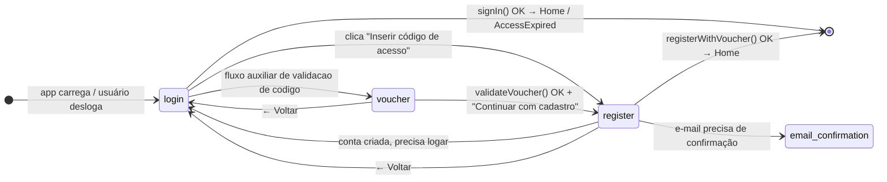
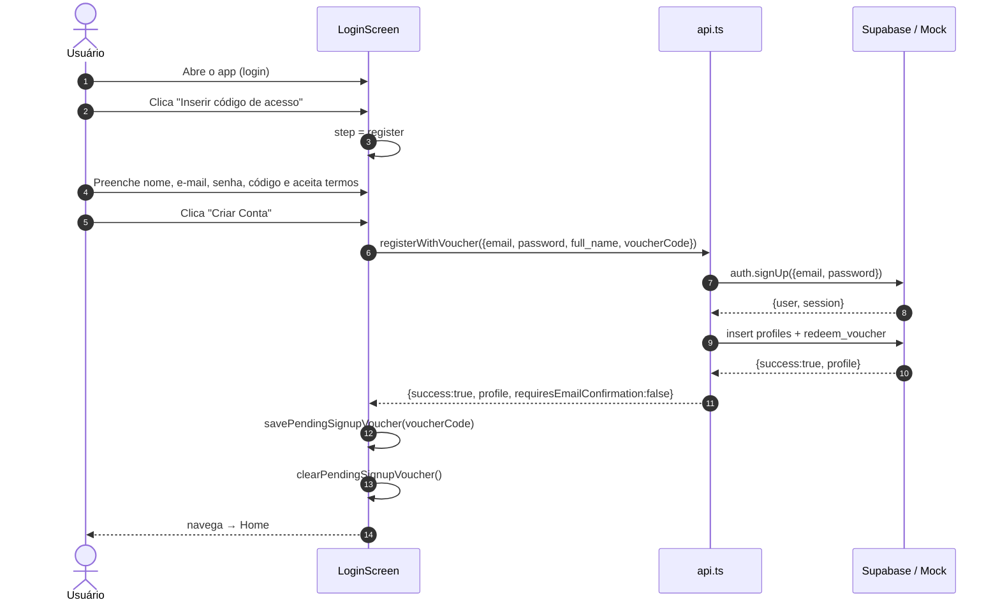
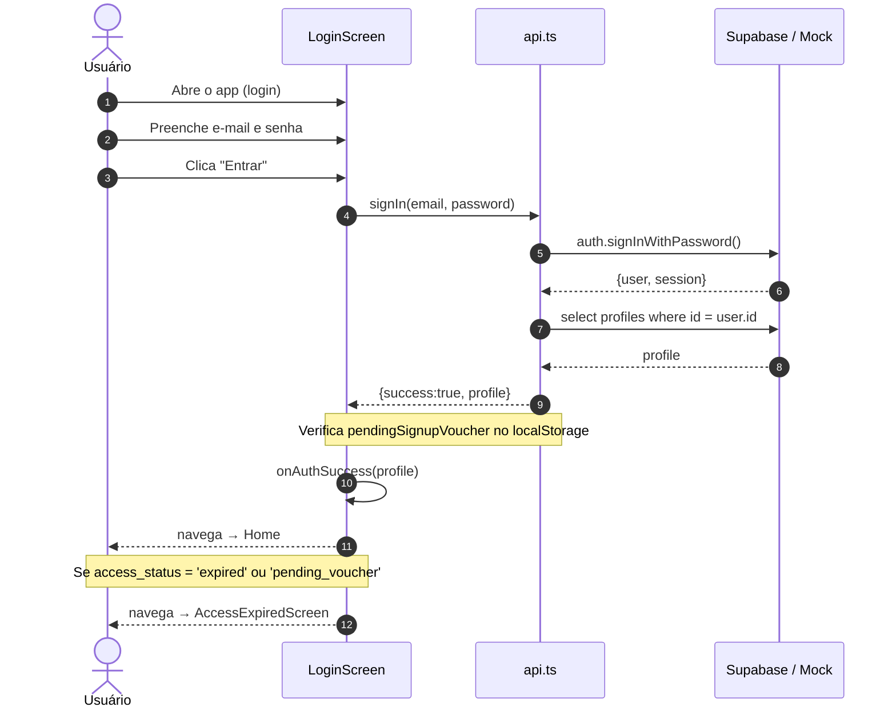
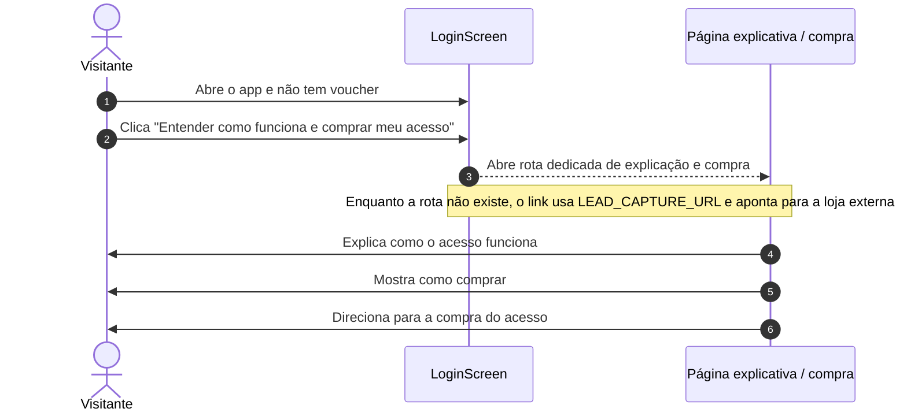
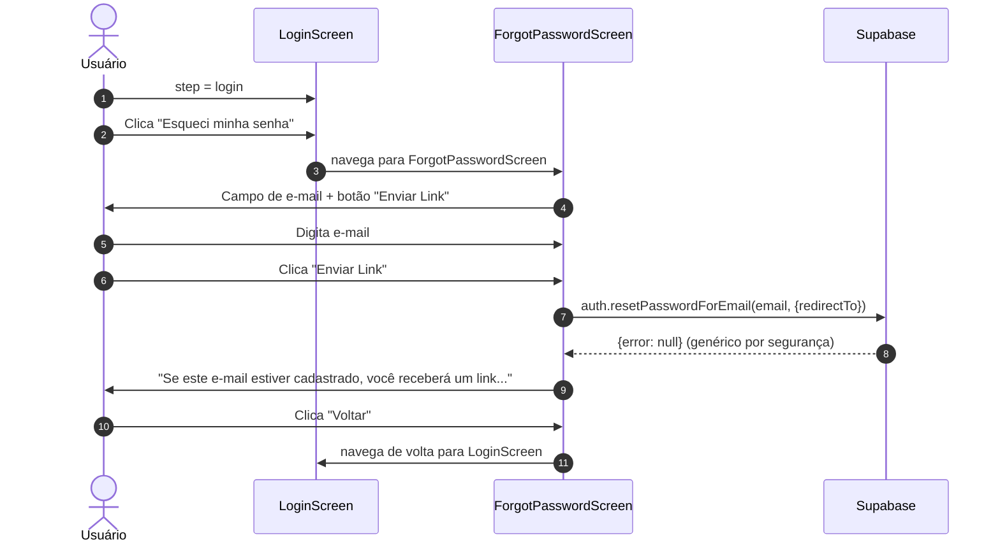

# Jornadas — Autenticação

> Screenshots capturados em viewport **1440×900 (desktop)**.

---

## 1. Visão Geral do Fluxo de Autenticação

O app abre diretamente na tela de login e organiza a entrada em três saídas objetivas:

- **"Entrar"** → Login direto para quem já tem conta ativa.
- **"Inserir código de acesso"** → Inicia o cadastro e coleta o voucher dentro do próprio formulário.
- **"Entender como funciona e comprar meu acesso"** → CTA secundário para visitantes que ainda não receberam voucher.

### CTA para quem ainda não tem voucher

Esse link deve evoluir para uma rota dedicada do produto, com uma página que explique como o acesso funciona, para quem o voucher é indicado e como comprar.

Enquanto essa rota não existe, a implementação usa `LEAD_CAPTURE_URL` e aponta para a loja externa.

### CTA contextual para quem precisa de ajuda com o código

O suporte não deve competir com o CTA de compra na tela inicial. Ele aparece apenas nas etapas em que o usuário está lidando com o código de acesso, como `voucher` e `register`.

Hoje a implementação usa `SUPPORT_CONTACT_URL` com contato direto por e-mail.

| Entry Screen |
|:---:|
|  |

---

## 2. Máquina de Estados — LoginScreen

A `LoginScreen` hoje opera com dois estados principais visíveis na jornada atual e uma etapa auxiliar de validação de voucher que permanece disponível no código.

### Estados

| Estado | Descrição | Step Dots |
|--------|-----------|-----------|
| `login` | Tela inicial atual, com login direto e CTA de primeiro acesso | — |
| `register` | Cadastro com nome, e-mail, senha e código de acesso | — |
| `voucher` | Etapa auxiliar de validação prévia do código | 1/2 |

---

## 3. Jornada 1A — Novo usuário com voucher

Fluxo completo de um usuário que recebeu um código de acesso e quer criar sua conta pela primeira vez.

### Screenshots — Jornada 1A

| Voucher vazio | Voucher validado | Formulário de cadastro |
|:---:|:---:|:---:|
|  |  |  |

---

## 4. Jornada 1B — Usuário existente com voucher

Não existe mais uma etapa dedicada de pré-login para esse caso.

- O usuário entra pela tela padrão de login.
- Se houver voucher pendente salvo do cadastro, o app tenta resgatar automaticamente no primeiro login.
- Se ele precisar informar um novo código com o acesso bloqueado, o resgate acontece na AccessExpiredScreen.

---

## 5. Jornada 2 — Login direto (sem voucher)

Fluxo de usuário com conta ativa que acessa o app normalmente.

### Screenshot — Jornada 2

| Login direto |
|:---:|
|  |

---

## 5A. Jornada 2A — Usuário sem voucher

Fluxo do visitante que não recebeu um código e precisa entender o modelo de acesso antes de comprar.

---

## 6. Jornada 7 — Recuperação de senha

Fluxo quando o usuário esquece a senha.

### Screenshot — Jornada 7

| Recuperação de senha |
|:---:|
|  |
