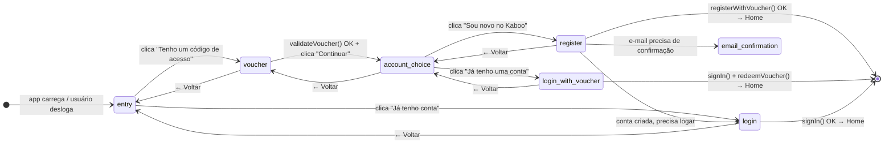
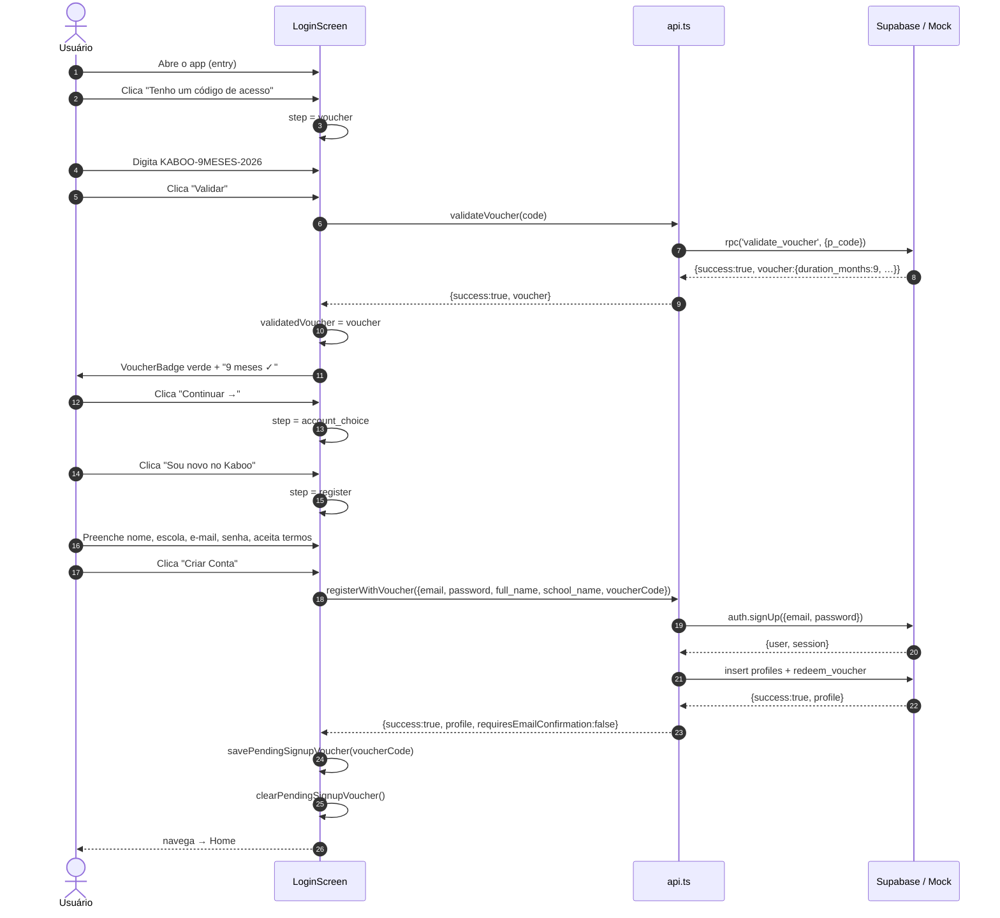
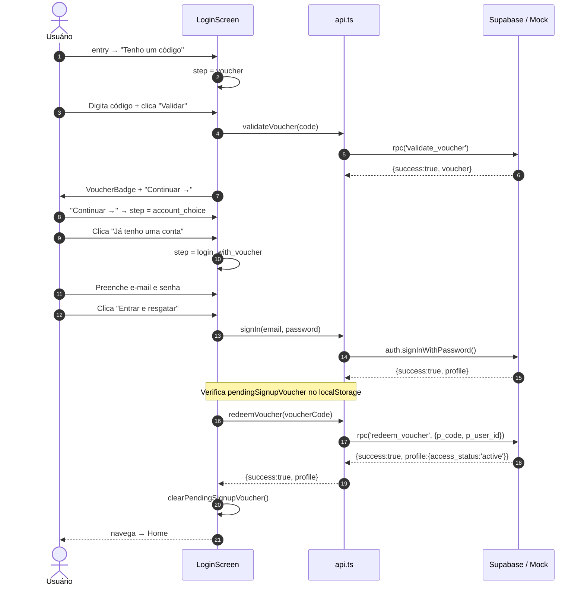
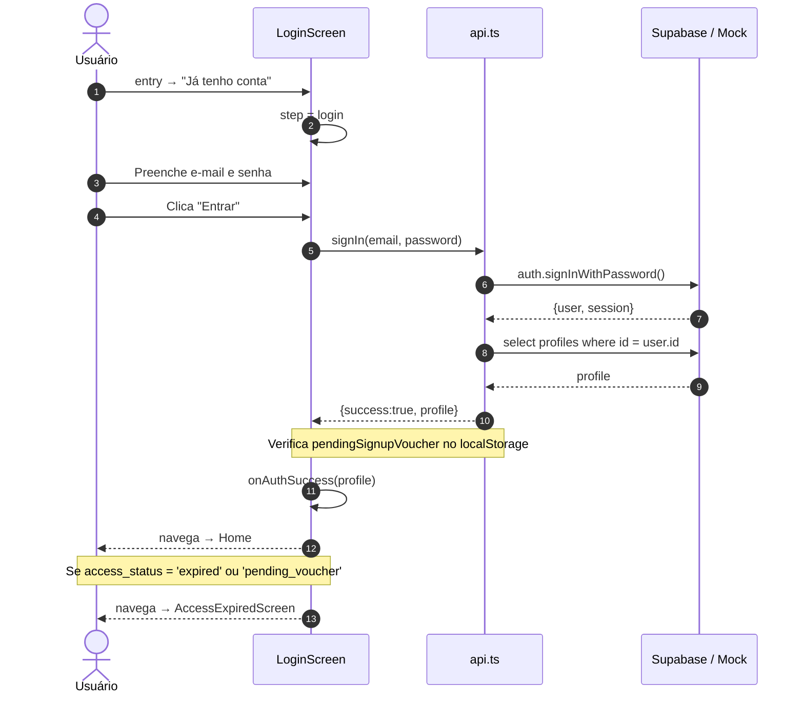
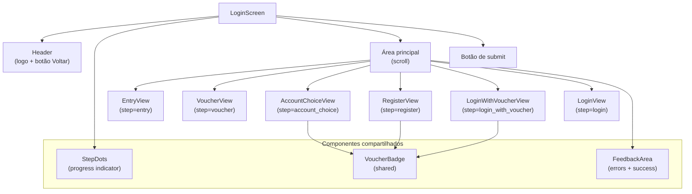
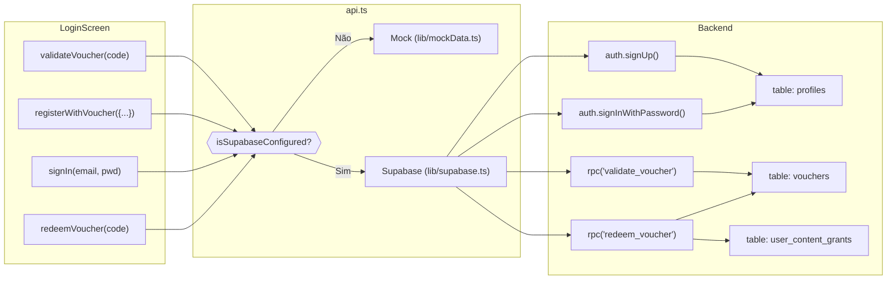
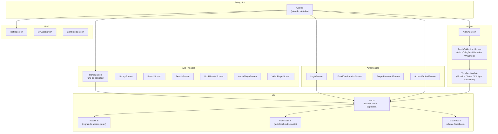
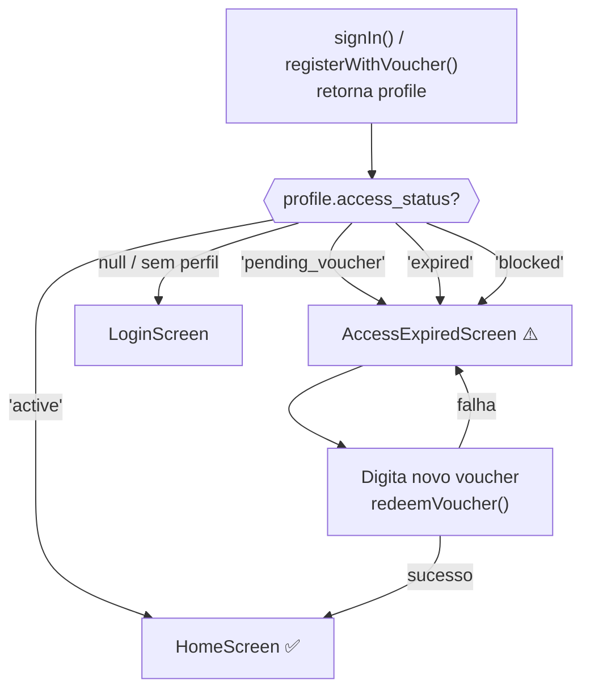

# Jornadas e Arquitetura

> Screenshots capturados em viewport **390 × 844 px** (iPhone 14 Pro Mobile).

---

## Índice

1. [Visão Geral do Fluxo de Autenticação](#1-visão-geral-do-fluxo-de-autenticação)
2. [Máquina de Estados — LoginScreen](#2-máquina-de-estados--loginscreen)
3. [Jornada 1A — Novo usuário com voucher](#3-jornada-1a--novo-usuário-com-voucher)
4. [Jornada 1B — Usuário existente com voucher](#4-jornada-1b--usuário-existente-com-voucher)
5. [Jornada 2 — Login direto](#5-jornada-2--login-direto-sem-voucher)
6. [Telas Capturadas](#6-telas-capturadas)
7. [Arquitetura de Componentes](#7-arquitetura-de-componentes--loginscreen)
8. [Fluxo de Dados — API Calls](#8-fluxo-de-dados--api-calls)
9. [Arquitetura Geral — Módulos do App](#9-arquitetura-geral--módulos-do-app)
10. [Fluxo de Acesso Pós-Login](#10-fluxo-de-acesso-pós-login)

---

## 1. Visão Geral do Fluxo de Autenticação

O app tem dois pontos de entrada principais na tela de login:

- **"Tenho um código de acesso"** → Fluxo de voucher (cadastro ou login + resgate)
- **"Já tenho conta"** → Login direto

  
  
<em>Tela de entrada</em>

---

## 2. Máquina de Estados — LoginScreen

A `LoginScreen` implementa uma máquina de estados linear com 6 passos. Cada transição é controlada pelos handlers `goBack()` e pelos fluxos de submit.

### Estados

| Estado | Descrição | Step Dots |
|--------|-----------|-----------|
| `entry` | Tela inicial — dois botões de escolha | — |
| `voucher` | Digitar e validar o código | 1/3 |
| `account_choice` | Novo ou usuário existente? | 2/3 |
| `register` | Formulário de cadastro | 3/3 |
| `login_with_voucher` | Login para resgatar o voucher | 3/3 |
| `login` | Login direto sem voucher | — |

---

## 3. Jornada 1A — Novo usuário com voucher

Fluxo completo de um usuário que recebeu um código de acesso via escola/gráfica e quer criar sua conta pela primeira vez.

### Screenshots — Jornada 1A

  

    
    
<em>Voucher vazio</em>

  

  

    
    
<em>Voucher validado</em>

  

  

    
    
<em>Escolha do perfil</em>

  

  

    
    
<em>Formulário de cadastro</em>

  

---

## 4. Jornada 1B — Usuário existente com voucher

Fluxo de um usuário que já tem conta no Kaboo e recebeu um novo voucher para resgatar.

  
  
<em>Login para resgatar o voucher</em>

---

## 5. Jornada 2 — Login direto (sem voucher)

Fluxo de usuário com conta ativa que acessa o app normalmente.

  
  
<em>Login direto sem voucher</em>

---

## 6. Telas Capturadas

Todas as telas foram capturadas em viewport **390 × 844 px** (iPhone 14 Pro).

### Autenticação

  

    
    
<em>Entry</em>

  

  

    
    
<em>Voucher (vazio)</em>

  

  

    
    
<em>Voucher (validado)</em>

  

  

    
    
<em>Escolha de perfil</em>

  

  

    
    
<em>Cadastro</em>

  

  

    
    
<em>Login c/ Voucher</em>

  

  

    
    
<em>Login direto</em>

  

### App Principal

  

    
    
<em>Home</em>

  

  

    
    
<em>Admin</em>

  

  

    
    
<em>Perfil</em>

  

---

## 7. Arquitetura de Componentes — LoginScreen

### Estado local do componente

| Estado | Tipo | Descrição |
|--------|------|-----------|
| `step` | `LoginStep` | Controla qual view é renderizada |
| `validatedVoucher` | `Voucher \| null` | Resultado de `validateVoucher()` |
| `loading` | `boolean` | Bloqueia double-submit |
| `errorMsg` | `string \| null` | Mensagem de erro |
| `successMsg` | `string \| null` | Mensagem de sucesso |
| `showContinueToHome` | `boolean` | Link safety net após falha de resgate |

### Persistência localStorage

| Chave | Propósito |
|-------|-----------|
| `kaboo_pending_signup_voucher` | Preserva o voucher entre cadastro e confirmação de e-mail |

---

## 8. Fluxo de Dados — API Calls

### Tratamento de erros

| Erro Supabase bruto | Mensagem exibida ao usuário |
|---------------------|----------------------------|
| `Invalid login credentials` | "E-mail ou senha incorretos." |
| `User already registered` | "Este e-mail já está cadastrado." |
| `Email not confirmed` | "Confirme seu e-mail…" → redireciona para `EmailConfirmationScreen` |
| `rate limit` | "Muitas tentativas. Por segurança, aguarde…" |

---

## 9. Arquitetura Geral — Módulos do App

---

## 10. Fluxo de Acesso Pós-Login

### Status de acesso

| `access_status` | Tela exibida | Ação disponível |
|----------------|-------------|-----------------|
| `active` | HomeScreen | Acesso total ao conteúdo |
| `pending_voucher` | AccessExpiredScreen | Inserir voucher |
| `expired` | AccessExpiredScreen | Inserir voucher de renovação |
| `blocked` | AccessExpiredScreen | Apenas visualização da mensagem |
| `null` | LoginScreen | Autenticar novamente |

---

## Referências Técnicas

| Arquivo | Responsabilidade |
|---------|----------------|
| `screens/LoginScreen.tsx` | UX de autenticação (state machine + formulários) |
| `lib/api.ts` | Facade que abstrai mock vs. Supabase |
| `lib/access.ts` | Regras puras de status de acesso |
| `lib/mockData.ts` | Auth local multiusuário + catálogo em memória |
| `lib/mockVoucherData.ts` | Content grants para o modo mock |
| `types.ts` | Tipos compartilhados |
| `supabase/migrations/` | Migration SQL: tabela `vouchers`, RPCs, `user_content_grants` |
