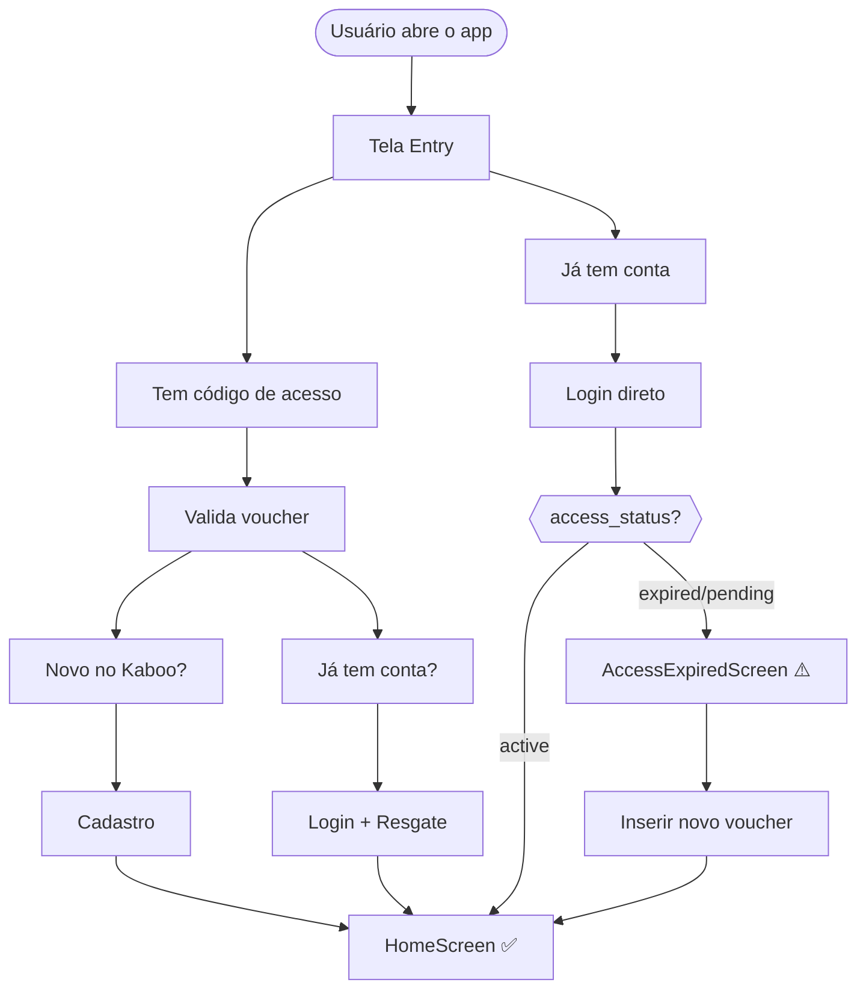

---
id: journeys
title: Jornadas do Usuário
sidebar_position: 1
---

# Jornadas do Usuário

> Screenshots capturados em viewport **1440×900 (desktop)**.

Esta seção documenta todas as jornadas do usuário no Mundo de Kaboo, do primeiro acesso ao uso avançado pelo admin.

---

## Navegação

| Seção | Descrição | Link |
|-------|-----------|------|
| **Autenticação** | Login, cadastro com voucher, recuperação de senha | [→ Autenticação](./auth) |
| **Pós-Login** | Home, busca, perfil, admin CMS, acesso expirado | [→ Pós-Login](./post-login) |
| **Referência Técnica** | Arquitetura de componentes, fluxo de dados, módulos | [→ Referência](./reference) |

---

## Visão Geral dos Fluxos

---

## Telas — Visão Rápida

| Entry | Home | Busca | Perfil |
|:---:|:---:|:---:|:---:|
|  |  |  |  |

---
