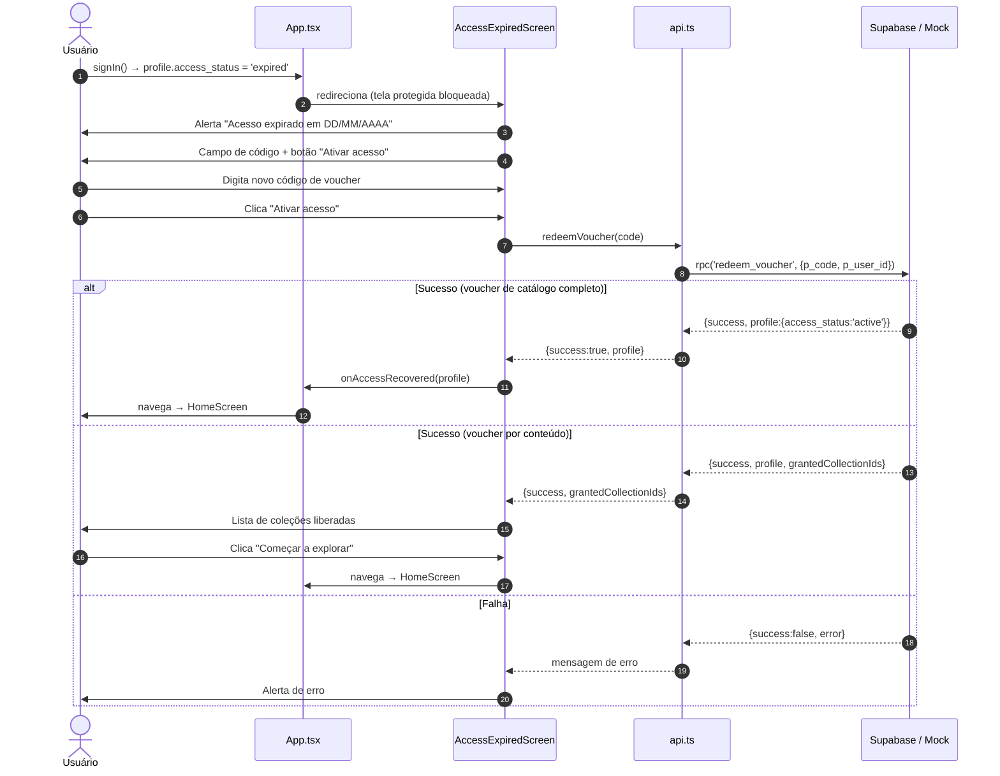
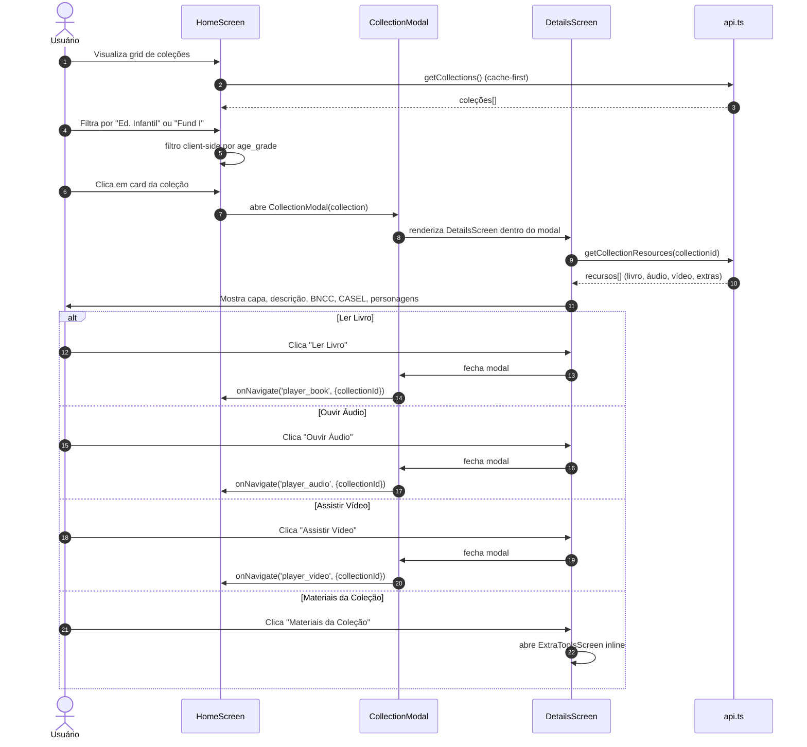
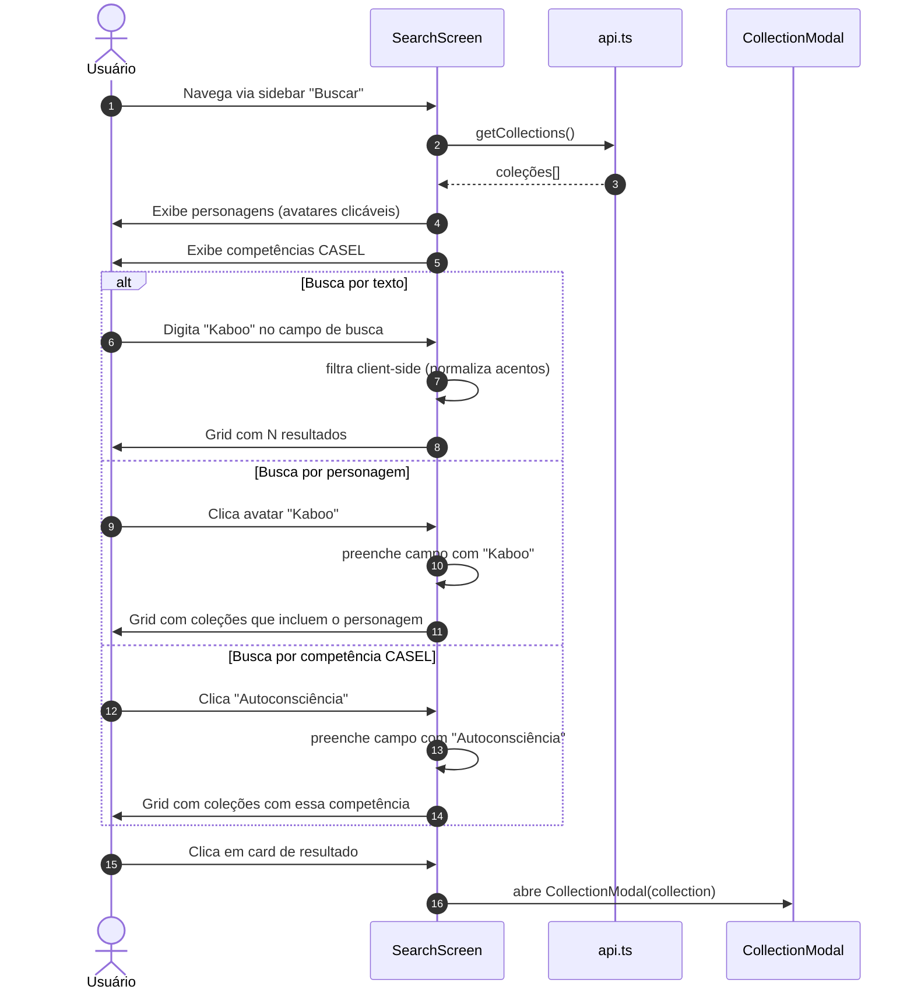
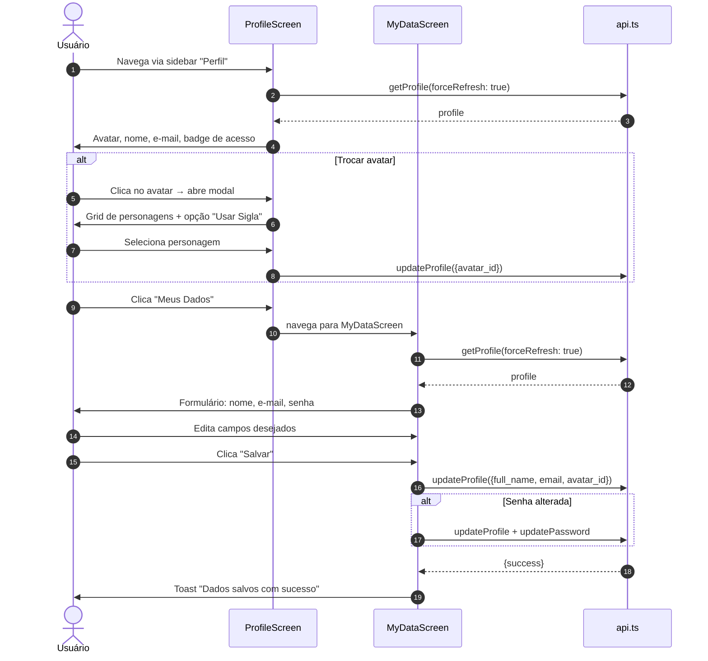
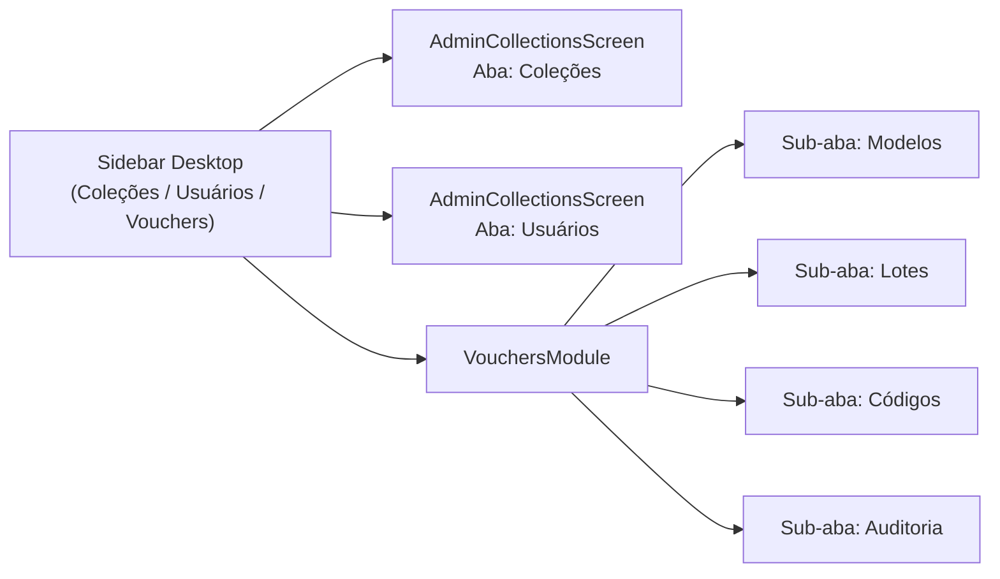
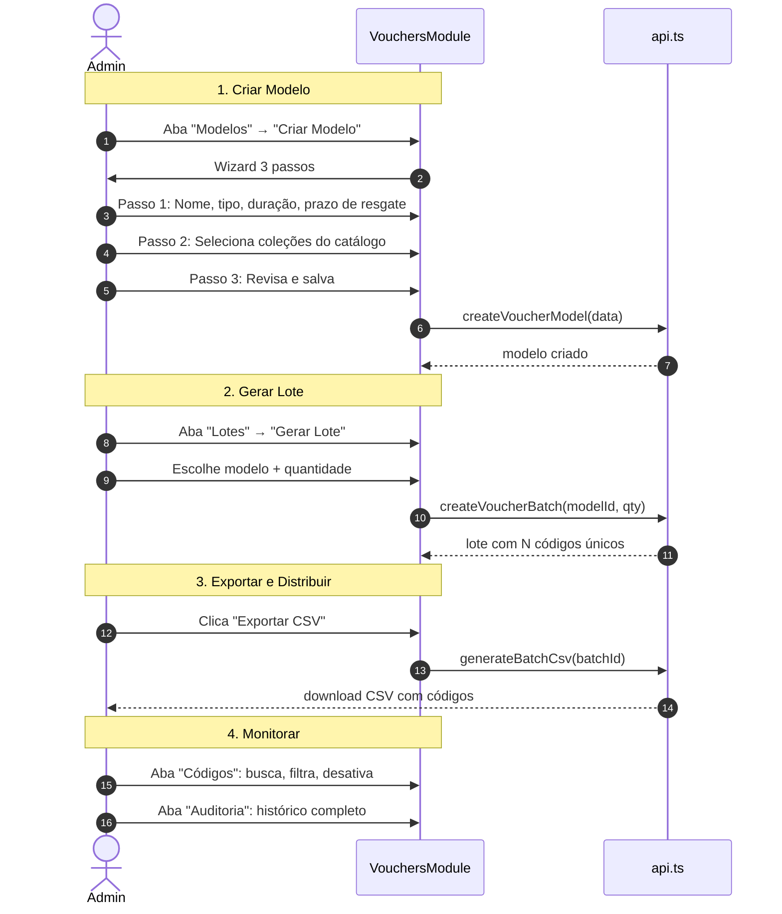

# Jornadas — Pós-Login

> Screenshots capturados em viewport **1440×900 (desktop)**.

---

## 1. Jornada 3 — Acesso expirado / Renovação

Fluxo de um usuário cujo acesso expirou (ou nunca teve voucher) e precisa informar um novo código para continuar.

| Acesso expirado |
|:---:|
|  |

---

## 2. Jornada 4 — Navegação principal (Home → Coleção)

Fluxo do professor navegando nas coleções, filtrando por nível, e abrindo o detalhe de uma coleção.

| Home (grid de coleções) | Detalhe da coleção (modal) |
|:---:|:---:|
|  |  |

---

## 3. Jornada 5 — Busca

Busca client-side unificada por título, personagem, BNCC, CASEL e competências.

| Busca (padrão) | Busca com resultados |
|:---:|:---:|
|  |  |

---

## 4. Jornada 6 — Perfil e Meus Dados

Fluxo do professor visualizando e editando seus dados pessoais.

| Perfil | Meus Dados |
|:---:|:---:|
|  |  |

---

## 5. Jornada 8 — Admin CMS

### Navegação do Admin

### Gerenciamento de Coleções e Usuários

O admin pode criar, editar e excluir coleções. Visualização de todos os usuários com resumo de status de acesso (total, ativos, pendentes, expirados).

### Módulo de Vouchers

| Coleções | Usuários | Vouchers |
|:---:|:---:|:---:|
|  |  |  |

---

## 6. Telas Capturadas

Todas as telas abaixo foram capturadas em viewport **1440 × 900 px** (desktop).

### Autenticação

| Entry | Voucher (vazio) | Voucher (validado) |
|:---:|:---:|:---:|
|  |  |  |

| Cadastro | Login Direto | Esqueci Senha |
|:---:|:---:|:---:|
|  |  |  |

### App Principal

| Home | Modal Coleção | Busca | Busca (resultados) |
|:---:|:---:|:---:|:---:|
|  |  |  |  |

| Perfil | Meus Dados | Acesso Expirado |
|:---:|:---:|:---:|
|  |  |  |

### Admin

| Coleções | Usuários | Vouchers |
|:---:|:---:|:---:|
|  |  |  |
