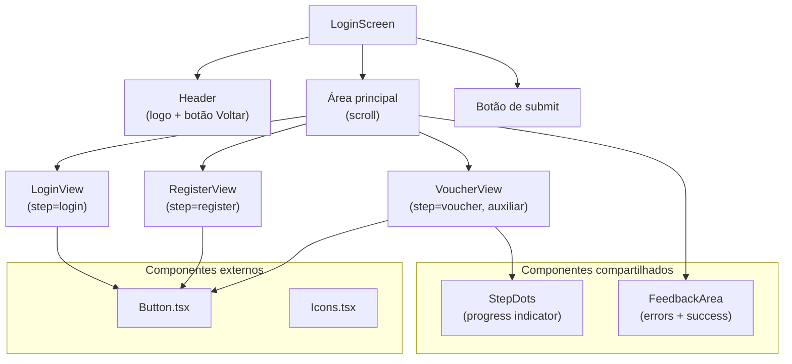
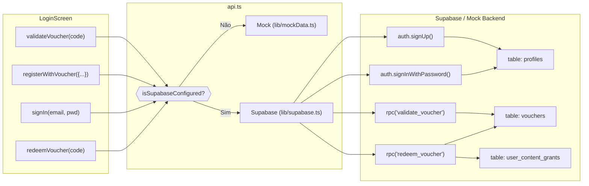
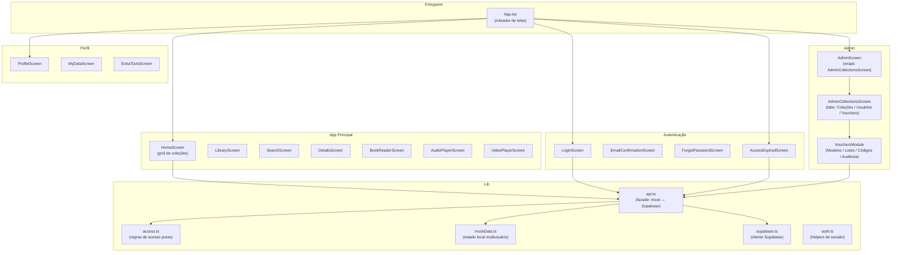
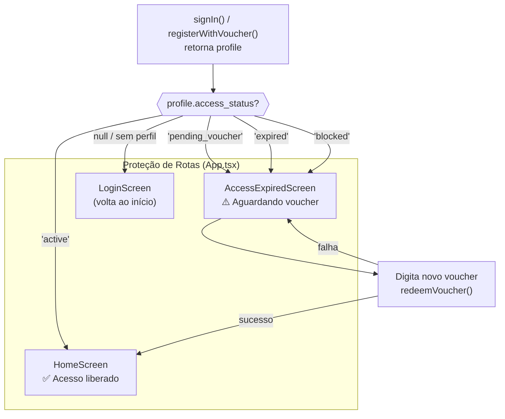

# Referência Técnica

---

## Arquitetura de Componentes — LoginScreen

### Estado local do componente

| Estado | Tipo | Descrição |
|--------|------|-----------|
| `step` | `LoginStep` | Controla qual view é renderizada |
| `validatedVoucher` | `Voucher \| null` | Resultado de `validateVoucher()` |
| `loading` | `boolean` | Bloqueia double-submit |
| `errorMsg` | `string \| null` | Mensagem de erro da FeedbackArea |
| `successMsg` | `string \| null` | Mensagem de sucesso da FeedbackArea |
| `voucherValidationMsg` | `string \| null` | Label de duração após validação |
| `email, password, fullName, voucherCode, confirmPassword` | `string` | Campos de formulário |
| `acceptedTerms` | `boolean` | Checkbox de política de privacidade |
| `showPassword, showConfirmPassword` | `boolean` | Toggle de visibilidade de senha |

### Persistência localStorage

| Chave | Valor | Propósito |
|-------|-------|-----------|
| `kaboo_pending_signup_voucher` | código do voucher | Preserva o voucher entre cadastro e confirmação de e-mail |

---

## Fluxo de Dados — API Calls

### Tratamento de erros

| Erro Supabase bruto | Mensagem exibida |
|---------------------|-----------------|
| `Invalid login credentials` | "E-mail ou senha incorretos." |
| `User already registered` | "Este e-mail já está cadastrado." |
| `Email not confirmed` | "Confirme seu e-mail para entrar…" → redireciona para `EmailConfirmationScreen` |
| `security purposes` / `rate limit` | "Muitas tentativas. Por segurança, aguarde…" |

---

## Arquitetura Geral — Módulos do App

---

## Fluxo de Acesso Pós-Login

| `access_status` | Tela exibida | Ação disponível |
|----------------|-------------|-----------------|
| `active` | HomeScreen | Acesso total ao conteúdo |
| `pending_voucher` | AccessExpiredScreen | Inserir voucher |
| `expired` | AccessExpiredScreen | Inserir voucher de renovação |
| `blocked` | AccessExpiredScreen | Apenas visualização da mensagem |
| `null` / indefinido | LoginScreen | Autenticar novamente |

---

## Arquivos-chave

| Arquivo | Responsabilidade |
|---------|----------------|
| `screens/LoginScreen.tsx` | Toda a UX de autenticação (state machine + formulários) |
| `lib/api.ts` | Facade que abstrai mock vs. Supabase |
| `lib/access.ts` | Regras puras de status de acesso (sem side-effects) |
| `lib/mockData.ts` | Auth local multiusuário + catálogo em memória |
| `lib/mockVoucherData.ts` | Content grants para o modo mock |
| `types.ts` | Tipos compartilhados (`UserProfile`, `Voucher`, `LoginStep`, …) |
| `supabase/migrations/` | Migration SQL: tabela `vouchers`, RPCs, `user_content_grants` |
