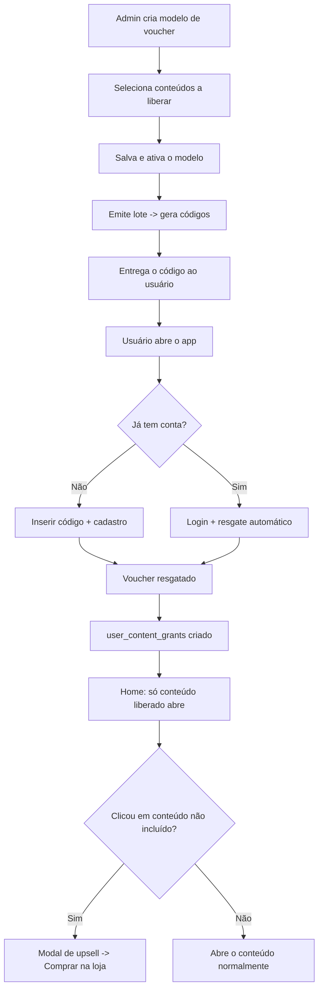
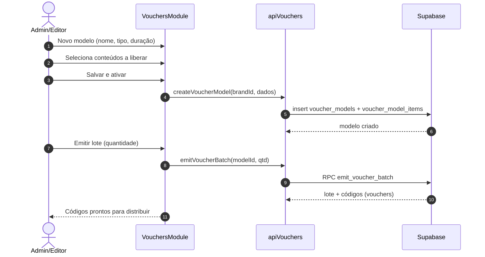
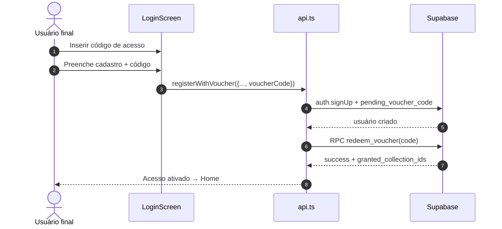
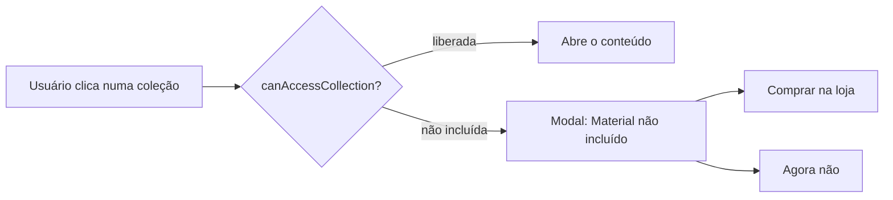

# Jornada do Voucher — Criação, Liberação e Acesso

> Tutorial completo de ponta a ponta: como o **admin/editor cria e emite** um voucher liberando conteúdo específico, e como o **usuário final entra, cadastra, resgata e navega** com acesso restrito ao que foi liberado.
>
> Screenshots em viewport **1440×900 (desktop)**.

---

## 1. Visão geral

O Mundo de Kaboo usa um modelo de **acesso por conteúdo**: um voucher não libera "tudo", libera **exatamente as coleções selecionadas** no momento da criação.

São duas camadas de acesso:

| Camada | Pergunta que responde | Onde fica |
|--------|------------------------|-----------|
| **Temporal** | O acesso está ativo, pendente ou expirado? | `profiles.access_status` / `access_expires_at` |
| **Por conteúdo** | Quais coleções esse usuário pode abrir? | `user_content_grants` |

Regra de bloqueio (`canAccessCollection`):

- **Sem grants** → acesso total (modo legado).
- **Com grants** → acesso **apenas** às coleções liberadas; o resto cai no **modal de upsell** (degustação → "Comprar na loja").

### Papéis

| Papel | O que faz na jornada |
|-------|----------------------|
| **Admin / Editor** | Cria o modelo de voucher, seleciona os conteúdos, emite o lote de códigos |
| **Usuário final** | Recebe um código, cadastra/loga, resgata e passa a acessar o conteúdo liberado |

### Fluxo de ponta a ponta



---

## 2. Parte A — Admin/Editor: criar e liberar o voucher

### A.1 — Abrir o módulo de Vouchers

No painel de **Administração**, abra **Vouchers**. O módulo tem um cabeçalho **"Vouchers"** (PageHeader, consistente com o design system) acima de 4 abas: **Modelos**, **Lotes**, **Códigos** e **Auditoria**.

| Módulo de Vouchers (Modelos) |
|:---:|
|  |

<!-- TODO(screenshot): recapturar voucher-admin-01-lista.png em 1440×900 mostrando o cabeçalho "Vouchers" (PageHeader) acima das 4 abas. -->

> Um **modelo** define *o que* o voucher libera e por *quanto tempo*. Um **lote** gera os **códigos** a partir de um modelo.

### A.2 — Novo modelo · Etapa 1: Configuração

Clique em **Novo modelo**. Na primeira etapa você define:

- **Nome interno** — identifica o modelo na gestão (ex.: "Degustação — 1 conteúdo").
- **Tipo de pacote** — Livro, Coleção, Vídeo, Áudio, Formação ou Material. *Organiza a oferta; não é ele que define o que é liberado.*
- **Duração do acesso** — por quantos meses o acesso fica ativo após o resgate.
- **Validade do código** *(opcional)* — data limite para o código ser resgatado.

| Etapa 1 — Configuração |
|:---:|
|  |

### A.3 — Novo modelo · Etapa 2: Selecionar conteúdos

Aqui está o coração da liberação: **selecione exatamente as coleções** que o voucher vai liberar. O que você marcar aqui é **o que o usuário final poderá acessar** — nada além disso.

| Etapa 2 — Selecionar conteúdos |
|:---:|
|  |

> ⚠️ **Importante:** o *tipo de pacote* organiza a oferta, mas **os conteúdos liberados são definidos apenas pelas seleções desta etapa**. Para liberar um único conteúdo, marque só ele.

### A.4 — Novo modelo · Etapa 3: Revisão e ativação

Revise o resumo e clique em **Salvar e ativar** (ou **Salvar rascunho** se ainda houver dúvida — os dados ficam congelados após a emissão de lotes).

| Etapa 3 — Revisão |
|:---:|
|  |

### A.5 — Emitir lote (gerar os códigos)

Abra o modelo e clique em **Emitir lote**. Informe a **quantidade de vouchers** e uma **finalidade** (nota interna). Ao confirmar, o sistema gera os códigos no formato `KABOO-XXXXXXXX-YYYYYYYY`, onde `XXXXXXXX` identifica o lote e `YYYYYYYY` é um **sufixo aleatório** (8 caracteres hex).

> 🔒 **Por que o sufixo é aleatório.** Anteriormente o sufixo era **sequencial** (`-0001`, `-0002`, …), o que permitia *enumeração*: quem conhecesse um código conseguia adivinhar os demais do lote. Desde junho/2026 o sufixo passou a ser aleatório (`gen_random_bytes` → ~4 bilhões de combinações por lote), inviabilizando o ataque. Migration: `supabase/migrations/20260629000000_fix_voucher_sequential_codes.sql`.

| Emitir lote |
|:---:|
|  |

### A.6 — Aba Lotes: acompanhar o consumo

Na aba **Lotes**, cada lote emitido aparece com uma **barra de consumo segmentada** e um breakdown textual logo abaixo:

> **X resgatados · Y disponíveis · Z desativados · de N**

Isso permite ver **num relance** quantos códigos já foram usados, quantos ainda estão livres e quantos foram desativados — sem precisar abrir a lista de códigos.

| Segmento | Significado |
|----------|-------------|
| **Resgatados** | Códigos já consumidos por um usuário |
| **Disponíveis** | Códigos ativos, ainda não resgatados |
| **Desativados** | Códigos invalidados (não podem mais ser resgatados) |
| **de N** | Total de códigos emitidos no lote |

> ℹ️ **Status do lote ≠ estado dos códigos.** O *status* do lote (ex.: "Gerado") descreve a emissão; o **breakdown de consumo** descreve o estado individual dos códigos dentro dele. São informações distintas e complementares.

<!-- TODO(screenshot): capturar novo screenshot da aba Lotes em 1440×900 mostrando a barra de consumo segmentada + breakdown "X resgatados · Y disponíveis · Z desativados · de N". -->

### A.7 — Aba Códigos: quem resgatou cada código

A aba **Códigos** lista todos os códigos gerados em uma tabela com as colunas:

| Coluna | Conteúdo |
|--------|----------|
| **Código** | O código do voucher (ex.: `KABOO-XXXXXXXX-A24C3ACE`) |
| **Status** | ativo / resgatado / desativado |
| **Lote** | Lote de origem do código |
| **Consumidor** | Nome de quem resgatou o código |
| **E-mail** | E-mail de quem resgatou o código |
| **Resgatado em** | Data/hora do resgate |

As colunas **Consumidor** e **E-mail** mostram **quem resgatou** cada código, fechando o ciclo de rastreabilidade entre o lote emitido e o usuário final.

<!-- TODO(screenshot): capturar novo screenshot da aba Códigos em 1440×900 mostrando as colunas Código, Status, Lote, Consumidor, E-mail, Resgatado em. -->

> 🔒 **Nota técnica/segurança.** Os dados de Consumidor/E-mail vivem em `public.profiles`, cuja RLS (fix DB-01) só permite cada usuário ler o **próprio** perfil — admins **não** leem perfis de terceiros pelo client. Para a tabela de Códigos, esses dados são servidos pela RPC **`get_voucher_consumers`** (`SECURITY DEFINER`), que expõe o mínimo (nome + e-mail) **apenas** para vouchers de marcas que o chamador administra (autorização por `can_manage_brand`). A função **não afrouxa** a RLS de `profiles` — a regra "cada usuário lê só o próprio perfil" continua valendo no acesso direto à tabela.
>
> Migration: `supabase/migrations/20260630000000_voucher_consumers_rpc.sql`.

### A.8 — Aba Auditoria: histórico de emissões e resgates

A aba **Auditoria** registra cada ação para rastreabilidade, incluindo:

- **Emissões de lote** (`batch_emitted`) — quando códigos são gerados a partir de um modelo.
- **Resgates** (`Resgate + grants` / `redeem_grants`) — quando um usuário resgata um código e os `user_content_grants` correspondentes são criados.
- Também: criação/atualização de modelos, mudanças de status e desativações.

Os registros podem ser filtrados por tipo de entidade (**Modelo**, **Lote**, **Voucher**).

### Sequência — lado do Admin



---

## 3. Parte B — Usuário final: entrar, cadastrar e resgatar

### B.1 — Tela de entrada

O app abre na tela de login com três saídas:

- **Entrar** — para quem já tem conta ativa.
- **Inserir código de acesso** — inicia o cadastro coletando o voucher.
- **Entender como funciona e comprar meu acesso** — para quem ainda não tem voucher (vai para a loja).

| Tela de entrada |
|:---:|
|  |

### B.2 — Inserir o código de acesso

Ao escolher **Inserir código de acesso**, o usuário informa o voucher. O sistema valida o código antes de seguir.

| Campo do voucher | Voucher validado |
|:---:|:---:|
|  |  |

### B.3 — Novo usuário (cadastro) ou usuário existente (login)

| Já tem conta no Kaboo? | Tela |
|---|---|
| **Não** → cadastro com nome, e-mail, senha + o código | Formulário de cadastro |
| **Sim** → login normal; o voucher pendente é resgatado no primeiro login | Login |

| Escolha de conta | Cadastro | Login com voucher |
|:---:|:---:|:---:|
|  |  |  |

### B.4 — Resgate automático

No cadastro, o código é salvo (`pending_voucher_code`) e resgatado assim que a conta é criada/autenticada. O resgate (RPC `redeem_voucher`):

1. marca o voucher como **resgatado**,
2. ativa o acesso (`access_status = active`, `access_expires_at = hoje + duração`),
3. cria os **`user_content_grants`** com exatamente os conteúdos do snapshot do lote.

### B.5 — Acesso pendente / expirado (renovação)

Se o usuário entra sem acesso ativo (`pending_voucher` ou `expired`), ele cai na **tela de acesso expirado**, onde pode informar um novo código para reativar.

| Acesso expirado / inserir voucher |
|:---:|
|  |

### Sequência — lado do Usuário



---

## 4. Parte C — Visão do usuário final (acesso restrito)

### C.1 — Home: liberado vs bloqueado

Na Home, o usuário vê o catálogo. As coleções **liberadas** abrem normalmente; as **não incluídas** ficam marcadas e direcionam para o upsell.

| Home do usuário com acesso por voucher |
|:---:|
|  |

### C.2 — Conteúdo liberado abre normalmente

Ao clicar em uma coleção **incluída** no voucher, o conteúdo abre direto no modal/detalhe da coleção (sem upsell), de onde o usuário acessa livro, áudios, vídeos e materiais vinculados.

| Conteúdo liberado abre normalmente |
|:---:|
|  |

### C.3 — Conteúdo não incluído → upsell

Ao clicar em uma coleção **fora** do voucher, aparece o **modal de degustação/upsell** — "Material não incluído" — com o botão **Comprar na loja**.

| Modal de upsell (material não incluído) |
|:---:|
|  |



---

## 5. Referência técnica

### Tabelas e RPCs

| Objeto | Papel |
|--------|-------|
| `voucher_models` | Modelo (o que libera, duração, validade) |
| `voucher_model_items` | Conteúdos liberados pelo modelo |
| `voucher_batches` | Lotes emitidos (com `model_snapshot`) |
| `vouchers` | Códigos individuais |
| `user_content_grants` | Concessões de conteúdo por usuário |
| `audit_log` | Trilha de auditoria |
| RPC `emit_voucher_batch` | Gera o lote + códigos |
| RPC `redeem_voucher(p_code)` | Resgata e cria os grants |
| RPC `get_voucher_consumers(p_voucher_ids)` | `SECURITY DEFINER`; retorna nome + e-mail de quem resgatou cada voucher, autorizado por `can_manage_brand`. Alimenta as colunas Consumidor/E-mail da aba Códigos sem afrouxar a RLS de `profiles`. |

### Permissões (RLS + GRANT)

As tabelas de voucher têm **RLS** escopada por marca (`can_manage_brand(brand_id)`) **e** dependem do **`GRANT`** de tabela para o papel `authenticated`. O Postgres avalia o `GRANT` **antes** da RLS — sem o GRANT, o admin recebe `permission denied for table` (HTTP 403) mesmo com a política correta.

> Migration `20260615120000_grant_voucher_tables_to_authenticated.sql` concede ao `authenticated` exatamente os privilégios que batem com as políticas (menor privilégio), mantendo a RLS como filtro de linhas.

### Regra de acesso (`canAccessCollection`)

```text
grants vazio       → acesso total (legado)
grants não-vazio   → acesso somente às coleções em grants; resto → upsell
```
