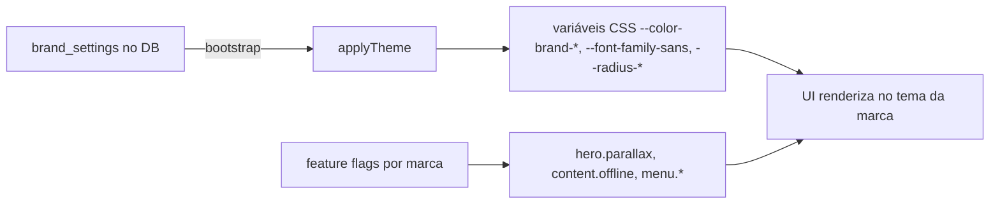

# Marca / Tema

O produto é **único**. **Kaboo** e **Central Coruja** são a mesma aplicação,
mesmo código — o que muda é o **tema** (tokens de cor, fonte, radius) e as
**feature flags** por marca. Não há fork de tela por marca; a diferença é
resolvida por variáveis CSS e por flags.

## As duas marcas

| Aspecto | Kaboo | Central Coruja |
|---------|-------|----------------|
| Personalidade | Claro, lúdico | Escuro, imersivo (glass) |
| Cor principal | `#5D1F58` (roxo) | `#0C1A34` (navy escuro) |
| Cor de destaque | `#4EA8DE` (azul) | `#F5A623` (laranja dourado) |
| Fundo | `#F9F5F9` | `#F5F7FA` |
| Card do consumidor | Branco (tom `default`) | Glass escuro + borda dourada `#EA9A3B` |
| Hero Parallax | — | Disponível (feature flag) |
| Hero da home | — | Disponível |

Definições dos temas em `design-system/tokens/themes.ts:36-96`.

## Tokens e aplicação

Cada tema (`BrandTheme`, `design-system/tokens/themes.ts:6-25`) descreve cores,
fonte opcional e tokens de radius/spacing. Um tema é aplicado por `applyTheme`
(`design-system/tokens/themes.ts:99-129`), que grava as variáveis CSS no
`documentElement`:

| Variável CSS | Origem | Uso |
|--------------|--------|-----|
| `--color-brand-primary` | `colors.primary` | Botões, links, títulos |
| `--color-brand-light` | `colors.light` | Hovers, variação clara |
| `--color-brand-bg` | `colors.bg` | Fundo suave da app |
| `--color-brand-accent` | `colors.accent` | Destaque secundário |
| `--color-brand-green` | `colors.green` | Sucesso / progresso |
| `--font-family-sans` | `font` (ou Nunito padrão) | Tipografia global |
| `--radius-xl` / `--radius-2xl` / `--radius-3xl` | `tokens.radius` | Raios de canto |

`applyTheme` também escreve os aliases `--color-kaboo-*` (legado) e define
`data-brand="{id}"` no root (`design-system/tokens/themes.ts:111-128`).

### De onde vêm os valores em produção

Em produção o tema não vem do objeto `themes` estático, e sim de
`brand_settings` (editável no [Admin White Label](../screens/admin-white-label.md)).
A **fonte** escolhida no admin é gravada em `brand_settings.font_family` como
stack CSS completa e aplicada em `--font-family-sans`. Fonte vazia cai no padrão
`DEFAULT_FONT_FAMILY = 'Nunito'` (`design-system/tokens/themes.ts:27`). As opções
curadas no admin são Nunito, Poppins, Inter e Baloo 2 — todas pré-carregadas via
Google Fonts no `index.html`, então qualquer escolha renderiza.

## O card por tom

O `Card3D` é tone-aware (prop `tone: 'default' | 'central-coruja'`) — ver
[Card3D](../components/card-3d.md). O layout é idêntico entre marcas; só as cores
mudam:

- **`default` (Kaboo):** card **branco**, borda suave `brand-primary/10`.
- **`central-coruja`:** card **glass escuro** (`rgba(12,26,52,0.55)` +
  `backdrop-blur-xl`) com **moldura de capa dourada** `#EA9A3B`
  (`components/Card3D.tsx:200`, `:208`).

## Glass vs branco — quando usar

A escolha entre superfície **glass** (translúcida escura) e **branca** é guiada
pelo tema da marca e pelo fundo em que a superfície vive:

- **Central Coruja (escuro/imersivo):** superfícies flutuantes sobre o hero
  escuro usam **glass** — barra de busca, chips de filtro (Idade/Ano), tabs
  passivas e os cards. Isso mantém a atmosfera imersiva e deixa o hero respirar.
- **Kaboo (claro):** superfícies **brancas** sobre fundo claro, com sombras
  suaves. Sem glass.

### Contraste — o card dá contraste sobre o hero

Na Coruja o desafio é legibilidade sobre um hero escuro e variável. A solução é
o próprio **card**: a moldura com **borda dourada** `#EA9A3B` e o fundo glass
recortam a capa contra o hero, e o texto vive **dentro** do card com cores claras
(`#FFF4E3` no título, `#D4DCF0` no subtítulo — `components/Card3D.tsx:310`,
`:314`). Assim o contraste não depende da imagem de capa nem de sombras pesadas;
o card é a unidade de contraste.

## Adicionar/ajustar uma marca

1. **Cores/fonte/radius:** editar no Admin → Identidade Visual (grava em
   `brand_settings`, invalida cache, re-hidrata).
2. **Capacidades:** ligar/desligar via feature flags (Operações/Menus).
3. **Comportamento exclusivo de marca** (ex.: hero parallax da Coruja) é gated no
   código por `slug` — ver `isCentralCorujaBrand` em
   `screens/AdminWhiteLabelScreen.tsx:172`.
