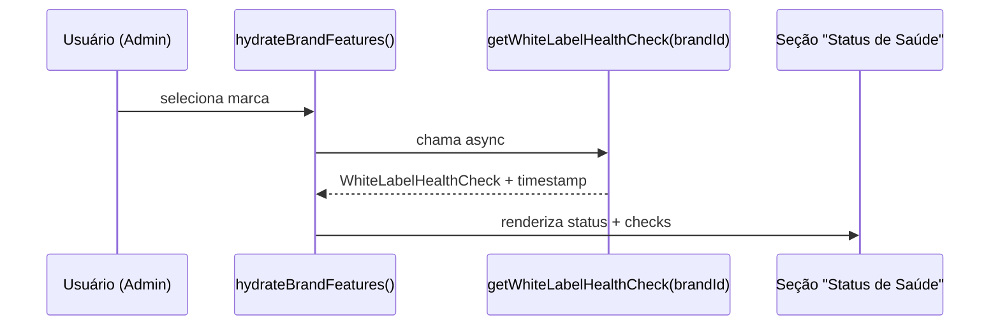

# Health Check Automático — White Label

{/* Migrado e reescrito de docs/HEALTH-CHECK-WHITE-LABEL.md. */}

O health check automático valida a integridade operacional de **cada marca** em tempo real. É
executado a cada carregamento da marca no painel Admin, verifica consistências críticas e gera
avisos/erros. Vale igualmente para Kaboo e Central Coruja.

## Checagens implementadas

### 1. Feature Flags

| Status | Condição |
|---|---|
| ✅ Pass | Pelo menos 1 feature flag habilitada. |
| 🟡 Warn | Nenhuma flag habilitada (marca vazia?). |
| 🔴 Fail | Erro ao carregar flags. |

**Por quê:** uma marca sem flags não faz sentido operacionalmente.

### 2. Rollout & Publicação

| Status | Condição |
|---|---|
| 🔴 Fail | Rollout em `general` **sem** nenhuma publicação registrada. |
| ✅ Pass | Rollout em `general` **com** publicação, OU rollout ainda em fase piloto/grupo. |

**Por quê:** colocar em `general` sem publicação viola o contrato de governança. Detecta violação
de pré-requisitos.

### 3. Alertas Externos

| Status | Condição |
|---|---|
| 🔴 Fail | Alertas habilitados mas `webhook_url` vazio. |
| 🟡 Warn | Último dispatch retornou erro. |
| ✅ Pass | Webhook configurado e pronto, OU alertas desabilitados. |

**Por quê:** detecta misconfiguração crítica que impediria alertas de funcionar.

### 4. Integridade de Métricas

| Status | Condição |
|---|---|
| 🟡 Warn | Mudanças registradas mas nenhuma flag ativa. |
| ✅ Pass | Métricas consistentes. |

**Por quê:** pode indicar dados legados ou inconsistência no evento de flag.

## Status geral

O status agregado (`healthCheck.status`) é um de:

- **`healthy`** — todos os checks passam.
- **`warning`** — um ou mais checks retornam `warn`.
- **`critical`** — um ou mais checks retornam `fail`.

## Contrato da função

```typescript
export async function getWhiteLabelHealthCheck(brandId: string): Promise<WhiteLabelHealthCheck>

// Retorno
{
  status: 'healthy' | 'warning' | 'critical',
  checks: [
    { name: 'Feature Flags', status: 'pass' | 'warn' | 'fail', message: string },
    { name: 'Rollout & Publicação', status: 'pass' | 'warn' | 'fail', message: string },
    { name: 'Alertas Externos', status: 'pass' | 'warn' | 'fail', message: string },
    { name: 'Integridade de Métricas', status: 'pass' | 'warn' | 'fail', message: string },
  ],
  timestamp: '2024-12-19T10:30:45.123Z'
}
```

## Fluxo de carregamento



## Comportamento em produção

- Roda **silenciosamente** durante a hidratação da marca.
- Falhas **não bloqueiam** o painel; apenas renderizam na UI.
- Status é **informativo** (não impede ações); o usuário pode ignorar avisos, mas recebe feedback
  claro (ícone colorido, label Saudável/Aviso/Crítico, timestamp e lista de checks).

## Extensões futuras

- **Rate limiting:** validar se o webhook não está sendo bombardeado.
- **Cache validation:** comparar `brand_settings` contra o cache.
- **Audit trail:** verificar lacunas na auditoria.
- **Webhook reachability:** testar conectividade antes de marcar como crítico.
- **Event ordering:** validar a ordem cronológica da timeline.
