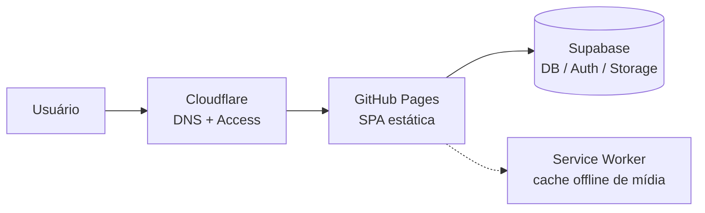

# Runbook Operacional — Mundo de Kaboo

{/* Migrado e reescrito de docs/RUNBOOK-OPERACIONAL.md (auditoria + runbook de 2026-06-15). */}

> Gate P0 de go-live: "Hardening operacional homologado".
> Stack: SPA estática (React/Vite) publicada no **GitHub Pages**, backend **Supabase** (DB/Auth/Storage), domínio `mundodekaboo.educacross.dev` atrás de **Cloudflare Access**.

Este runbook cobre a operação da plataforma. As **duas marcas** (Kaboo e Central Coruja) rodam
sobre o **mesmo backend Supabase** e o **mesmo código** — a diferença é tema + feature flags por
`brand_id`. Cada front é travado numa marca via `VITE_BRAND_SLUG` (ver `hooks/useBrandConfig.ts`).

## 1. Arquitetura operacional

- **Front:** build estático (Vite), sem servidor próprio. Não há endpoint de health da aplicação
  — a "saúde" do front = o shell carrega + Supabase responde.
- **Backend:** Supabase project `yevysgqlnhonhkczkyhu` (DB Postgres + Auth + Storage). É a única
  dependência runtime.
- **Marca:** resolvida por `VITE_BRAND_SLUG` no build; em produção (Azure/Pages) o valor é
  injetado fixo por front.

## 2. Deploy (CI/CD)

**Workflow:** `.github/workflows/deploy-pages.yml`. Dispara em **push para `main` ou `v1.1`**, ou
manualmente (`workflow_dispatch`).

Etapas: build do app (`npm run build`, `VITE_PUBLIC_BASE=./`, secrets
`VITE_SUPABASE_URL`/`VITE_SUPABASE_ANON_KEY`) → build da wiki (`/wiki/`) → merge
(`scripts/merge-pages-wiki.mjs`) → **smoke do artefato** (`scripts/smoke-pages-artifact.sh`) →
deploy Pages → **smoke do site publicado** (valida host `mundodekaboo.educacross.dev`, o
`title` da página e a wiki em `/wiki/`).

| Secret (GitHub) | Uso |
|---|---|
| `VITE_SUPABASE_URL`, `VITE_SUPABASE_ANON_KEY` | Build do front |
| `CLOUDFLARE_ACCESS_CLIENT_ID` / `CLOUDFLARE_ACCESS_CLIENT_SECRET` | Smoke-check passar pelo Cloudflare Access (opcional; se ausente, o smoke valida só o redirect) |

> O deploy é **direto para produção** — não há staging. Todo push em `main`/`v1.1` vai ao ar.
> Nota do cutover em andamento (2026-07): a virada para produção separa **merge** (só builda) de
> **Release manual**, que decide o que realmente sobe. Ver [Pra lançar / Go-live](../roadmap-historico/pra-lancar).

## 3. Rollback

Como o Pages publica sempre o último build:

1. **Reverter o commit** problemático (`git revert <sha>`) e push em `main` → CI republica o
   estado bom. **(Preferido.)**
2. Ou **re-disparar o workflow** em um commit anterior são (Actions → Deploy GitHub Pages → Run
   workflow → selecionar ref).
3. Se o problema for de dados/migration (não de front), rollback de front **não resolve** — ver §4.

## 4. Banco de dados / migrations

- Migrations versionadas em `supabase/migrations/`. Aplicadas em prod via Supabase (CLI
  `supabase db push` ou MCP `apply_migration`).
- ⚠️ **Sem staging:** migrations rodam direto em produção. Antes de aplicar qualquer DDL:
  1. **Backup/seguro:** confirmar PITR/backup do projeto Supabase ativo.
  2. Rodar em uma **branch do Supabase** quando a mudança for arriscada.
  3. Rodar `get_advisors` (security + performance) **depois** de DDL.
  4. Mudanças de alta severidade exigem autorização explícita do dono.
- **Rollback de migration:** escrever e aplicar a migration inversa (não há "undo" automático).
  Para GRANT/policy, reverter é re-aplicar o estado anterior.

## 5. Variáveis de ambiente / segredos

| Variável | Onde | Notas |
|---|---|---|
| `VITE_SUPABASE_URL` / `VITE_SUPABASE_ANON_KEY` | CI (secrets) + `.env.local` | Públicas por natureza (anon key) |
| `SUPABASE_SERVICE_ROLE_KEY` | **só local** (`.env.local`, gitignored) | NUNCA no front/CI público |
| `VITE_BRAND_SLUG` | `.env.local` / env do build | Trava o front numa marca |

## 6. Monitoramento / health checks (processo)

Não há APM. O processo de "health" combina:

- **Pós-deploy:** o smoke-check do CI valida shell + wiki. Se falhar, o deploy é marcado vermelho.
- **Banco (semanal e após DDL):** `get_advisors` security + performance (ver §10), `get_logs`
  (postgres/api/auth) para erros.
- **Manual rápido:** abrir `https://mundodekaboo.educacross.dev` (shell carrega?), logar, abrir uma
  coleção. Para smoke automatizado (incl. erros de console), rodar a suíte Playwright
  `npm run test:e2e`, que sobe o dev server em `127.0.0.1:4100` (ver `playwright.config.ts`).
- **Supabase Dashboard:** status do projeto (pausado? quota?), uso de DB/Storage/Auth.

O painel White Label ainda tem um **health check por marca** automático (feature flags, rollout,
alertas, métricas) — ver [Health Check White Label](./health-check-white-label).

## 7. Feature flags / kill switches

- Fonte: `feature_flags` (default global) + `brand_feature_overrides` (override por marca),
  resolvidos em `get_brand_bootstrap` → `useBrandConfig().isFeatureEnabled()`. Fallback em código:
  `DEFAULT_FEATURES`.
- **Desligar um módulo por marca (rápido):** White Label → features, ou RPC
  `set_brand_feature_flag(brand_id, key, enabled, config, reason)`. Ex.: desativar `module.vouchers`
  numa marca em incidente.
- Após mudar, o cache de bootstrap por sessão (`kaboo:brand_bootstrap_cache`) revalida;
  `invalidateBrandBootstrapCache(slug)` força refresh.

## 8. Offline

- **Service Worker** `public/sw.js` (cache `kaboo-offline-v1`), registrado em `index.tsx`.
  Intercepta **GET** de `*.supabase.co/storage/*` (mídia), estratégia **cache-first**; se offline e
  não cacheado → `503 "Conteúdo não disponível offline"`.
- Download/controle: `lib/offline.ts` (`offlineManager`).
- **Implicação operacional:** com Supabase fora, **mídia já baixada continua tocando** (servida do
  cache); o resto (auth, listagens) degrada. Atualizar o SW = bump `CACHE_NAME`.
- No Kaboo, o offline sobe como **interruptor-mestre desligado** por padrão (PR #81) — ligar o toggle
  no go-live. Ver [Pra lançar / Go-live](../roadmap-historico/pra-lancar).

## 9. Playbooks de incidente

| Sintoma | Diagnóstico → Ação |
|---|---|
| **App não abre (shell)** | É deploy ou domínio? Ver Actions (último deploy verde?) → se vermelho, rollback §3. Checar Cloudflare (DNS/Access). |
| **Usuário externo bloqueado** | Cloudflare Access exige `@educacross.com.br` (item G1). Ajuste é no Cloudflare, fora do código. |
| **Erro 403 / "permission denied"** | RLS **ou** GRANT. `get_logs(postgres)` mostra `permission denied for table X` (falta GRANT) vs `new row violates RLS` (policy). Precedente: vouchers (GRANT faltando) — ver migrations `20260615120000`/`20260615170000`. |
| **Resgate/criação de voucher falha** | `get_logs`, RPC `validate_voucher`, conferir GRANT/RLS das tabelas `voucher_*`. |
| **Supabase fora/lento** | Dashboard (status/quota). Front degrada; mídia offline ainda serve. Comunicar; sem failover de backend. |
| **Conteúdo não toca** | Mídia não cacheada + offline → 503 esperado. Online: verificar URL no Storage / bucket `collections`. |

Para incidentes específicos de White Label (rollback de flag por marca, isolamento), ver
[Incidentes White Label](./incidentes-white-label).

## 10. Status de homologação & pendências de hardening

**Sólido ✅:** deploy reprodutível com smoke-check automatizado; rollback simples (revert+push);
migrations versionadas; isolamento por marca homologado (RLS); offline de mídia; kill switches por
marca.

**Pendências (não-bloqueantes p/ go-live só-Kaboo, mas recomendadas):**

- 🟡 **Sem staging** — push = prod; migrations direto em prod. (Item de infra.)
- 🟡 **Sem error tracking** (Sentry/equivalente) — só `console`/`logger`. Sem visibilidade de erros
  de cliente em prod.
- ✅ **Advisors de segurança — parcialmente fechado (2026-06-15):** migrations `20260615190000` +
  `20260615191000` fixaram `search_path = public` nas 9 funções flagueadas e revogaram `EXECUTE` de
  `PUBLIC`/`anon` nas triggers (`handle_new_user`/`sync_profiles_email`/`handle_media_updated_at`) e
  nas RPCs admin (`set_brand_feature_flag`/`emit_voucher_batch`, mantidas só para `authenticated`).
  Verificado: funções seguem operando (RLS/bootstrap OK).
- 🟡 **Advisors de segurança — restante (por design ou dashboard):** algumas funções `DEFINER`
  seguem executáveis por `anon` **intencionalmente** (`get_brand_bootstrap`, `validate_voucher`,
  `redeem_voucher`, `can_manage_brand`, `is_white_label_super_admin` — usadas pré-login e/ou dentro
  de RLS); bucket público `collections` permite listagem (SEC-58 — ver
  [Pra lançar](../roadmap-historico/pra-lancar)); auth (OTP expiry > 1h, leaked-password protection
  off, MFA) — ajustar no **dashboard do Supabase**.
- 🟡 **Advisors de performance (WARN/INFO):** 39 `auth_rls_initplan`, 36 `multiple_permissive_policies`,
  22 FK sem índice, 5 índices não usados. Débito de performance para escala (dataset hoje é pequeno).
- 🟡 **Cloudflare Access** (G1) — config fora do código.
- 🟡 **Smoke de console:** hoje coberto pela suíte Playwright (`npm run test:e2e`, porta 4100 em
  `playwright.config.ts`). Não há script dedicado de validação de env.
