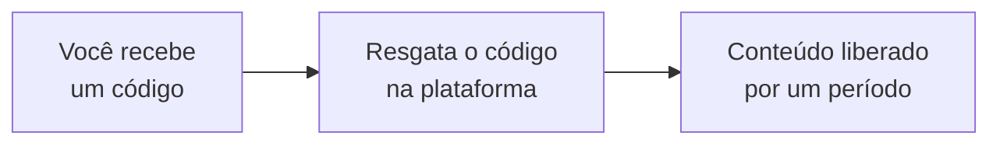

# Como funciona

Do código de acesso ao conteúdo, em passos simples.

## A ideia em três passos

1. **Você recebe um código de acesso** (chamado de *voucher*) — pela escola, por uma
   compra ou por uma campanha.
2. **Você resgata o código** dentro da plataforma.
3. **O conteúdo é liberado** para você usar por um período (por exemplo, 6 meses).

## Passo a passo para começar

1. **Abra a plataforma da sua marca** — acesse o site ou app da marca que você recebeu
   (Kaboo ou Central Coruja).
2. **Entre ou crie sua conta** — com e-mail e senha. No primeiro acesso você define a
   senha.
3. **Informe o código de acesso** — digite o voucher no campo indicado. Se você recebeu
   o código junto do cadastro, ele pode ser aplicado automaticamente.
4. **Pronto!** — o conteúdo liberado aparece na tela inicial. É só tocar para ler,
   ouvir ou assistir.

| Entrada (hoje: seleção de marca) | Código aplicado | Conteúdo liberado |
| --- | --- | --- |
|  |  |  |

:::note Como você chega na marca (hoje × produção)

O jeito de **entrar na marca** muda conforme a fase do projeto:

- **Hoje (ambiente de testes):** existe uma **tela inicial de seleção** onde você
  escolhe entre **Kaboo** e **Central Coruja** antes de entrar. As duas marcas convivem
  no mesmo endereço.
- **Em produção:** cada marca terá seu **próprio domínio e seu próprio aplicativo**
  (um site/app da Kaboo, um site/app da Central Coruja). Você já chega direto na marca
  pelo endereço — **sem a etapa de escolher a marca**. A partir daí, os passos 2 a 4
  são iguais.

:::

## O que o código libera

Cada código está ligado a um **pacote de conteúdos** e a um **prazo de acesso**:

- **O que libera** — pode ser um livro, uma coleção, vídeos, áudios, uma formação ou
  materiais. Isso é definido por quem emitiu o código.
- **Por quanto tempo** — o acesso vale por um período (ex.: 1, 3, 6, 9 ou 12 meses),
  contado a partir do resgate.
- **Validade do código** — alguns códigos têm uma data limite para serem resgatados.
  Depois dela, o código não pode mais ser usado. Resgate assim que puder.

## Navegando pelo conteúdo

- Use as **abas por nível** (Ed. Infantil, Fundamental) e os **filtros** por idade,
  personagem e tema para achar conteúdos.
- Toque num item para abrir o **leitor de livro**, o **player de áudio**, o **de vídeo**
  ou a **formação**.
- Se a sua marca permitir, você pode **baixar** conteúdo para usar **sem internet**.

## Quando o acesso termina

Ao fim do período, o acesso é pausado e a plataforma mostra uma tela avisando. Nessa tela
você pode:

- **Ativar acesso** — informar um novo código, se já tiver um; ou
- **Voltar para o login**.

Assim que um novo código válido for resgatado, tudo volta a ficar disponível.

O botão de **comprar na loja** aparece em outro momento: quando você **toca num conteúdo
que está fora do seu acesso atual**, a plataforma abre um aviso oferecendo adquirir o
pacote completo na loja da marca.

## Uma marca de cada vez

Seu acesso pertence à **marca** pela qual você entrou. Um código da Kaboo funciona na
Kaboo; um código da Central Coruja funciona na Central Coruja. Se aparecer um aviso de
marca incorreta, entre pela marca correspondente ao seu código.

Ainda com dúvidas? Veja as [perguntas frequentes](./faq.md).
