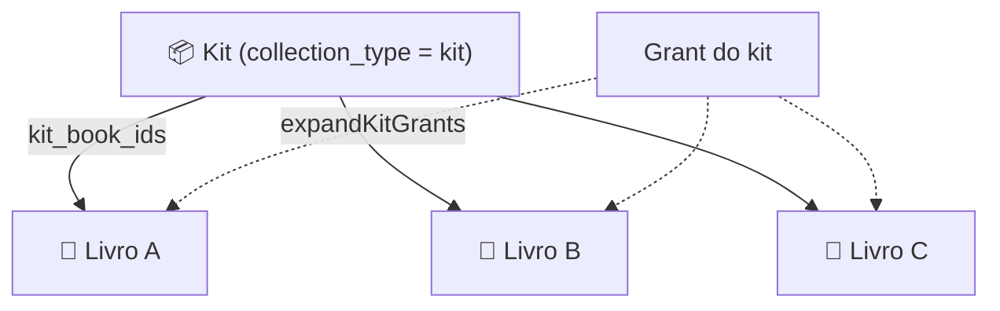
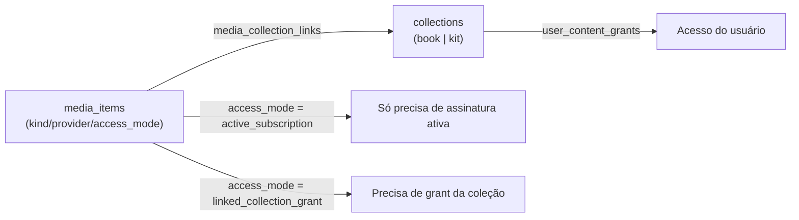

# Catálogo de Conteúdo

O catálogo é **o que existe para ser consumido** dentro de uma marca. Ele tem duas peças
que trabalham juntas: as **coleções** (a unidade de organização e de venda) e o
**backbone de mídia** (o acervo real de vídeos, áudios, formações e materiais que se
vinculam às coleções).

{/* Modelo de coleção: 20260419000100_collection_kit_fields.sql.
    Backbone de mídia: 20260425000100_private_media_backbone.sql. */}

## Coleções: livro ou kit

A coleção (`collections`) é a unidade central. Ela tem um **tipo** que muda o seu papel.

Âncora: `supabase/migrations/20260419000100_collection_kit_fields.sql` adiciona à tabela:

- `collection_type text` — `'book'` (default) ou `'kit'`, com constraint
  `collections_collection_type_check` limitando aos dois valores;
- `kit_cover_image text` — capa específica do kit;
- `kit_book_ids text[]` — para kits, a lista de coleções-livro que o kit agrupa.

| Tipo | O que é | Papel comercial |
|------|---------|-----------------|
| `book` | Um livro/coleção individual de conteúdo | Unidade de acesso mais granular |
| `kit` | Um agrupador que referencia vários livros via `kit_book_ids` | Pacote — conceder o kit concede os livros |

### Livro sempre tem PDF

Um **livro** (coleção `book`) sempre carrega um **PDF** como seu conteúdo-base. Um item
sem PDF não é um livro — é conteúdo avulso vinculado por outra via. Essa é a razão de o
livro ser a menor unidade de acesso concedível.

### Como o kit se expande no acesso

Conceder um **kit** deve liberar também os **livros** que ele agrupa. Como o grant guarda
só o `collection_id` do kit, o acesso expande o kit em grants sintéticos por livro
(`collections.kit_book_ids`) antes de decidir — ver
[`expandKitGrants` no Modelo de acesso](./modelo-acesso.md#expansão-de-kit--livros)
(`lib/api.ts` → `expandKitGrants()`). No **resgate via voucher**, os grants dos livros do
kit já são persistidos **no servidor** pela RPC `redeem_voucher`; o `expandKitGrants` do
cliente cobre grants de kit **pré-existentes**.

## Backbone de mídia

O acervo consumível vive num backbone unificado (`media_items`), organizado em **hubs**
por tipo: **vídeos, músicas, formações e materiais**. Cada item de mídia declara três
atributos que governam como ele é servido e protegido.

Âncora: `supabase/migrations/20260425000100_private_media_backbone.sql`.

### `kind` — o tipo de mídia

`media_kind` (`:29`): `'video'`, `'audio'`, `'document'`, `'training'`.

### `provider` — de onde vem

`media_provider` (`:51`): `'internal'`, `'youtube'`, `'external_audio'`.

Regras de consistência por provider (checks em `:117-122`):

- `internal` → exige `storage_bucket` + `storage_path` (mídia hospedada no Storage);
- `youtube` / `external_audio` → exigem `external_url`.

### `access_mode` — como é protegida

`media_access_mode` (`:62`): `'active_subscription'` ou `'linked_collection_grant'`.

| `access_mode` | Quem pode ver |
|---------------|---------------|
| `active_subscription` | Qualquer pessoa com **assinatura ativa** (camada temporal). |
| `linked_collection_grant` | Somente quem tem **grant** para a coleção vinculada àquela mídia. |

Essa distinção é aplicada no **RLS** (`:249`), a autoridade final de acesso à mídia — ver
o [callout de assimetria cliente ↔ servidor](./modelo-acesso.md#callout-assimetria-cliente--servidor).

## Como a mídia se vincula à coleção / livro

A ponte entre o acervo e as coleções é a tabela **`media_collection_links`**
(`media_item_id` ↔ `collection_id`). É ela que:

- define quais mídias pertencem a uma coleção/livro;
- alimenta a checagem de RLS `linked_collection_grant` — o banco cruza
  `media_collection_links` com `user_content_grants` para decidir o acesso
  (`20260425000100_private_media_backbone.sql:272-279`).

Na prática, o vínculo de uma mídia a um livro é feito no **editor de livro** do admin, que
associa vídeos, áudios (narração/audiolivro) e materiais àquela coleção.

## Escopo por marca

Todo o catálogo é escopado por marca: coleções e mídias pertencem a uma `brand_id` e nunca
cruzam para outra marca. Ver [White-label e marcas](./white-label-marcas.md).
