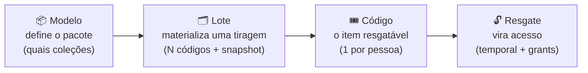
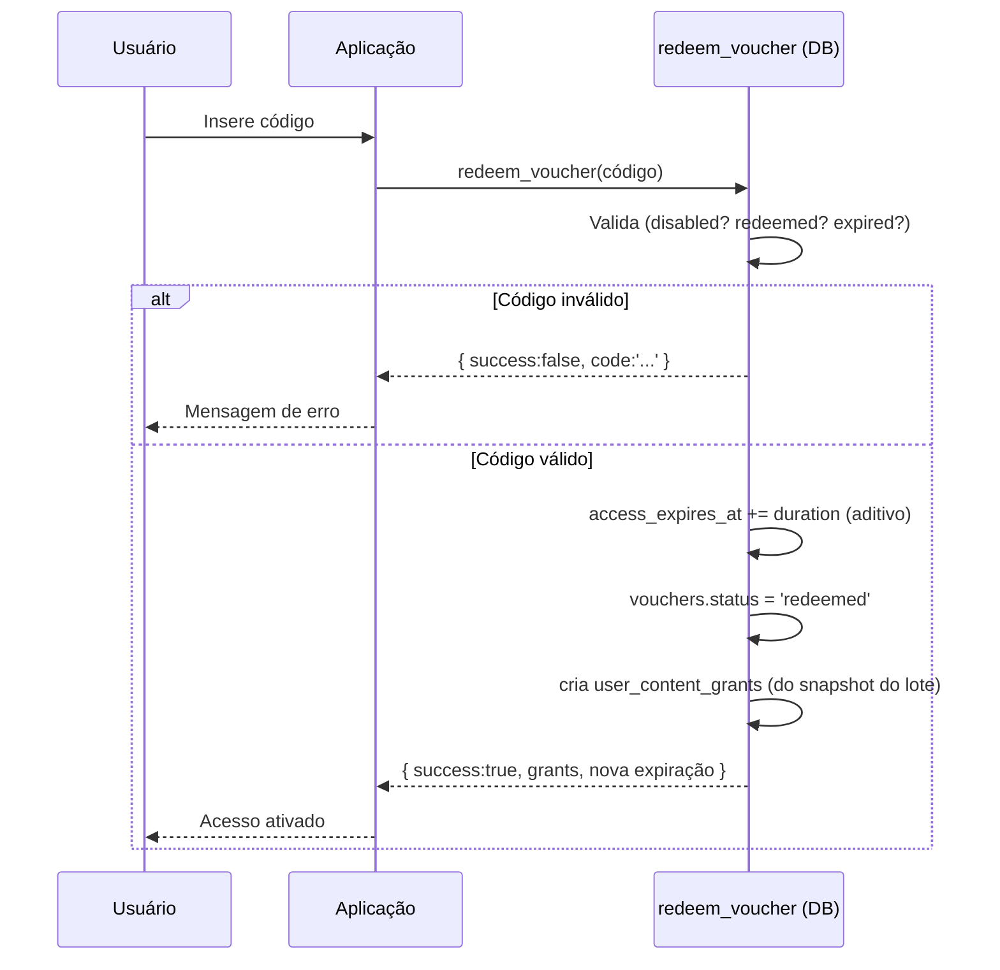

# Ciclo do Voucher

O voucher é o **instrumento comercial** do produto: é como o acesso é empacotado, gerado,
distribuído e, por fim, convertido em acesso real. O ciclo tem **quatro camadas**, cada
uma com um papel bem definido.

## Camada 1 — Modelo (o pacote comercial)

O **modelo de voucher** (`voucher_models`) define **o que um pacote libera**: um conjunto
de coleções (via `voucher_model_items`) e a duração do acesso. É a "SKU" do produto.

- Está sempre **escopado por marca** (`brand_id`).
- Cada item aponta para uma coleção do catálogo daquela marca.
- Âncora: `lib/apiVouchers.ts:getVoucherModels` (`lib/apiVouchers.ts:25`) — carrega o
  modelo já com seus itens e as coleções vinculadas.

**Status do modelo** (`VoucherModelStatus`, `types.ts:389`):

| Status | Significado |
|--------|-------------|
| `draft` | Em construção, ainda não emite lotes. |
| `active` | Publicado, pode gerar lotes. |
| `archived` | Aposentado, não gera novos lotes. |

O modelo é criado por um assistente de três etapas:

| Configurar modelo | Selecionar conteúdos | Revisar e salvar |
|:---:|:---:|:---:|
|  |  |  |

## Camada 2 — Lote (a tiragem)

O **lote** (`voucher_batches`) é uma **emissão concreta** de um modelo: gera N códigos de
uma vez e **congela um snapshot** do modelo (`model_snapshot`) no momento da emissão. Esse
snapshot é o que garante que, mesmo que o modelo mude depois, os códigos daquele lote
concedam exatamente o que foi vendido.

- Gerado pela RPC **`emit_voucher_batch`** (`lib/apiVouchers.ts:267`).
- O snapshot guarda os itens (coleções) que serão convertidos em grants no resgate.

**Status do lote** (`VoucherBatchStatus`, `types.ts:391`):

| Status | Significado |
|--------|-------------|
| `generated` | Códigos criados no banco. |
| `exported` | Exportado (ex.: planilha/impressão). |
| `sent` | Enviado ao parceiro/distribuidor. |
| `confirmed` | Recebimento/uso confirmado. |
| `cancelled` | Lote cancelado. |

## Camada 3 — Código (o item resgatável)

O **código** (`vouchers`) é o que chega à mão da pessoa. Cada código é de **uso único**:
um resgate o consome e o vincula ao usuário.

**Status do código** (`VoucherStatus`, `types.ts:17`):

| Status | Significado |
|--------|-------------|
| `active` | Disponível para resgate. |
| `redeemed` | Já utilizado (consumido por um usuário). |
| `expired` | Passou da validade. |
| `disabled` | Desativado manualmente. |

### Sufixo aleatório anti-enumeração

Os códigos **não são sequenciais**. Cada código recebe um **sufixo aleatório** para que
não seja possível "adivinhar" o próximo a partir de um conhecido — mitigando resgate
fraudulento por enumeração. (Correção histórica: os códigos sequenciais foram substituídos
por sufixo aleatório; ver commit `fix(security): voucher codes sequenciais substituídos
por sufixo aleatório`.)

## Camada 4 — Resgate (vira acesso)

O **resgate** é onde o código se transforma em acesso real. Acontece na RPC
**`redeem_voucher`** (`SECURITY DEFINER`), chamada pelo cliente em
`lib/api.ts` → `redeemVoucher()` (que invoca `supabase.rpc('redeem_voucher', …)`).

A versão *grants-aware* da RPC foi introduzida em
`20260409000500_redeem_voucher_grants.sql`, mas a **definição atual** foi redefinida por
migrations posteriores: o **guard de marca** (`brand_mismatch`) veio em
`20260620100000_t01_redeem_voucher_brand_guard.sql` e a última redefinição
(`CREATE OR REPLACE`, ajuste de `brand_id` no audit) está em
`20260620300010_t22_redeem_voucher_audit_brand_id.sql`. O comportamento descrito abaixo
reflete a versão atual (t01/t22).

O resgate faz, em uma única transação:

1. **Valida o código** — bloqueia se `disabled`, já `redeemed` (ou com `consumed_at` /
   `consumed_by_user_id` preenchidos) ou `expired`
   (`20260620100000_t01_redeem_voucher_brand_guard.sql:40-50`).
2. **Guard de marca** — se o perfil ainda não tem `brand_id`, adota o da marca do voucher;
   se já tem e diverge, aborta com `brand_mismatch`
   (`20260620100000_t01_redeem_voucher_brand_guard.sql:60-68`).
3. **Estende o acesso temporal** — de forma **aditiva**: parte do maior valor entre a
   expiração atual e agora, e soma `duration_months`
   (`20260620100000_t01_redeem_voucher_brand_guard.sql:71-72`). Marca o perfil como `active`.
4. **Marca o código como `redeemed`** e o vincula ao usuário (`consumed_by_user_id`,
   `consumed_at`).
5. **Cria os grants de conteúdo** (o que torna o resgate *grants-aware*): se o código
   pertence a um lote com `model_snapshot`, insere um `user_content_grants` para cada
   coleção do snapshot. **Se a coleção é um kit, expande também os livros vinculados**
   (`collections.kit_book_ids`), inserindo grants reais por livro **no servidor** — não só
   no cliente (`20260620100000_t01_redeem_voucher_brand_guard.sql:95-107`). Registra um
   `audit_log`. A expansão de kit no cliente (`lib/api.ts` → `expandKitGrants()`) continua
   cobrindo grants de kit **pré-existentes** que ainda não passaram por esse resgate.

| Resgate bem-sucedido (voucher validado) | Conteúdo fora do acesso (upsell) |
|:---:|:---:|
|  |  |

### Códigos de erro do resgate

O front traduz os códigos de erro em mensagens (`lib/access.ts:3`):

| Código | Mensagem ao usuário |
|--------|---------------------|
| `invalid_code` | Código de acesso inválido. |
| `already_redeemed` | Este código já foi utilizado. |
| `voucher_expired` | Este código de acesso expirou. |
| `voucher_disabled` | Este código de acesso não está mais disponível. |
| `not_authenticated` | Faça login para ativar um novo código de acesso. |

### Cadastro com voucher

No fluxo de cadastro (`lib/api.ts` → `registerWithVoucher()`), o código é persistido no
`raw_user_meta_data` (`pending_voucher_code`) já no `signUp`, para que o resgate
**sobreviva** a troca de dispositivo ou limpeza de `localStorage`. Após confirmar e-mail e
autenticar, o resgate é disparado (chamada a `redeemVoucher()` dentro de
`registerWithVoucher()`).

## Escopo por marca (brand-scope)

Todo o ciclo é **escopado por marca**. Modelos, lotes e códigos carregam `brand_id`, e as
consultas filtram por marca (`lib/apiVouchers.ts:36`). Um voucher de uma marca não pode
ser resgatado em outra.

> ⚠️ **Um perfil pertence a uma única marca.** O resgate de um voucher de uma **segunda**
> marca é bloqueado (`brand_mismatch`). A regra "um usuário com voucher das duas marcas"
> **não é suportada hoje** — cada pessoa vive dentro de uma marca. Ver
> [White-label e marcas](./white-label-marcas.md).

## Consumo do lote (quem resgatou)

Para relatórios de consumo, a RPC **`get_voucher_consumers`** (`lib/apiVouchers.ts:140`)
retorna quem resgatou cada código de um lote, alimentando a visão de consumidores no admin
de vouchers.
