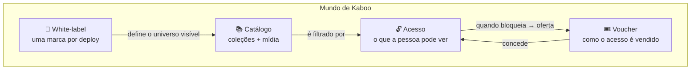

# Regras de Negócio

Esta seção descreve, em linguagem de produto, **como o Mundo de Kaboo decide o que cada
pessoa pode ver e fazer**. É a fonte de verdade compartilhada entre produto, engenharia,
QA e suporte para responder perguntas do tipo "por que este usuário não vê esta coleção?"
ou "o que muda entre Kaboo e Central Coruja?".

{/* As afirmações desta seção citam âncoras de código (arquivo:linha ou arquivo:função)
    para que qualquer regra possa ser auditada contra a implementação real. */}

## As 4 regras-mãe

Quatro modelos de negócio governam o produto inteiro. Tudo o mais deriva deles.

| # | Regra-mãe | Pergunta que responde | Documento |
|---|-----------|-----------------------|-----------|
| 1 | **Modelo de acesso** | Esta pessoa pode abrir este conteúdo? | [Modelo de acesso](./modelo-acesso.md) |
| 2 | **Ciclo do voucher** | Como o acesso é vendido, gerado e resgatado? | [Ciclo do voucher](./ciclo-voucher.md) |
| 3 | **White-label / marcas** | O que muda entre Kaboo e Central Coruja? | [White-label e marcas](./white-label-marcas.md) |
| 4 | **Catálogo de conteúdo** | Como coleções, livros, kits e mídias se organizam? | [Catálogo de conteúdo](./catalogo-conteudo.md) |

## Como as regras se encaixam

1. **A marca define o universo.** Cada deploy pertence a **uma única marca**
   (Kaboo *ou* Central Coruja). A marca resolve tema, menu e feature flags, e escopa
   todo o dado que o front consulta. Ver [White-label e marcas](./white-label-marcas.md).

2. **O catálogo é o que existe para ser consumido.** Coleções (livros e kits) e o
   backbone de mídia (vídeos, músicas, formações, materiais) formam o acervo daquela
   marca. Ver [Catálogo de conteúdo](./catalogo-conteudo.md).

3. **O voucher é o instrumento comercial.** Um modelo define *quais coleções* um pacote
   libera; um lote materializa códigos; o resgate converte um código em acesso concreto.
   Ver [Ciclo do voucher](./ciclo-voucher.md).

4. **O acesso é a decisão final de leitura.** Combina uma camada **temporal** (a
   assinatura está ativa?) com uma camada **por conteúdo** (quais coleções foram
   liberadas?). Ver [Modelo de acesso](./modelo-acesso.md).

## As duas marcas em uma frase

**Kaboo e Central Coruja são o mesmo produto** — mesmo código, mesmo banco, mesmas
regras. Diferem apenas por **tema visual** (cores, logo, fonte, imagens) e por **feature
flags** (o que está ligado ou desligado). Sempre que uma regra valer diferente entre as
marcas, o documento correspondente destaca a diferença.

## Convenção de leitura

Cada documento traz **callouts** com regras críticas e **âncoras de código** para
verificação. Quando você ler uma afirmação de comportamento, o `arquivo:linha` ao lado
aponta exatamente onde ela vive no código, para que produto e engenharia nunca divirjam
sobre "o que o sistema realmente faz".
