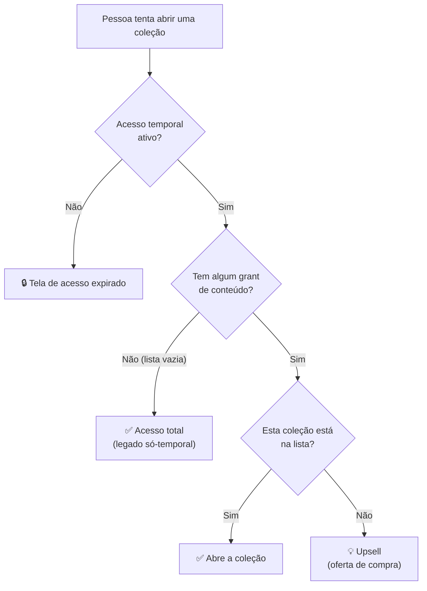

# Modelo de Acesso

O modelo de acesso responde a uma única pergunta, feita milhares de vezes por dia:
**"esta pessoa pode abrir este conteúdo agora?"**

A resposta combina **duas camadas independentes** que precisam estar ambas satisfeitas:

1. **Camada temporal** — a assinatura da pessoa está ativa (não expirou)?
2. **Camada por conteúdo** — esta coleção específica foi liberada para ela?

{/* Regra central verificada em lib/access.ts:118 (canAccessCollection) e no gate de
    navegação em App.tsx:1462. */}

## A regra central (por conteúdo)

> **Grants vazio = acesso total. Com grants = só o que foi liberado.**

Cada usuário tem uma lista de "concessões de conteúdo" (`user_content_grants`). A regra
que decide o acesso a uma coleção é deliberadamente simples:

- **Sem nenhum grant** → a pessoa vê **tudo** (comportamento legado, "só temporal").
- **Com pelo menos um grant** → a pessoa vê **apenas as coleções concedidas**; qualquer
  outra coleção vira **oportunidade de upsell**.

Âncora: `lib/access.ts:118` — `canAccessCollection(grants, collectionId)`:

- `grants.length === 0` → retorna `true` (tudo liberado);
- caso contrário → só é `true` se a coleção estiver na lista de grants.

## Camada temporal (assinatura ativa)

Antes de olhar para o conteúdo, o sistema pergunta se a assinatura está válida. Isso vem
de dois campos do perfil: `profiles.access_status` e `profiles.access_expires_at`.

Âncora: `lib/access.ts:20` — `getProfileAccessStatus(profile)` resolve o estado assim:

| Situação do perfil | Status resultante |
|--------------------|-------------------|
| Sem perfil | `pending_voucher` (aguardando código) |
| `role = admin` ou `role = editor` | `active` (bypass — ver abaixo) |
| `access_status = pending_voucher` | `pending_voucher` |
| `access_status = expired` | `expired` |
| Tem `access_expires_at` no futuro | `active` |
| Tem `access_expires_at` no passado | `expired` |
| Sem data de expiração | `active` |

Apenas o status `active` libera o consumo. `hasActiveAccess()` e `isAccessBlocked()`
(`lib/access.ts:45` e `:49`) são os atalhos usados pela aplicação; quando o acesso está
bloqueado, a pessoa cai na **tela de acesso expirado** (`screens/AccessExpiredScreen.tsx`).

### Renovação é aditiva

Ao resgatar um novo voucher, o novo prazo é somado ao saldo restante, não substitui.
`calculateRenewedAccessExpiry` (`lib/access.ts:53`) parte da data de expiração atual (se
ainda no futuro) e adiciona os meses do voucher. Assim, renovar cedo não faz a pessoa
perder dias.

## Bypass de admin e editor

Perfis com `role = admin` ou `role = editor` **ignoram as duas camadas**: têm acesso
irrestrito, sem depender de voucher nem de grants.

- Na camada temporal: `getProfileAccessStatus` retorna `active` direto para esses papéis
  (`lib/access.ts:26`).
- No banco (RLS): a política de leitura de mídia libera tudo se o perfil for `admin` ou
  `editor` (`supabase/migrations/20260425000100_private_media_backbone.sql:259`).

## Expansão de kit → livros

Um grant pode conceder um **kit** (uma coleção que agrupa vários livros). Como a lista de
grants guarda só o `collection_id` do kit, o sistema **expande** o kit em grants
sintéticos para cada livro vinculado (`collections.kit_book_ids`), antes de avaliar o
acesso.

Âncora: `lib/api.ts` → `expandKitGrants()`. Para cada kit concedido, ele
adiciona grants para os livros do kit que ainda não estavam concedidos — mantendo
`canAccessCollection` funcionando sem mudanças em nenhum outro lugar. Ver o modelo de kit
em [Catálogo de conteúdo](./catalogo-conteudo.md).

> Nota: no **resgate via voucher**, os grants dos livros do kit já são persistidos **no
> servidor** pela RPC `redeem_voucher` (`20260620100000_t01_redeem_voucher_brand_guard.sql:95-107`).
> A expansão no cliente (`expandKitGrants()`) cobre grants de kit **pré-existentes** que
> ainda não passaram por esse resgate.

## Onde o acesso é aplicado na aplicação

- **Consulta de um grant específico:** `lib/api.ts` → `hasContentGrant(collectionId)`
  busca os grants do usuário e verifica se a coleção está na lista.
- **Gate de deep-link / restauração:** `App.tsx:1462` — quando a pessoa chega por link
  direto a uma coleção fora do seu voucher, o **detalhe não abre**; em vez disso é
  mostrado o **upsell**. Cliques dentro do app já são barrados no gate de navegação.

## Callout: assimetria cliente ↔ servidor

> ⚠️ **A regra "grants vazio = tudo" existe apenas no cliente. O banco NÃO tem esse
> atalho.**

Há uma diferença importante — e intencional — entre as duas pontas:

| Camada | Regra de "acesso amplo" |
|--------|--------------------------|
| **Cliente** (`lib/access.ts:118`) | Lista de grants vazia libera **tudo** (legado só-temporal). |
| **Banco / RLS** (`supabase/migrations/20260425000100_private_media_backbone.sql:249`) | Libera mídia por `access_mode = 'active_subscription'` (assinatura ativa) **ou** por `linked_collection_grant` (grant existente). Não existe "lista vazia libera tudo". |

Na prática, o banco separa a mídia em dois modos de acesso:

- `access_mode = 'active_subscription'` → basta ter assinatura ativa;
- `access_mode = 'linked_collection_grant'` → exige um grant para a coleção vinculada
  àquela mídia (via `media_collection_links`), com `expires_at` ainda válido.

**Consequência de produto:** o "acesso total do legado" é uma cortesia do front para
usuários antigos sem grants. Ela **não** contorna o RLS: mídias marcadas como
`linked_collection_grant` continuam exigindo grant real no banco. Ao desenhar novas regras
de acesso, trate o RLS como a autoridade final e o cliente como uma camada de experiência.
