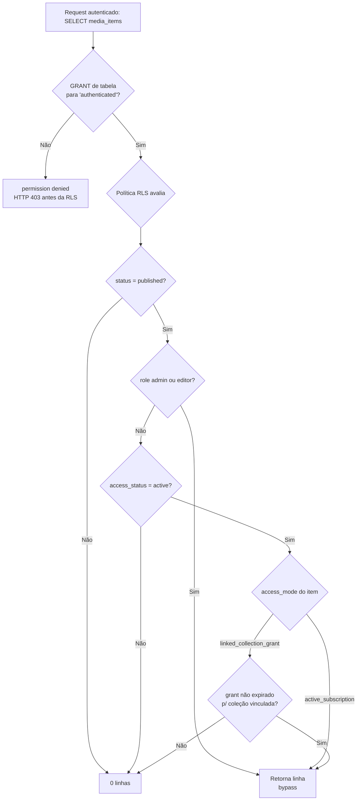

{/* Camada técnica das regras de negócio de acesso. Fonte de verdade: migrations em supabase/migrations/ e lib/access.ts. Vale para as duas marcas (Kaboo e Central Coruja) — o modelo de acesso é idêntico; a marca muda apenas tema e feature flags. */}

Este documento descreve **como o acesso a conteúdo é efetivamente garantido** — não a intenção de produto, mas o mecanismo que roda no banco (Postgres/Supabase) e no cliente. O objetivo é que qualquer pessoa entenda por que um usuário vê (ou não vê) uma mídia, uma coleção ou o painel admin.

> Regra de ouro: **o cliente sugere, o servidor decide.** Toda checagem de acesso feita no front é conveniência de UX. A autoridade final é a Row Level Security (RLS) do Postgres.

## As duas camadas de decisão

Existem duas verificações de acesso rodando em lugares diferentes, com **lógicas propositalmente distintas**. Entender essa assimetria é o ponto mais importante deste documento.

| Camada | Onde roda | Pergunta que responde | Fonte |
|--------|-----------|----------------------|-------|
| Cliente | Browser (React) | "Devo mostrar o cadeado neste card?" | `lib/access.ts` → `canAccessCollection` |
| Servidor | Postgres | "Esta linha pode sair do banco para este usuário?" | Políticas RLS nas migrations |

### Camada cliente — `canAccessCollection`

No front, a decisão de coleção é intencionalmente simples e **otimista** (`lib/access.ts:118-126`):

```ts
export const canAccessCollection = (
    grants: UserContentGrant[],
    collectionId: string
): boolean => {
    // Sem nenhum grant = acesso temporal legado, tudo liberado
    if (grants.length === 0) return true;
    // Com grants = só as coleções concedidas
    return grants.some(g => g.collection_id === collectionId);
};
```

A semântica **"lista de grants vazia = acesso total"** existe por compatibilidade com o modelo temporal antigo (usuário com assinatura ativa, antes de existir concessão por coleção). Quem tem qualquer `user_content_grants` passa a ver **apenas** as coleções concedidas.

Antes disso, o cliente já verificou o **status temporal** do perfil (`lib/access.ts:20-47`):

- `admin` e `editor` são sempre `active` — não dependem de voucher (`lib/access.ts:26-28`).
- Caso contrário, o status vem de `access_status` / `access_expires_at`.

### Camada servidor — RLS de `media_items`

No banco, a mesma pergunta é respondida de forma **restritiva e explícita**. A política de leitura de mídia (`supabase/migrations/20260425000100_private_media_backbone.sql:249-285`) exige que **todas** as condições sejam verdadeiras:

1. `status = 'published'`;
2. **E** uma de duas trilhas de papel:
   - o usuário é `admin`/`editor` (bypass — vê tudo publicado); **ou**
   - o perfil está com `access_status = 'active'` **E** o `access_mode` do item é satisfeito.
     A RLS usa `COALESCE(profiles.access_status, 'active') = 'active'` (`:266`), então um
     `access_status` **NULL** é tratado como **ativo** (compatibilidade com perfis legados
     sem status explícito):
     - `active_subscription` → basta ter acesso temporal ativo; **ou**
     - `linked_collection_grant` → precisa existir um `user_content_grants` **não expirado** para uma coleção vinculada ao item via `media_collection_links`.

```sql
-- supabase/migrations/20260425000100_private_media_backbone.sql:269-282
access_mode = 'active_subscription'
OR (
  access_mode = 'linked_collection_grant'
  AND EXISTS (
    SELECT 1
    FROM public.media_collection_links links
    JOIN public.user_content_grants grants
      ON grants.collection_id = links.collection_id
    WHERE links.media_item_id = media_items.id
      AND grants.user_id = auth.uid()
      AND (grants.expires_at IS NULL OR grants.expires_at > NOW())
  )
)
```

### A assimetria — por que as duas divergem de propósito

| | Cliente (`canAccessCollection`) | Servidor (RLS) |
|---|---|---|
| Postura | Otimista ("vazio = tudo") | Restritiva (condições explícitas em AND) |
| Papel | UX: decidir cadeado/CTA | Segurança: barrar dados |
| Consequência de erro | Mostra card que não deveria → cadeado ou 403 na abertura | Vaza / bloqueia dados de verdade |

Essa divergência é **intencional e segura**: se o cliente errar para o lado permissivo (mostrar algo a mais), a RLS ainda barra a leitura da linha no banco. O contrário — cliente restritivo, servidor permissivo — seria o perigoso, e não é o caso aqui. Nunca replique a regra `grants vazio = total` dentro de uma política RLS.

## Fluxo de autorização (mídia)



## Papéis e bypass

Os papéis vêm de `public.profiles.role`. Dois têm tratamento especial de bypass em **quase toda** política de conteúdo:

| Papel | Acesso a conteúdo | Origem |
|-------|-------------------|--------|
| `admin` | Irrestrito (gerencia + lê tudo publicado e não publicado nas políticas `FOR ALL`) | RLS + `lib/access.ts:26-28` |
| `editor` | Igual a admin para conteúdo de mídia/coleção | RLS + `lib/access.ts:26-28` |
| usuário comum | Depende de `access_status` + grants | RLS |
| `service_role` | Bypass total (backend/edge functions) | Políticas `TO service_role USING (true)` |

O bypass de `admin`/`editor` aparece repetido em cada tabela do backbone de mídia — leitura e escrita de `media_items`, `media_collection_links`, `media_shelves`, `media_shelf_items` e `media_link_health` (ex.: `20260425000100_private_media_backbone.sql:286-305` para gestão de items). Progresso e favoritos (`user_media_progress`, `user_media_favorites`) **não** têm bypass de admin: são estritamente `user_id = auth.uid()` (`:413-483`), porque são dados pessoais, não catálogo.

## Voucher — o gatilho do acesso temporal

O voucher é o que transforma um perfil `pending_voucher` em `active`. A camada técnica do resgate vive na RPC `redeem_voucher` — versão *grants-aware* introduzida em `20260409000500_redeem_voucher_grants.sql` e **redefinida** depois, com a definição atual em `20260620300010_t22_redeem_voucher_audit_brand_id.sql` (o guard de marca veio em `20260620100000_t01_redeem_voucher_brand_guard.sql`). A renovação temporal é calculada no cliente por `calculateRenewedAccessExpiry` (`lib/access.ts:53-64`), que **estende** a partir da data de expiração atual se ela ainda estiver no futuro (renovação acumulativa, não reinício).

> Restrição multi-marca conhecida: `redeem_voucher` bloqueia o resgate de um voucher de uma segunda marca para o mesmo perfil (`brand_mismatch`, `20260620100000_t01_redeem_voucher_brand_guard.sql:60-68`). Um perfil está preso a um `brand_id`. Isso é comportamento atual, não bug.

## Armadilha de infraestrutura: GRANT vem antes de RLS

**Postgres aplica os privilégios SQL de tabela ANTES de avaliar qualquer política RLS.** Se uma tabela tem política para `authenticated` mas falta o `GRANT` de tabela correspondente, todo acesso de usuário autenticado morre com `permission denied for table` (HTTP 403) **antes** de a política ser sequer consultada.

Esse exato bug aconteceu com as tabelas de voucher no admin e foi corrigido em `supabase/migrations/20260615120000_grant_voucher_tables_to_authenticated.sql`:

```sql
-- Sintoma: brand admins não conseguiam criar/listar modelos, lotes, códigos
-- nem ler o audit log — só o service_role funcionava.
-- Causa: RLS presente, GRANT de tabela ausente.
GRANT SELECT, INSERT, UPDATE ON public.voucher_models TO authenticated;
GRANT SELECT, INSERT, DELETE ON public.voucher_model_items TO authenticated;
GRANT SELECT, INSERT, UPDATE ON public.voucher_batches TO authenticated;
GRANT SELECT, UPDATE          ON public.vouchers TO authenticated;
GRANT SELECT                  ON public.audit_log TO authenticated;
```

Regra de arquitetura, obrigatória em qualquer migration nova:

1. Os `GRANT`s devem **espelhar exatamente** os verbos das políticas RLS (menor privilégio). Se a política só faz `SELECT`, não conceda `INSERT`.
2. A RLS continua sendo quem filtra as **linhas** (via `can_manage_brand(brand_id)`, `user_id = auth.uid()`, etc.). O GRANT só abre a **porta da tabela**; a RLS decide quais linhas passam.
3. Ao ver 403 em tabela nova com RLS aparentemente correta, **suspeite do GRANT ausente antes de mexer na política.**

## Checklist para novas políticas de conteúdo

- [ ] A tabela tem `ENABLE ROW LEVEL SECURITY`?
- [ ] Existe `GRANT` de tabela para `authenticated` espelhando os verbos das políticas?
- [ ] Há política `TO service_role USING (true)` para o backend?
- [ ] `admin`/`editor` têm bypass **onde faz sentido** (catálogo sim; dados pessoais não)?
- [ ] A condição de acesso do usuário comum inclui checagem de `status`/`access_status` **e** grants quando aplicável?
- [ ] A lógica permissiva do cliente (`grants vazio = total`) **não** foi replicada na RLS?

## Referências de código

- `lib/access.ts:20-47` — `getProfileAccessStatus` (status temporal + bypass admin/editor)
- `lib/access.ts:53-64` — `calculateRenewedAccessExpiry` (renovação acumulativa)
- `lib/access.ts:118-126` — `canAccessCollection` (regra otimista do cliente)
- `supabase/migrations/20260425000100_private_media_backbone.sql:249-285` — RLS de leitura de `media_items`
- `supabase/migrations/20260425000100_private_media_backbone.sql:418-456` — RLS de `user_media_progress` (INSERT valida acesso ao item)
- `supabase/migrations/20260429000100_white_label_access_control.sql:24-40` — `can_manage_brand` (com super admin white-label)
- `supabase/migrations/20260615120000_grant_voucher_tables_to_authenticated.sql` — GRANT-antes-de-RLS
