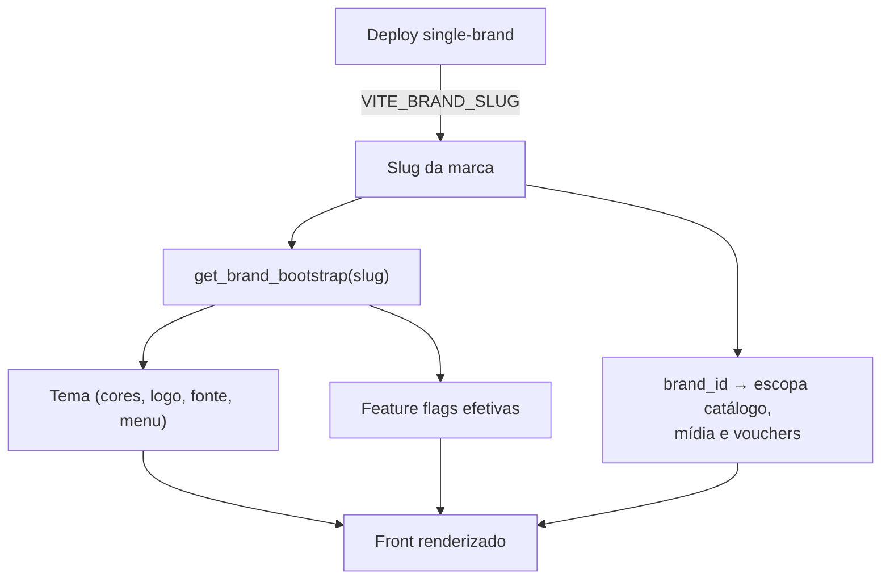

# White-label e Marcas

**Kaboo e Central Coruja são o mesmo produto.** Mesmo código, mesmo banco, mesmas regras
de negócio. A diferença entre elas é **puramente de configuração**: tema visual + feature
flags. Tudo o que muda de uma marca para a outra passa por dados, não por código.

{/* Regra verificada em hooks/useBrandConfig.ts:147 (resolveBrandSlug) e na RPC
    get_brand_bootstrap — supabase/migrations/20260426000100_white_label_brands.sql:186. */}

## Uma marca por deploy (single-brand)

Cada front no ar pertence a **uma única marca**. A marca é resolvida por uma cadeia de
prioridades, mas a fonte **autoritativa** em produção é a variável de ambiente
`VITE_BRAND_SLUG`.

Âncora: `hooks/useBrandConfig.ts:147` — `resolveBrandSlug()` resolve nesta ordem:

1. **`VITE_BRAND_SLUG`** (autoritativo). Em deploys single-brand, **ignora `?brand=`** de
   propósito, para que ninguém re-escope a camada de dados por query string.
2. Só em deploys **multi-marca** (sem `VITE_BRAND_SLUG`): honra `?brand=` (portal de
   preview / seleção de marca).
3. Preferências de preview de white-label (ambiente de desenvolvimento).
4. `pathname` / `hostname` (ex.: host contém `central-coruja` ou começa com `coruja.`).

> ⚠️ **Por que single-brand importa para segurança:** o slug da marca escopa **todo** o
> dado consultado (coleções, mídias, vouchers). Fixar a marca por ambiente evita que uma
> query string troque o universo de dados visível. Em produção, `VITE_BRAND_SLUG` é
> injetado fixo pelo deploy.

## O que é configurável por marca

A configuração completa de uma marca chega ao front por um único contrato de bootstrap.

Âncora: RPC **`get_brand_bootstrap`**
(`supabase/migrations/20260426000100_white_label_brands.sql:186`), consumida em
`hooks/useBrandConfig.ts:378` (`fetchBootstrap`), com cache de 60 s em `sessionStorage`.

O bootstrap devolve, por marca ativa (`is_active = true`):

### Tema visual (`brand_settings`)

- Cores: `primary_color`, `bg_color`, `accent_color`, `green_color`;
- Tipografia: `font_family`;
- Raios de borda: `radius_xl`, `radius_2xl`, `radius_3xl`;
- Imagens: `login_background_url`, `home_hero_image_url`, logo;
- Menu: `menu_config` (quais itens de navegação aparecem).

### Feature flags

Flags efetivas = **default global** (`feature_flags.default_enabled`) **sobrescrito** pelo
override da marca (`brand_feature_overrides`). A resolução acontece dentro da própria RPC
(`20260426000100_white_label_brands.sql:219-229`).

Exemplos de flags que diferem entre as marcas:

| Flag | Papel |
|------|-------|
| `hero.parallax` | Efeito de parallax na home. |
| `content.offline` | Download/consumo offline de conteúdo. |
| `module.*` / `menu.*` | Liga/desliga módulos e itens de menu. |

## Kaboo vs Central Coruja — o que realmente muda

Os defaults de cada marca vivem no próprio front como fallback
(`hooks/useBrandConfig.ts:120-142`), refletindo o que o banco entrega:

| Aspecto | Kaboo | Central Coruja |
|---------|-------|----------------|
| Produto / regras | Idêntico | Idêntico |
| Tema (cores, logo, fonte) | Tema Kaboo | Tema Coruja (`bg` lilás `#F8F4FF`, banner próprio) |
| `hero.parallax` | Ligado | **Desligado** (`mode: 'off'`) |
| `menu.music` | **Desligado** | Ligado |

{/* Estes defaults são fallback de cliente; a fonte real é o get_brand_bootstrap.
    Se o banco e o fallback divergirem, o banco vence. */}

Além do tema/flags, a marca também troca detalhes de casca visual — por exemplo, o fundo
do shell muda para a cor primária quando a marca é `central-coruja` (`App.tsx:1471`).

## Escopo de dados por marca

A marca não é só aparência: ela **escopa o dado**. Consultas de catálogo, mídia e voucher
filtram por `brand_id` (ex.: formações em `lib/api.ts` → `getFormations()`, vouchers em
`lib/apiVouchers.ts:36`). Isso garante isolamento: uma marca nunca lê o acervo da outra.

## Degradação graciosa

Se a RPC de bootstrap falhar ou o ambiente estiver em modo mock, o front cai para um
**bootstrap mock** por marca (`hooks/useBrandConfig.ts:379-388`), sem quebrar a
experiência — a marca continua resolvida pelos defaults locais.
