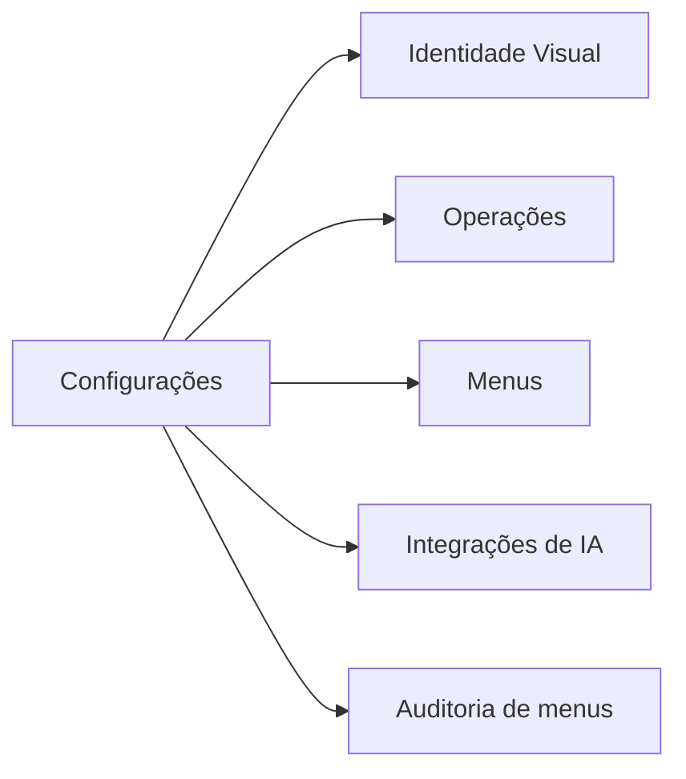

# Admin — White Label (Configurações)

**Local:** `screens/AdminWhiteLabelScreen.tsx`

Tela de administração da identidade da marca, feature flags e integrações. É
**single-brand**: sempre edita a marca **desta instância**, resolvida pelo app
via `VITE_BRAND_SLUG`, sem seletor de marca. O fallback é a primeira marca
disponível (`screens/AdminWhiteLabelScreen.tsx:312-318`). Escritas só ficam
habilitadas para administradores (`isAdmin()`, `screens/AdminWhiteLabelScreen.tsx:132-134`).

## As 5 abas

A navegação por abas está em `screens/AdminWhiteLabelScreen.tsx:523-544`. O
estado `activeTab` aceita `'identidade' | 'operacoes' | 'menus' | 'ia' | 'auditoria'`
(`screens/AdminWhiteLabelScreen.tsx:114`).

### 1. Identidade Visual (`identidade`)

Configura a aparência da marca, gravada em `brand_settings` e aplicada via
`applyTheme` (ver [Marca / Tema](../marca-tema/index.md)). Bloco em
`screens/AdminWhiteLabelScreen.tsx:547-855`.

- **Dados da marca:** nome exibido e **Família tipográfica** por `<select>`
  (Nunito/Poppins/Inter/Baloo 2 — `screens/AdminWhiteLabelScreen.tsx:40-45`,
  `:572-588`). O valor gravado é a stack CSS aplicada em `--font-family-sans`.
- **Imagens:** Logo (recomendado 512×512), Fundo do login (1920×1080) e — **só
  na Central Coruja** — Hero da home (2400×1200). Usam `FileUpload` com
  `recommendedSize` e placeholder de preview (`screens/AdminWhiteLabelScreen.tsx:596-638`).
- **Paleta de cores:** principal, clara, fundo e destaque via `ColorPicker`
  (`screens/AdminWhiteLabelScreen.tsx:647-672`).
- **Links da marca:** loja/upsell, captação de lead e contato de suporte, usados
  nos CTAs (`screens/AdminWhiteLabelScreen.tsx:684-702`).
- **Tokens de design:** cor de sucesso e radius XL/2XL/3XL
  (`screens/AdminWhiteLabelScreen.tsx:705-764`).
- **Prévia ao vivo** (sticky) reflete paleta, fonte e ativos em edição
  (`screens/AdminWhiteLabelScreen.tsx:783-853`). Ao salvar, o cache do bootstrap
  é invalidado (`screens/AdminWhiteLabelScreen.tsx:433-435`).

### 2. Operações (`operacoes`)

Feature flags da marca (`screens/AdminWhiteLabelScreen.tsx:857-964`).

- **Hero Parallax** — **só Central Coruja** (`isCentralCorujaBrand`,
  `screens/AdminWhiteLabelScreen.tsx:872`). Três modos: Desligado / Suave /
  Padrão, gravados na flag `hero.parallax` (`:890`).
- **Download Offline** — toggle que grava `content.offline` (`:921`). É o **gate
  autoritativo** de download: a permissão real é **marca (flag) AND coleção AND
  asset** — ver `hooks/useOfflineDownload.ts` e `lib/access.ts`.
- **Contexto da alteração** — texto livre que acompanha a mudança no log de
  auditoria (`:931-943`).
- **Preset "Baseline padrão"** — reativa os menus e zera parallax/offline
  (`applyDefaultBaseline`, `screens/AdminWhiteLabelScreen.tsx:447-471`).

### 3. Menus (`menus`)

Liga/desliga itens de navegação da marca, **data-driven** a partir de
`brandBootstrap.menu` (`screens/AdminWhiteLabelScreen.tsx:966-1020`). Cada toggle
grava `menu.{key}` (`:994`). Admin/gestão são filtrados fora
(`:976`). Desligar "Coleções" redireciona o app para o primeiro menu disponível
(aviso em `:986-988`). É aqui que vive o controle de **Músicas** (o toggle
duplicado que existia em Operações foi removido).

### 4. Integrações de IA (`ia`)

Conecta um provedor de LLM para sugestões de conteúdo (ex.: sinopse). Bloco em
`screens/AdminWhiteLabelScreen.tsx:1022-1187`. A chave de API é enviada com
segurança e **cifrada no servidor (Vault)** — a UI só mostra os últimos 4 dígitos
(`:1148-1151`). Suporta salvar (`handleSaveAIConfig`, `:174-202`) e testar
conexão (`handleTestAIConnection`, `:204-228`). Em modo local/mock, salvar e
testar exigem o ambiente real (edge functions) (`:1081-1085`).

### 5. Auditoria de menus (`auditoria`)

Lista os últimos eventos de feature flag da marca com **rollback** por entrada
(`screens/AdminWhiteLabelScreen.tsx:1189-1232`). O reverter usa
`rollbackAuditEntry`, que reescreve a flag para o estado anterior
(`enabled_before` / `config_before`) — `screens/AdminWhiteLabelScreen.tsx:473-495`.

## Gating por marca

O flag `isCentralCorujaBrand` (`slug === 'central-coruja'`,
`screens/AdminWhiteLabelScreen.tsx:172`) controla o que só faz sentido na Coruja:

| Controle | Kaboo | Central Coruja |
|----------|-------|----------------|
| Hero Parallax (Operações) | Oculto | Visível |
| Hero da home (Identidade → Imagens) | Oculto | Visível |
| Demais abas/controles | Visíveis | Visíveis |

Motivo: o consumidor de outras marcas não renderiza parallax nem hero da home,
então exibir esses controles seria inócuo — são escondidos em vez de mostrados
sem efeito.

## Persistência e cache

Toda escrita de feature passa por `writeFeature` + `refreshAfterWrite`, que
**sempre** invalida o cache do bootstrap da marca e re-hidrata a tela — a
centralização evita o bug recorrente de esquecer a invalidação
(`screens/AdminWhiteLabelScreen.tsx:358-397`).
