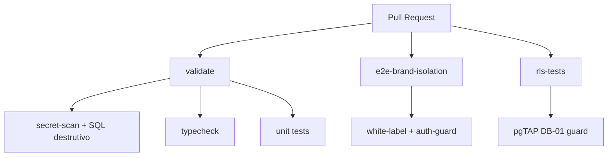

# Testes

A suíte tem duas camadas: **unit** (Vitest) e **E2E BDD** (Playwright). O CI
(`.github/workflows/ci.yml`) roda um subconjunto determinístico como gate de
merge.

## Unit — Vitest

Testes de unidade rodam no projeto `unit` do Vitest.

```bash
npm run test          # vitest run --project unit
npm run test:unit     # idem (alias)
npm run typecheck     # tsc --noEmit
```

Cobrem lógica pura de `lib/` e `hooks/` (elegibilidade de acesso, normalização
de assets, apresentação de coleção, etc.).

## E2E BDD — Playwright

Specs em estilo BDD em `tests/*.spec.ts`. O Playwright **sobe o dev server
sozinho em modo mock** (sem segredos), então rodam localmente e no CI sem
credenciais de produção.

```bash
npm run test:e2e         # npx playwright test --config playwright.config.ts
npm run test:e2e:ui      # modo interativo (--ui)

# Rodar um spec específico (por substring do nome)
npx playwright test --config playwright.config.ts white-label
npx playwright test --config playwright.config.ts consumer-navigation-drilldown
```

### Specs principais

| Spec | Fluxo coberto |
|------|---------------|
| `tests/consumer-navigation-drilldown.spec.ts` | Navegação do consumidor: home → hub de mídia → drilldown na coleção |
| `tests/player-playback-verification.spec.ts` | Reprodução: abrir player e verificar playback (vídeo/áudio) |
| `tests/admin-vouchers-management.spec.ts` | Admin: gestão de lotes e vouchers |
| `tests/consumer-voucher-signup-redeem.spec.ts` | Cadastro por voucher + resgate; inclui regressão anti-enumeração (#59) |
| `tests/voucher-upsell.spec.ts` | Upsell de voucher (CTA de loja/renovação) |
| `tests/white-label.spec.ts` | Isolamento de marca e identidade white-label |

### Specs de regressão e JTBD

Além dos fluxos principais, há specs focados por marca (Central Coruja) e de
regressão:

- **JTBD Central Coruja:** `central-coruja-book-jtbd`, `central-coruja-video-jtbd`,
  `central-coruja-audio-jtbd`.
- **Regressão:** `auth-guard.regression-1`, `admin-books-routing.regression-1`,
  `home-books-nav.regression-1`, `collection-detail-media-routing.regression-1`,
  `white-label-shell.regression-1`, `white-label-favicon.regression-1`,
  `audio-drawer-upload-regression`.
- **Usabilidade admin:** `admin-collections-usability`,
  `admin-collections-usability-kaboo`.

## CI — gates determinísticos

O workflow `.github/workflows/ci.yml` roda em todo PR e nos pushes para
`main`/`develop`/`v1.1`, com três jobs:



| Job | O que roda | Referência |
|-----|-----------|-----------|
| **validate** | QA gate (secret-scan + SQL destrutivo em migrações), `typecheck`, `test:unit` | `ci.yml:17-45` |
| **e2e-brand-isolation** | Playwright dos specs `white-label` e `auth-guard` (isolamento de marca é a garantia central do white-label) | `ci.yml:47-66` |
| **rls-tests** | pgTAP contra Supabase local: guard de privilégio DB-01 (`rls_profiles_guard.sql`) | `ci.yml:68-92` |

Observações do CI:

- O job `e2e-brand-isolation` roda **só** `white-label` e `auth-guard` como gate
  rápido; a suíte E2E completa é executada localmente/sob demanda.
- O `rls-tests` esvazia `supabase/seed.sql` no checkout efêmero porque o seed
  falha em DB limpo (blocker pré-existente); o guard pgTAP cria os próprios
  fixtures (`ci.yml:79-84`).
- A verificação de SQL destrutivo compara migrações novas contra a base do PR
  (`scripts/qa/check-staged.mjs`, `ci.yml:33-39`).
