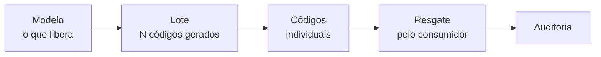

# Módulo Vouchers

## Para que serve

Vouchers são os **códigos de acesso** que liberam conteúdo para o consumidor. Todo o
ciclo — do que o código libera até quem o resgatou — vive neste módulo
(`screens/VouchersModule.tsx`). É exclusivo de **admin** (`module.vouchers`).

O fluxo tem quatro conceitos encadeados:

## Como abrir

Administração → **Vouchers**. A tela abre com o cabeçalho "Vouchers" e **quatro abas**
(`screens/VouchersModule.tsx:1908`): **Modelos**, **Lotes**, **Códigos**, **Auditoria**.

---

## Aba 1 — Modelos

Um **modelo** define o que cada voucher libera ao ser resgatado. Estados possíveis:
Rascunho, Ativo, Arquivado (`MODEL_STATUS_LABELS`, `screens/VouchersModule.tsx:68`).

### Criar um modelo (assistente de 3 etapas)

Clique em **Novo modelo** (visível só para admin). O assistente
(`ModelWizard`, `screens/VouchersModule.tsx:496`) tem 3 etapas:

1. **Configurar modelo** (`:646`)
   - **Nome interno** (mínimo 3 caracteres) e **Descrição**.
   - **Tipo de pacote** — Livro, Coleção, Vídeo, Áudio, Formação ou Material
     (`PACKAGE_LABELS`, `:53`). O tipo apenas **organiza a oferta**; o que é liberado
     vem dos conteúdos selecionados na etapa 2 (`:757`).
   - **Duração do acesso** — 1, 3, 6, 9, 12 meses ou **Personalizada** (1 a 12 meses).
     É o tempo de acesso **depois** do resgate.
   - **Validade do código** (opcional) — data limite para **resgatar** o código.
2. **Selecionar conteúdos** (`:734`)
   - Busque e filtre coleções por nível; clique para marcar/desmarcar.
   - A barra inferior resume tipo, quantidade de itens e duração.
   - É obrigatório selecionar ao menos 1 item.
3. **Revisar e salvar** (`:802`)
   - Confira o resumo. Salve como **Rascunho** ou **Salvar e ativar**.
   - Aviso: após a emissão de lotes, os dados críticos ficam **congelados** para os
     lotes gerados (`:827`).

| Etapa 1 — Configurar modelo | Etapa 2 — Selecionar conteúdos | Etapa 3 — Revisar e salvar |
|:---:|:---:|:---:|
|  |  |  |

### Ações no detalhe do modelo

Abrindo um modelo (`ModelDetailView`, `:331`):

- **Ativar** — só com pelo menos 1 item (`:372`). Modelo precisa estar Ativo para emitir lotes.
- **Editar** — disponível em Rascunho.
- **Emitir lote** — disponível quando Ativo (leva ao modal de emissão).
- **Duplicar** — cria uma cópia como Rascunho.
- **Arquivar** — remove da lista de ativos.
- A tela ainda lista **Lotes emitidos** e o **Histórico** (auditoria) do modelo.

---

## Aba 2 — Lotes

Um **lote** agrupa os códigos emitidos de um modelo. Status:
Gerado, Exportado, Enviado, Confirmado, Cancelado (`BATCH_STATUS_LABELS`, `:74`).

### Emitir um lote

A partir de um modelo **Ativo**, clique em **Emitir lote** (`EmitBatchModal`, `:854`):

1. Informe a **Quantidade de vouchers** (inteiro dentro do limite permitido).
2. Informe a **Finalidade** (nota interna), ex.: "campanha abril/2026".
3. Confirme. O aviso deixa claro: o sistema gera N códigos únicos e **congela o
   snapshot** do modelo para o lote — **ação irreversível** (`:943`).

### Acompanhar o consumo do lote

Na lista de lotes, cada card mostra uma barra de consumo com três faixas
(`screens/VouchersModule.tsx:1060`): **resgatados** (verde), **disponíveis** (claro) e
**desativados** (vermelho), mais o total.

### Ciclo de vida do lote (no detalhe)

`BatchDetailView` (`:1101`) mostra contadores (Total / Disponíveis / Resgatados /
Desativados) e ações contextuais conforme o status:

| Status atual | Ações disponíveis |
|--------------|-------------------|
| Gerado / Exportado | **Exportar CSV**, **Exportar Excel** |
| Exportado | **Registrar envio** (→ Enviado) |
| Enviado | **Registrar confirmação** (→ Confirmado) |
| Qualquer, exceto Cancelado/Confirmado | **Cancelar lote** |

- **Exportar** baixa o arquivo de códigos e marca o lote como *Exportado* (`:1146`).
- **Cancelar lote** pede confirmação crítica: vouchers ativos deixam de ser resgatáveis;
  os já resgatados não são afetados; é irreversível (`:1342`).
- A tabela mostra os **primeiros 20 vouchers** com código, status, consumidor, e-mail e
  data de resgate; vouchers ativos têm o botão **Desativar** (`:1326`).

---

## Aba 3 — Códigos

Lista **todos os códigos individuais** e seu status de resgate
(`CodesListView`, `:1379`), com busca por código, filtro por status
(Ativo / Resgatado / Desativado / Expirado) e paginação de 50 em 50.

Clicar numa linha abre um **painel lateral** com os detalhes do código (`:1570`):
código, duração, lote, quem resgatou, e-mail, expiração, o **snapshot do modelo** e o
**histórico** de auditoria daquele código. Códigos ativos podem ser **desativados** por
ali (com confirmação crítica).

---

## Aba 4 — Auditoria

Histórico de emissões e resgates (`AuditListView`, `:1726`). Filtra por entidade
(Modelos, Lotes, Vouchers) e pagina de 25 em 25. Cada linha mostra data, ação
(Criação, Atualização, Mudança de status, Desativação, Resgate + grants), tipo de
entidade, ID e detalhes.

---

## O que muda no consumidor

- Um voucher **resgatado** concede *grants* de acesso ao usuário pelos meses de duração
  do modelo. É o que faz o conteúdo publicado ficar **acessível** (não só visível).
- Códigos **desativados/cancelados** deixam de ser resgatáveis imediatamente.

## Kaboo × Central Coruja

Vouchers são **escopados por marca** (`brand.id` em todas as consultas, ex.
`screens/VouchersModule.tsx:182`). Um código emitido para uma marca **não** resgata na
outra — o resgate de voucher de marca diferente é bloqueado (`brand_mismatch`). Não há
hoje suporte a "um voucher que serve nas duas marcas".
