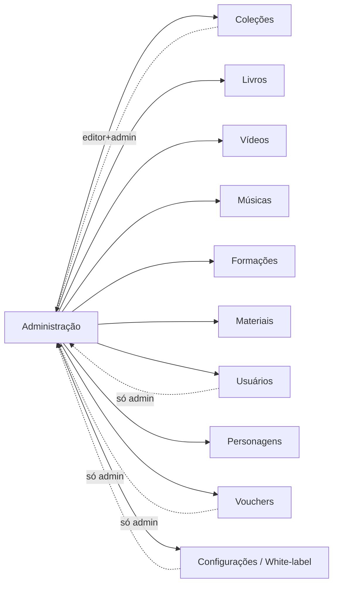

# Usabilidade da plataforma

Esta seção explica **como operar** cada parte do produto na prática — passo a passo,
por perfil de usuário. É o manual de operação da mesma base de código que atende
as duas marcas: **Kaboo** e **Central Coruja**.

{/* As duas marcas são o MESMO produto: mudam o tema (cores, logo, fontes) e as feature flags. */}

## As duas marcas, o mesmo produto

Kaboo e Central Coruja rodam sobre o **mesmo código**. O que muda entre elas:

- **Tema** — logo, cores, fontes e imagens de fundo (configurados em *Configurações → Identidade Visual*).
- **Feature flags** — quais módulos e menus aparecem (ex.: uma marca pode ligar *Músicas* e a outra não).
- **Catálogo** — cada marca tem seu próprio acervo de conteúdos e seus próprios vouchers.

Ao abrir o app em `#portal`, o usuário escolhe entre entrar como Kaboo, Central Coruja
ou acessar a Wiki. Em produção, o hostname já resolve a marca automaticamente
(ver `screens/PortalScreen.tsx:27` — `routeToBrandLogin`).

## Perfis de usuário

| Perfil | O que enxerga | Onde atua |
|--------|---------------|-----------|
| **Consumidor** (professor, escola, família) | Home/acervo, bibliotecas, players, busca, perfil | App público |
| **Editor** | Módulos de conteúdo (coleções, livros, vídeos, músicas, formações, materiais, personagens) | Administração |
| **Admin** | Tudo do editor **+** usuários, vouchers e configurações (white-label) | Administração |

A distinção editor × admin vem de `isAdmin()` (`lib/auth`). No painel, editores veem
`EDITOR_MODULES` e admins veem `ALL_MODULES` (`screens/AdminScreen.tsx:36`).
Módulos ainda podem ser escondidos por feature flag (`MODULE_FEATURE_FLAG`,
`screens/AdminScreen.tsx:39`).

## Mapa da Administração

## Como abrir a Administração

1. Faça login como usuário com permissão de editor ou admin.
2. No menu de navegação, entre em **Administração** (rota `#admin`).
3. No desktop, a **barra lateral** lista os módulos disponíveis; no celular, eles viram
   uma **barra de abas** rolável no topo (`screens/AdminScreen.tsx:110`).
4. Clique num módulo para abri-lo. Se você tiver alterações não salvas em Coleções,
   Livros, Usuários, Vídeos ou Músicas (`COLLECTION_SCREEN_MODULES`,
   `screens/AdminScreen.tsx:50`) — e também em Personagens, tratado à parte — o sistema
   pede confirmação antes de trocar de módulo (`screens/AdminScreen.tsx:184`).

## Guia por módulo

- [Coleções](./admin-colecoes.md)
- [Livros](./admin-livros.md)
- [Vídeos e Músicas](./admin-videos-musicas.md)
- [Formações](./admin-formacoes.md)
- [Materiais](./admin-materiais.md)
- [Vouchers](./admin-vouchers.md)
- [Personagens](./admin-personagens.md)
- [Configurações (White-label)](./admin-configuracoes.md)
- [Usuários](./admin-usuarios.md)

## Guia do consumidor

- [Como o usuário final navega](./consumidor.md)
