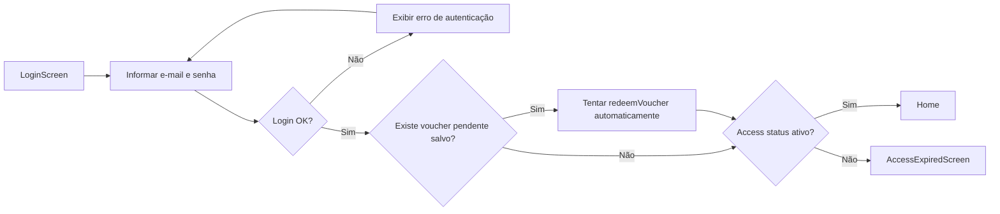
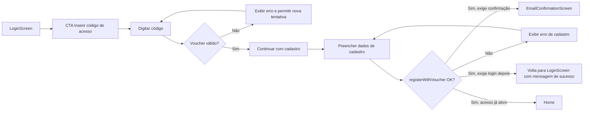
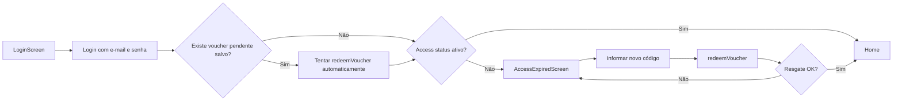
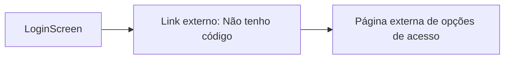
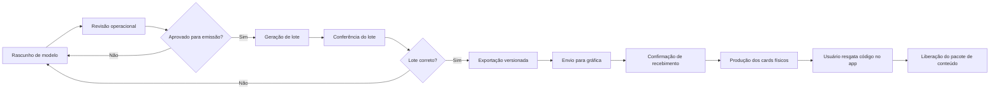

# Extração da reunião - Fluxo Kaboo (público-alvo, login e fabricação)

Data da extração: 13/04/2026  
Base de referência: PRD + benchmark operacional + jornadas de autenticação.

## 1. Recorte da reunião

Esta extração organiza o fluxo de ponta a ponta discutido para o Kaboo:

1. definição de público-alvo e papéis;
2. jornada de entrada e login no app;
3. processo administrativo de emissão e fabricação de vouchers físicos.

## 2. Público-alvo e papéis no fluxo

### 2.1 Administrador (interno)

- Objetivo: configurar modelos de voucher, emitir lotes, exportar para gráfica e auditar operação.
- Permissão no v1: acesso total ao CMS administrativo.
- Responsabilidades principais:
  - criar e revisar modelo;
  - aprovar emissão;
  - gerar lote;
  - conferir e exportar arquivo;
  - registrar envio e confirmação de recebimento.

### 2.2 Gráfica (ator externo)

- Objetivo: receber arquivo de lote e produzir cards físicos.
- Permissão no v1: sem login no sistema (processo via hand-off externo).
- Responsabilidades principais:
  - confirmar recebimento da versão correta do arquivo;
  - validar variante de arte;
  - produzir tiragem;
  - sinalizar exceções e solicitar reenvio quando necessário.

### 2.3 Professor

- Objetivo: acessar e utilizar o conteúdo educacional liberado pelo voucher ou pela conta já existente.
- Interação principal:
  - entra no app;
  - faz login direto ou segue o fluxo com código de acesso;
  - após autenticação e ativação válidas, acessa o pacote liberado.

### 2.4 Família

- Objetivo: apoiar a ativação do acesso quando o código físico estiver com a família ou quando o uso acontecer em ambiente doméstico.
- Interação principal:
  - pode receber ou guardar o card físico;
  - pode apoiar o resgate do código no app;
  - depois da ativação, acompanha o acesso ao conteúdo liberado.

## 3. Fluxo de login (visão operacional)

## 3.1 Pontos de entrada

- A tela inicial implementada hoje é o login direto com e-mail e senha.
- A partir dela, o usuário pode seguir por dois desvios:
  - inserir código de acesso, quando ainda não tem cadastro;
  - abrir a página externa de opções de acesso, quando não tem código.

## 3.2 Máquina de estados da autenticação

Estados principais expostos:

1. login;
2. register.

Estado auxiliar ainda disponível no componente:

3. voucher.

Transições implementadas:

- login -> register: CTA Inserir código de acesso;
- register -> email_confirmation: cadastro criado, mas exige confirmação de e-mail;
- register -> login: cadastro criado, mas o usuário ainda precisa entrar para concluir a ativação;
- register -> home: cadastro e ativação concluídos no mesmo fluxo;
- login -> home ou access_expired: depende do status final após login e eventual voucher pendente salvo.

Transições auxiliares ainda existentes no componente:

- voucher -> register: voucher validado + Continuar com cadastro;
- voucher -> login: voltar;

## 3.3 Jornadas chave

### A) Login direto (usuário já cadastrado)

1. usuário abre a LoginScreen;
2. informa e-mail e senha;
3. sistema autentica o perfil;
4. se houver voucher pendente salvo, o app tenta resgatar automaticamente;
5. navegação para Home quando o acesso está ativo ou para AccessExpiredScreen quando o perfil continua bloqueado.

### B) Novo usuário com voucher

1. usuário valida código;
2. escolhe continuar com cadastro;
3. cadastra os dados de acesso;
4. sistema cria a conta e tenta concluir a ativação;
5. o resultado pode levar a Home, EmailConfirmationScreen ou retorno ao login com mensagem de sucesso.

### C) Usuário existente com voucher

1. usuário entra pela LoginScreen padrão;
2. se houver voucher pendente salvo do cadastro, o app tenta resgatar automaticamente;
3. se o acesso continuar bloqueado e ele precisar informar um novo código, o resgate acontece na AccessExpiredScreen;
4. navegação para Home ou permanência em bloqueio depende do status final de acesso.

### D) Usuário sem código

1. usuário permanece na tela de login;
2. clica no link externo de opções de acesso;
3. o app abre a página pública de aquisição/conhecimento do produto.

## 3.4 Mermaid dos fluxos de autenticação

### Fluxo 1 - Entrada principal (login direto)

### Fluxo 2 - Novo usuário com voucher

### Fluxo 3 - Usuário existente com voucher após autenticação

### Fluxo 4 - Usuário sem código

## 4. Fluxo de fabricação (do CMS até a gráfica)

## 4.1 Macrofluxo recomendado

Rascunho de modelo -> revisão operacional -> aprovação para emissão -> geração de lote -> conferência de lote -> exportação versionada -> envio para gráfica -> confirmação de recebimento.

## 4.2 Estrutura operacional em três camadas

- Modelo de voucher: define o que será liberado (conteúdo, duração, validade).
- Lote de emissão: define a tiragem de uma rodada específica.
- Voucher individual: define código único impresso e resgatável.

## 4.3 Regras críticas acordadas para v1

1. lote é a unidade oficial de produção física;
2. aprovação de modelo deve existir antes da emissão;
3. emissão congela snapshot dos campos críticos;
4. exportação principal deve ser por lote (não por filtro solto);
5. qualquer correção após envio deve gerar nova versão de exportação;
6. reimpressão deve ser evento novo controlado (ou sublote), sem reutilização informal de CSV antigo.

## 4.4 Hand-offs com a gráfica

1. alinhamento pré-produção (modelo, variante, quantidade);
2. envio do CSV mestre do lote;
3. confirmação de recebimento da versão correta;
4. aceite para produção;
5. tratamento de exceções com nova versão registrada.

## 4.5 Artefatos mínimos

- registro de modelo com preview operacional;
- evento de aprovação/revisão;
- registro de lote com snapshot;
- CSV versionado por lote;
- log de envio;
- log de confirmação de recebimento;
- log de exceção/reimpressão quando houver.

## 5. Campos essenciais do arquivo para gráfica

Campos mínimos destacados:

- batch_id;
- export_version;
- voucher_code;
- voucher_model_id e voucher_model_name;
- artwork_id ou card_variant;
- package_type;
- content_summary_short e content_count;
- access_duration_months;
- redeem_by_date (quando existir);
- generated_at e generated_by.

Diretriz: não enviar dados pessoais de usuário final no arquivo de produção.

## 6. Riscos e mitigação discutidos

Riscos principais:

1. conteúdo prometido no card diferente do conteúdo liberado;
2. uso de arquivo desatualizado na gráfica;
3. duplicidade de códigos;
4. reuso informal de planilhas antigas;
5. divergência entre quantidade solicitada e quantidade produzida.

Mitigações centrais:

1. preview obrigatório + checklist antes de exportar;
2. versionamento do arquivo e confirmação de recebimento da versão correta;
3. geração transacional com garantia de unicidade;
4. snapshot por lote e bloqueio de edição retroativa dos campos críticos;
5. trilha de auditoria para emissão, exportação e hand-offs.

## 7. Decisões de documentação para seguir

1. manter separação explícita entre modelo, lote e voucher individual em todos os documentos;
2. documentar sempre validade do código separada da duração do acesso;
3. manter login em três jornadas: novo com voucher, existente com voucher e login direto;
4. tratar gráfica como ator externo no v1;
5. registrar todos os hand-offs no CMS, mesmo quando o canal de envio for externo.

## 8. Fontes usadas nesta extração

- [docs/prd-vouchers-por-conteudo.md](./prd-vouchers-por-conteudo.md)
- [docs/benchmark-fluxo-vouchers-grafica.md](./benchmark-fluxo-vouchers-grafica.md)
- [docs/docs/journeys/auth.md](./docs/journeys/auth.md)