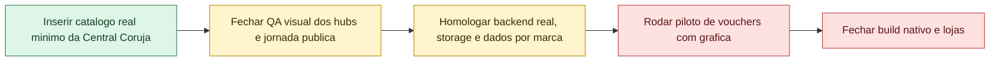

# Handoff de Evolucao do Produto - Mundo de Kaboo / Central Coruja

Data de corte: 16/05/2026  
Publico: Board, CEO, Produto, Engenharia, Operacoes e times parceiros  
Escopo: consolidacao do que foi planejado, do que evoluiu no repo, do que foi entregue em mock/local, do que avancou em hardening de plataforma e do que ainda falta para producao real.

---

## 1. Resumo executivo

A leitura mais honesta do estado atual e a seguinte: a Central Coruja esta pronta para demo, onboarding editorial e piloto controlado em ambiente local/mock, mas ainda nao esta pronta para operacao comercial publicada ponta a ponta.

O historico do git pede uma leitura em camadas:

- primeiro veio a **fundacao tecnica do Kaboo** no inicio do projeto;
- depois entrou a frente funcional de **voucher e acesso**;
- em seguida houve o amadurecimento do **Kaboo e do catalogo**;
- so depois a **Central Coruja** passou a existir como white-label e camada de operacao por marca.

Em cima dessa sequencia, o produto evoluiu para uma base compartilhada com:

- shell white-label por marca;
- jornadas de autenticacao e voucher operacionais;
- catalogo multimidia consumivel;
- CMS editorial com ativos tipados;
- taxonomia pedagogica e biblioteca estruturada;
- separacao de catalogo por marca;
- hardening de branding, feature flags, health check e offline no codigo.

O principal gap deixou de ser interface e passou a ser operacao real: catalogo verdadeiro da Central Coruja, backend real homologado, storage e dados por marca, fluxo operacional de vouchers com grafica e publicacao em lojas.

### Placar executivo

| Frente | Status | Leitura |
| --- | --- | --- |
| Planejamento, backlog e delta local | 100% | Roadmap e backlog consolidados e reconciliados |
| v1.2 local demonstravel | 100% | Vitrine e navegacao local/mock fechadas |
| QA de acesso, conteudo e separacao por marca | 90% | QA forte concluido; falta fechar validacao visual final com catalogo real nos hubs de videos e formacoes |
| v1.3 producao real | 20% | Arquitetura e shell existem; operacao real ainda nao homologada |
| v2.0 expansao | 0% | Academia, gamificacao, perfil infantil e OAuth ainda nao iniciados como rollout real |

### Legenda de maturidade

| Classe | Significado |
| --- | --- |
| Demonstravel | Validado em repo local, seed ou mock |
| Operavel | Validado com dado real, ambiente real ou piloto controlado |
| Publicado | Rodando em operacao real, com distribuicao ou loja |

```mermaid
flowchart LR
    A[08-12/01 - Fundacao tecnica Kaboo] --> B[08-10/04 - Voucher e acesso]
    B --> C[16/04 - Kaboo e catalogo v2]
    C --> D[21-29/04 - Central Coruja e white-label]
    D --> E[09/05 - QA e separacao por marca]
    E --> F[Mai/2026 - Hardening white-label, admin e offline]
    F --> G[v1.3 producao real - pendente]

    style D fill:#DDF6E8,stroke:#2D7A46,color:#143D22
    style E fill:#DDF6E8,stroke:#2D7A46,color:#143D22
    style F fill:#FFF4CC,stroke:#B78B00,color:#3A2A00
    style G fill:#FDE2E1,stroke:#C23B3B,color:#5A1414
```

---

## 2. Linha do tempo executiva

| Data | Fase | O que mudou | Resultado |
| --- | --- | --- | --- |
| 08-12/01/2026 | Fundacao tecnica do Kaboo | Primeiro bloco visivel no git: leitor, home, cards, navegacao, mobile, admin, cache e estrutura base da experiencia | Base tecnica do produto estabelecida |
| 08-10/04/2026 | Voucher e acesso | Entram voucher-only access, duas rotas de login, CTA para usuarios sem voucher, fluxo code-first, ajustes de QA e documentacao de jornadas | Primeira frente funcional clara de acesso e monetizacao definida |
| 16/04/2026 | Kaboo e catalogo v2 | Design system, contrato canonico do catalogo e adaptacao das superficies existentes | Base do Kaboo amadurece e fica mais preparada para escalar |
| 13-21/04/2026 | Tese e direcao de produto | A reuniao e os docs consolidam a tese da Central Coruja como white-label do Kaboo/Cabu: conteudo extra digital, publico adulto/familiar/educador, sem jogos e sem turmas, voucher fisico, infra separada e conta Empatia como pior cenario para lojas | Direcao de produto e restricoes macro definidas |
| 21-29/04/2026 | White-label e Central Coruja | Entram roadmap e backlog proprios da Central Coruja, baseline de brand config, fluxo de admin white-label, branding runtime e redesign da experiencia por marca | Central Coruja deixa de ser tese e vira frente concreta dentro da plataforma |
| 19-20/04/2026 e 09/05/2026 | Fechamento local e QA | v1.2 local demonstravel fecha em 100%; depois entram QA de acesso por papel, ciclo de conteudo, sincronizacao admin-publico e separacao por marca | Demo local fica forte e risco funcional cai de forma material |
| Maio/2026 | Hardening de plataforma | Codigo avanca em branding por bootstrap, feature flags, rotas por marca, admin media management e offline real com Service Worker e cache seletivo | Plataforma fica mais preparada para staging e rollout controlado |

---

## 3. Estado atual consolidado por camada

### 3.1 O que esta efetivamente pronto

- A tese de produto esta clara e documentada.
- O shell white-label por marca ja existe no app.
- As jornadas de autenticacao, voucher e acesso bloqueado estao documentadas e implementadas.
- O catalogo multimidia consumivel funciona em modo local/mock.
- O CMS editorial e os ativos tipados ja sustentam colecoes, personagens, midias e materiais.
- A separacao Kaboo x Central Coruja foi validada no repo com chaves e cache por marca.
- O hardening recente adicionou feature flags, health check de marca e base de offline real.

### 3.2 O que ainda nao pode ser vendido como pronto

- Nao ha prova documental de operacao real de vouchers com grafica ponta a ponta em producao.
- Nao ha prova de catalogo real da Central Coruja inserido e validado nos hubs publicos.
- A publicacao em lojas depende da decisao e execucao da conta Empatia.
- O backend real e o storage por marca ainda precisam ser homologados fora do modo mock/local.

### 3.3 Leitura reconciliada dos documentos

- O [README.md](../README.md) descreve o Kaboo core como plataforma-base para professores.
- Os documentos de produto da Central Coruja descrevem um white-label com foco em adulto, familiar e educador.
- A leitura correta para handoff e: o repo hoje sustenta uma plataforma compartilhada; o README descreve a base; o roadmap e backlog descrevem o produto white-label prioritario.
- O backlog de 09/05 ainda marca offline como pendente em uma story especifica, mas o codigo posterior ja mostra implementacao real de cache, Service Worker e gate por feature flag. Portanto, offline precisa ser lido como evolucao de maio, posterior ao snapshot original do backlog.

---

## 4. Epicos e entregaveis

### Epico 1 - White-label e isolamento de marca

**Objetivo**  
Permitir que o mesmo codebase atenda Kaboo e Central Coruja sem fork, com identidade visual, dados, menu, feature flags e governanca separados por marca.

**Planejado**
- Separacao de infra e white-label engine.
- Branding por configuracao.
- Isolamento operacional entre marcas.

**Entregue**
- Bootstrap de marca com slug, tema, menu e feature flags.
- Sync do slug para mock data, API e personagens.
- Catalogo vazio para Central Coruja, preservando seed do Kaboo.
- Health check de marca e checklist de incidente white-label.

**Pendente**
- Homologacao com backend real e storage por marca.
- Validacao de rollout/publicacao por marca em ambiente real.

**Status**  
Entregue no repo; producao real e rollout ainda pendentes.

**Evidencias**
- [mudancas KAboo](./mudan%C3%A7as%20KAboo.md)
- [backlog Central Coruja](./backlog-central-coruja-15abr2026.md)
- [health check white-label](./HEALTH-CHECK-WHITE-LABEL.md)
- [App.tsx](../App.tsx)
- [useBrandConfig.ts](../hooks/useBrandConfig.ts)

### Epico 2 - Vouchers e operacao grafica

**Objetivo**  
Transformar o voucher fisico em mecanismo de ativacao, vigencia e liberacao de conteudo, com trilha operacional para emissao, lote e envio para grafica.

**Planejado**
- Resgate temporal de vouchers.
- Renovacao digital pos-voucher.
- Modelo, lote e voucher individual como entidades operacionais.
- Exportacao para grafica e auditoria.

**Entregue**
- Core de voucher temporal no produto.
- Dados de resgate no CMS.
- Exportacao XLSX/CSV e teto operacional de 12 meses.
- Jornada de autenticacao com voucher documentada.
- Benchmark operacional detalhado para grafica.

**Pendente**
- Piloto real com grafica e comprovacao ponta a ponta.
- Fluxo real de renovacao/assinatura digital.
- Homologacao do processo em ambiente real, nao so desenho operacional.

**Status**  
Core entregue; operacao real e monetizacao pos-voucher ainda pendentes.

**Evidencias**
- [roadmap v1.2](./roadmap-central-coruja-v1.2.md)
- [consolidado backlog](./CONSOLIDADO-BACKLOG-REUNIAO-15ABR2026.md)
- [benchmark vouchers grafica](./benchmark-fluxo-vouchers-grafica.md)
- [extracao fluxo Kaboo](./extracao-reuniao-fluxo-kaboo.md)
- [JORNADAS](./JORNADAS.md)

### Epico 3 - Auth e jornadas de acesso

**Objetivo**  
Permitir entrada simples via login direto, cadastro com voucher e recuperacao de acesso expirado.

**Planejado**
- Cadastro com e-mail e senha.
- Entrada com voucher.
- Fluxo de acesso expirado e retomada.

**Entregue**
- Jornada de login direto.
- Jornada de novo usuario com voucher.
- Jornada de usuario existente com voucher pos-login.
- Tela de acesso expirado com reativacao.
- QA de acesso por papel no CMS.

**Pendente**
- CPF opcional com validacao juridica.
- Integracao futura com Educa Cross via OAuth.

**Status**  
Entregue e bem documentado; itens juridicos e SSO futuros.

**Evidencias**
- [JORNADAS](./JORNADAS.md)
- [extracao fluxo Kaboo](./extracao-reuniao-fluxo-kaboo.md)
- [README.md](../README.md)
- [backlog Central Coruja](./backlog-central-coruja-15abr2026.md)

### Epico 4 - Catalogo multimidia consumivel

**Objetivo**  
Entregar a experiencia de consumo do kit/livro com leitura, audio, video e derivados, sem misturar com jogos ou fluxo escolar.

**Planejado**
- Flipbook.
- Contacao de historia em audio.
- Video principal.
- Libras e video animado como evolucoes.
- Distincao kit vs livro.

**Entregue**
- Flipbook e leitura.
- Audio e video como modos de consumo.
- Distincao kit vs livro no mock/local.
- Labels descritivos e grid adaptativo.
- Leitor com modo texto.

**Pendente**
- Libras e animacao em rollout real consistente por catalogo.
- Persistencia real dos campos novos no backend.

**Status**  
Demonstravel e forte no repo local; real data e rollout ainda precisam fechar.

**Evidencias**
- [roadmap v1.2](./roadmap-central-coruja-v1.2.md)
- [consolidado backlog](./CONSOLIDADO-BACKLOG-REUNIAO-15ABR2026.md)
- [backlog Central Coruja](./backlog-central-coruja-15abr2026.md)

### Epico 5 - CMS editorial e ativos tipados

**Objetivo**  
Dar ao time editorial um modelo unico para administrar colecoes, midias, personagens e materiais, reduzindo divergencia entre admin e experiencia publica.

**Planejado**
- Admin de colecoes.
- Taxonomia editorial mais rica.
- Ativos multimidia tipados.
- Materiais com dois escopos.

**Entregue**
- Modelo tipado de assets.
- Sinopse.
- Segmentacao editorial multissegmento.
- Hubs publicos lendo dados vivos em vez de mock estatico em pontos criticos.
- QA cobrindo ciclo de criacao/edicao/delecao e consistencia entre admin e publico.

**Pendente**
- Inserir catalogo real minimo da Central Coruja no admin.
- Persistencia real do modelo tipado no backend e storage.

**Status**  
Entrega forte no repo; falta uso real com dados de operacao.

**Evidencias**
- [backlog Central Coruja](./backlog-central-coruja-15abr2026.md)
- [consolidado backlog](./CONSOLIDADO-BACKLOG-REUNIAO-15ABR2026.md)

### Epico 6 - Busca, filtros e taxonomias pedagogicas

**Objetivo**  
Ajudar descoberta rapida de conteudo por busca, filtros e leitura pedagogica do catalogo.

**Planejado**
- Busca unificada.
- Filtro por ano escolar.
- BNCC rica.
- CASEL e outros mapeamentos descritivos.

**Entregue**
- Busca inline e filtros unificados na home.
- Ordenacao por ano escolar.
- JSON BNCC estruturado e tooltip rico.
- CASEL com lookup local rico.
- Ajustes de UX mobile para BNCC.

**Pendente**
- Afuniladores pedagogicos mais profundos em backend real.
- Persistencia taxonomica e operacao fora do mock.

**Status**  
Entregue para demo e descoberta local; consolidacao real ainda pendente.

**Evidencias**
- [roadmap v1.2](./roadmap-central-coruja-v1.2.md)
- [consolidado backlog](./CONSOLIDADO-BACKLOG-REUNIAO-15ABR2026.md)
- [backlog Central Coruja](./backlog-central-coruja-15abr2026.md)

### Epico 7 - Personagens

**Objetivo**  
Dar identidade narrativa ao universo de conteudo e abrir uma frente de descoberta por personagem.

**Planejado**
- Pagina de personagens.
- Filtro por personagem com fotos.
- Uso de personagens como entidade propria.

**Entregue**
- CharactersScreen com rota, navegacao e dados.
- Correcoes de QA para excluir personagens inativos da camada publica.
- Viculos de personagens desacoplados de constantes estaticas em partes do fluxo.

**Pendente**
- Inserir personagens reais da Central Coruja.
- Fechar descoberta por personagem em catalogo real e backend.

**Status**  
Base pronta; uso real pela marca ainda pendente.

**Evidencias**
- [consolidado backlog](./CONSOLIDADO-BACKLOG-REUNIAO-15ABR2026.md)
- [backlog Central Coruja](./backlog-central-coruja-15abr2026.md)
- [App.tsx](../App.tsx)

### Epico 8 - Materiais e biblioteca estruturada

**Objetivo**  
Organizar materiais de apoio por componente e por escopo global sem perder contexto pedagogico.

**Planejado**
- Materiais por componente.
- Materiais extras genericos.
- Biblioteca estruturada.

**Entregue**
- Biblioteca estruturada de materiais extras.
- Teacher guide como asset dedicado.
- Modelo de materiais atendendo detalhe da colecao e biblioteca.
- QA garantindo que materiais criados no admin aparecem no hub publico.

**Pendente**
- Popular a Central Coruja com materiais reais.
- Persistencia real do escopo global e por componente.

**Status**  
Entregue no repo; falta uso real com catalogo da marca.

**Evidencias**
- [backlog Central Coruja](./backlog-central-coruja-15abr2026.md)
- [consolidado backlog](./CONSOLIDADO-BACKLOG-REUNIAO-15ABR2026.md)

### Epico 9 - Formacoes e hubs publicos

**Objetivo**  
Abrir hubs publicos de videos, musicas, formacoes e materiais para consumo agregado por tipo.

**Planejado**
- Hubs publicos por tipo.
- Conteudo de formacao como frente futura.
- QA de sincronizacao admin -> publico.

**Entregue**
- Rotas publicas para videos, music, formations, materials e characters.
- Bridge entre assets criados no admin e hubs publicos.
- QA cobrindo sincronizacao entre admin e Biblioteca Hub.

**Pendente**
- Validacao visual final dos hubs de videos e formacoes com catalogo real da Central Coruja.
- Definicao de rollout de formacoes como modulo de produto versus hub agregado.

**Status**  
Estrutura entregue com um caveat objetivo de validacao real.

**Evidencias**
- [backlog Central Coruja](./backlog-central-coruja-15abr2026.md)
- [App.tsx](../App.tsx)

### Epico 10 - Offline e hardening de plataforma

**Objetivo**  
Reduzir risco operacional da plataforma com controle por marca, cache seletivo, observabilidade e suporte a consumo offline de conteudo interno.

**Planejado**
- Inicialmente havia apenas ideia de mock de offline e restricao de YouTube por DRM.
- Hardening de marca e rollout nao estavam detalhados no backlog-base com a profundidade atual.

**Entregue**
- Decisao tecnica clara: YouTube nao entra em offline.
- Feature flag `content.offline` por marca.
- Hook de download offline com gate por colecao e por asset.
- Service Worker para cache de midia hospedada internamente.
- Health check white-label para feature flags, rollout, alertas e metricas.

**Pendente**
- Politica de rollout por marca e por tipo de conteudo em ambiente real.
- Homologacao com catalogo real e storage real.
- Definicao de suporte, limites e QA do offline em release candidate.

**Status**  
Avanco importante de maio; ainda precisa migrar de hardening tecnico para operacao validada.

**Evidencias**
- [backlog Central Coruja](./backlog-central-coruja-15abr2026.md)
- [HEALTH-CHECK-WHITE-LABEL.md](./HEALTH-CHECK-WHITE-LABEL.md)
- [useBrandConfig.ts](../hooks/useBrandConfig.ts)
- [useOfflineDownload.ts](../hooks/useOfflineDownload.ts)
- [sw.js](../public/sw.js)

---

## 5. Mapa planned vs delivered vs next

| Bloco | Planejado | Entregue no repo | Proximo gate |
| --- | --- | --- | --- |
| Tese e escopo do produto | White-label de conteudo extra digital, adulto/familiar/educador, sem jogos e sem turmas | Tese preservada em todos os documentos principais e refletida na arquitetura do app | Manter expansao futura fora da v1.3 |
| v1.2 vitrine local | Busca, filtros, tipagem editorial, assets, materiais, kit vs livro, BNCC/CASEL | Fechado em 19-20/04 como demo local validada | Nao reabrir escopo de vitrine; usar como baseline de RC |
| Sprint 2.5 editorial e operacao | Multissegmentos, vouchers operacionais, BNCC estruturado, personagens, modo texto, assets tipados, biblioteca de materiais | Fechado em 18-19/04 no repo local | Persistir e homologar em backend real |
| QA e separacao por marca | Papel, cache, consistencia admin/publico, catalogo isolado por marca | Fechado em 09/05 com 5 frentes principais | Popular catalogo real da Central Coruja |
| Hardening white-label e offline | Nao era bloco maduro no backlog-base | Avancou depois no codigo com bootstrap, feature flags, health check, cache e Service Worker | Homologar em staging/real e definir rollout controlado |
| v1.3 producao real | Supabase real, persistencia dos campos novos, conta Empatia, build nativo, publicacao | Apenas preparacao parcial | Transformar shell pronto em operacao comprovada |
| v2.0 expansao | Academia, gamificacao, perfil infantil, OAuth | Nao iniciado como entrega real | Decidir go/no-go depois do piloto de v1.3 |

---

## 6. Proximo gate de valor

O caminho mais curto entre "demo pronta" e "produto operavel" nao e construir mais interface. E colocar dado real minimo, fechar QA visual e homologar a camada de operacao.

---

## 7. Plano 30/60/90 dias

### 30 dias

| Frente | Owner sugerido | Criterio de saida |
| --- | --- | --- |
| Catalogo real minimo da Central Coruja | Fabio Alves + editorial + QA | Pelo menos 1 colecao real, 1 video, 1 formacao, 1 material e 2 personagens reais criados via admin |
| Fechamento do caveat dos hubs | QA + Fabio Alves | Hubs de videos e formacoes validados em browser com evidencias reais |
| Escopo fechado de v1.3 | Mario Teodoro | Lista formal do que entra em producao real e do que fica fora |
| Backend/staging por marca | Maxwell Cortez | Ambiente real ou staging com storage e isolamento por marca homologados |
| Decisao de lojas | Douglas Rossato + Rafael Fujii + Maxwell Cortez | Caminho fechado para conta Empatia, build e submissao |

### 60 dias

| Frente | Owner sugerido | Criterio de saida |
| --- | --- | --- |
| Fluxo real ponta a ponta | Maxwell Cortez + Mario Teodoro | Cadastro, login, voucher, acesso e consumo rodando fora do mock |
| Operacao editorial real | Fabio Alves | Colecoes, personagens e assets tipados reais refletidos no publico |
| Offline controlado | Maxwell Cortez + Fabio Alves | Rollout seletivo por marca e tipo de conteudo, sem YouTube |
| Release candidate | QA + Produto | RC validado com dado real, sem caveats abertos de bloqueio |

### 90 dias

| Frente | Owner sugerido | Criterio de saida |
| --- | --- | --- |
| Piloto controlado de producao real | Mario Teodoro + Maxwell Cortez | Primeira operacao real da Central Coruja ou primeira marca piloto em ambiente controlado |
| Operacao real de vouchers fisicos | Fabio Alves + operacao comercial | Lote emitido, exportado, recebido pela grafica e resgatado sem ruptura |
| Go/No-Go de expansao | CEO + Produto | Decisao formal sobre academia, gamificacao, perfil infantil e OAuth |

---

## 8. Riscos, lacunas e alertas de handoff

| Risco ou lacuna | Impacto | Leitura recomendada |
| --- | --- | --- |
| Confundir demo local com producao real | Alto | Sempre apresentar o triplo: demonstravel, operavel, publicado |
| Catalogo real da Central Coruja ainda nao inserido | Alto | Sem isso, os hubs publicos e o fluxo editorial ficam parcialmente teoricos |
| Operacao grafica documentada, mas nao comprovada em live | Alto | Tratar benchmark e fluxo como desenho operacional, nao como entrega em producao |
| Offline ja existe no codigo, mas backlog-base ainda o marca como pendente | Medio | Ler offline como avancao posterior de maio e precisar homologacao real |
| Lojas e conta Empatia ainda dependem de decisao/execucao cross-time | Alto | Tratar como bloqueio executivo, nao como detalhe tecnico |
| README e docs de produto falam de recortes diferentes | Medio | README descreve a plataforma-base Kaboo; roadmap/backlog descrevem o white-label Central Coruja |

---

## 9. Recomendacoes para apresentacao ao Board e ao CEO

- Abrir com a frase: "demo pronta, producao real ainda nao".
- Mostrar o placar triplo: v1.2 local 100%, v1.3 real 20%, v2.0 0%.
- Rotular cada entrega com um selo simples: Demonstravel, Operavel, Publicado.
- Tratar hardening tecnico como reducao de risco de plataforma, nao como prova de operacao comercial.
- Organizar os proximos passos por gate de dependencia real: catalogo real, QA visual, backend real, grafica, lojas.
- Evitar numero macro unico como manchete. Se um numero agregado for exigido, usar apenas como nota secundaria e nunca no lugar dos tres estagios.

---

## 10. Fontes-base para o handoff

### Estrategia, tese e origem

- [mudancas KAboo](./mudan%C3%A7as%20KAboo.md)
- [roadmap v1.2](./roadmap-central-coruja-v1.2.md)
- [consolidado backlog](./CONSOLIDADO-BACKLOG-REUNIAO-15ABR2026.md)
- [backlog Central Coruja](./backlog-central-coruja-15abr2026.md)

### Jornadas e operacao

- [JORNADAS](./JORNADAS.md)
- [extracao fluxo Kaboo](./extracao-reuniao-fluxo-kaboo.md)
- [benchmark vouchers grafica](./benchmark-fluxo-vouchers-grafica.md)

### White-label, branding e hardening recente

- [health check white-label](./HEALTH-CHECK-WHITE-LABEL.md)
- [App.tsx](../App.tsx)
- [useBrandConfig.ts](../hooks/useBrandConfig.ts)
- [useOfflineDownload.ts](../hooks/useOfflineDownload.ts)
- [sw.js](../public/sw.js)

### Plataforma-base

- [README.md](../README.md)
- [CHANGELOG](./CHANGELOG.md)

---

## 11. Conclusao para handoff

O projeto evoluiu de uma tese de produto definida em abril para uma base demonstravel robusta em maio, com ganho claro em editorial, descoberta, isolamento por marca e resiliencia tecnica. O ponto central do handoff e deixar explicito que o maior trabalho restante nao esta em desenhar novas telas, e sim em transformar uma vitrine local muito madura em uma operacao real, com catalogo proprio, ambiente homologado, vouchers rodando com dados verdadeiros e publicacao controlada.

Em resumo:

- produto demonstravel: sim;
- plataforma compartilhada white-label: sim;
- operacao real homologada: ainda nao;
- expansao v2.0: ainda nao iniciada.
