# PRD - Gestão Administrativa de Vouchers por Conteúdo

Status: Proposto  
Data: 08/04/2026  
Projeto: Mundo de Kaboo  
Foco: melhoria de UX administrativa e operação de emissão de vouchers físicos dentro de um CMS administrativo unificado do app

Base de contexto validada no código:
- O fluxo atual de voucher já existe e hoje é estritamente temporal, com tipos em types.ts e RPCs validate_voucher e redeem_voucher.
- O schema atual de vouchers em Supabase armazena código, duração, status, validade do código e consumo, mas não define escopo de conteúdo.
- A área administrativa atual em AdminCollectionsScreen.tsx cobre Coleções e Usuários; não existe gestão administrativa de vouchers por conteúdo.
- O catálogo atual já existe e hoje é representado principalmente por itens em collections, com recursos associados.

Este documento define a direção de produto e a modelagem de alto nível suficiente para orientar engenharia. Não substitui o design técnico detalhado de banco, APIs e tela.

Documentos complementares:
- benchmark operacional do fluxo de criação e envio para gráfica em [benchmark-fluxo-vouchers-grafica.md](./benchmark-fluxo-vouchers-grafica.md)
- wireframe textual do CMS administrativo em [wireframe-cms-admin.md](./wireframe-cms-admin.md)

Premissa de produto adotada:
- a nova área deve ser exclusiva para administradores;
- a experiência de vouchers deve nascer como um módulo dentro de uma área administrativa unificada, funcionando como o CMS operacional do app.

## 1. Contexto e problema

Hoje o Mundo de Kaboo já suporta ativação e renovação de acesso por voucher, mas o voucher atual só responde a duas perguntas: por quanto tempo o acesso ficará ativo e qual é o status do código. Isso resolve a vigência, mas não resolve o escopo do acesso.

Na prática, o pedido operacional mudou. Agora o negócio precisa emitir vouchers físicos para gráfica e cada card pode liberar combinações diferentes de conteúdos: um livro, uma coleção, um kit com múltiplos itens ou um conjunto curado. O sistema atual não oferece uma fonte única de verdade para essa operação.

Problemas gerados pelo cenário atual:
- O time administrativo não consegue configurar, revisar e versionar um voucher com base no conteúdo que ele libera.
- Não existe distinção entre um modelo reutilizável de voucher e um código individual que será impresso e resgatado.
- Não existe gestão de lotes para emissão em escala e envio para gráfica.
- Não existe preview operacional claro do que cada voucher libera, o que aumenta risco de erro humano.
- Não existe trilha de auditoria suficiente para responder perguntas como: qual lote foi enviado, quais códigos foram gerados, o que cada código prometia liberar e qual usuário resgatou cada um.
- Alterações posteriores podem gerar desalinhamento entre o que foi impresso no card e o que o sistema entende que o voucher libera.

Além do problema operacional, há um problema de UX administrativa: a área atual foi desenhada para coleções e usuários, não para um fluxo de configuração, emissão, revisão e rastreamento de vouchers por conteúdo.

## 2. Objetivo do produto

Criar uma área administrativa de vouchers que permita:
- cadastrar modelos de voucher com duração e escopo de conteúdo;
- gerar lotes de vouchers individuais a partir desses modelos;
- listar, buscar, filtrar, exportar e acompanhar os vouchers emitidos para envio à gráfica;
- reduzir erro operacional por meio de preview, estados claros, bloqueios de edição e trilha de auditoria;
- evoluir o fluxo de resgate para que o voucher continue concedendo tempo de acesso, mas também aplique o pacote de conteúdo correto.

Direção estrutural da experiência:
- a funcionalidade de vouchers não deve nascer como uma ilha separada;
- ela deve compor um CMS administrativo unificado, onde o app concentre tarefas como gestão de coleções, usuários, vouchers e demais operações administrativas relevantes.

Objetivo de negócio:
- transformar a emissão de vouchers físicos em um processo controlado, rastreável e escalável.

Objetivo de UX administrativa:
- permitir que um administrador configure e emita vouchers com confiança, sem depender de planilhas manuais ou memória operacional.

Objetivo de engenharia:
- sair do modelo atual de voucher apenas temporal para um modelo orientado a entitlements de conteúdo, preservando a simplicidade do resgate já existente.

## 3. Escopo v1 e fora de escopo

### Escopo v1

- Posicionar vouchers como um módulo dentro de um CMS administrativo unificado do app.
- Restringir acesso ao CMS administrativo exclusivamente a administradores.
- Permitir criar e manter modelos de voucher.
- Permitir selecionar itens do catálogo já existente como escopo de acesso do voucher.
- Permitir agrupar conteúdos em quatro formatos de apresentação no modelo: livro, coleção, kit ou conjunto curado.
- Permitir definir a duração do acesso do voucher com as durações já suportadas no produto atual: 1, 3, 6, 9 ou 12 meses.
- Permitir definir validade do código para resgate, separada da duração do acesso após resgate.
- Permitir gerar lotes de vouchers individuais a partir de um modelo aprovado.
- Permitir listar vouchers individuais e lotes com busca, filtros e exportação para gráfica.
- Exibir preview operacional do voucher antes da emissão, com contagem de itens, resumo do conteúdo liberado, duração e validade.
- Registrar trilha de auditoria básica para criação, edição, emissão, exportação, desativação e resgate.
- Evoluir o resgate para aplicar acesso por conteúdo, preservando a regra atual de extensão de vigência.

### Fora de escopo v1

- Criador visual de arte final do card físico.
- Integração direta com sistemas externos da gráfica.
- Geração automática de PDF pronto para impressão com layout final do card.
- Precificação comercial, campanhas promocionais e gestão financeira do voucher.
- Marketplace ou catálogo público de compra de vouchers.
- Workflows complexos de aprovação em múltiplas etapas.
- Reatribuição manual de um voucher já resgatado para outro usuário.
- Personalização de conteúdo por escola, turma ou contrato comercial no mesmo ciclo inicial.
- Criação de uma taxonomia nova de catálogo para o usuário final fora do que já existe hoje em collections.
- Delegação de permissões administrativas para perfis não admin no primeiro release.

## 4. Perfis de usuário

| Perfil | Objetivo principal | Papel no v1 |
| --- | --- | --- |
| Administrador | Configurar modelos, emitir lotes, exportar para gráfica, auditar e intervir em vouchers não usados | Acesso total |
| Gráfica | Receber lista de códigos e metadados para produção dos cards físicos | Ator externo, sem login no v1 |
| Professor/usuário final | Resgatar um código e acessar exatamente o conteúdo prometido pelo card | Impactado pelo fluxo de resgate |

Decisão de permissão para v1:
- o CMS administrativo deve ser acessível somente por administradores;
- emissão de lote, exportação, desativação de código, arquivamento e alteração de modelos já utilizados devem ser ações exclusivas de administrador;
- não haverá modo parcial para editor no primeiro release, para reduzir risco operacional e complexidade de autorização.

## 5. Principais jornadas UX

### Jornada 1: Criar um modelo de voucher

O administrador entra na área de vouchers, inicia um novo modelo, informa nome interno, tipo de pacote, duração do acesso, validade opcional do código e seleciona os itens do catálogo que serão liberados. Antes de salvar, visualiza um resumo claro com nomes dos itens, contagem total e o que o usuário final receberá.

Expectativa de UX:
- o formulário deve deixar explícita a diferença entre validade do código e vigência do acesso;
- o preview deve ser legível e suficiente para revisão sem abrir múltiplas telas;
- o sistema deve impedir salvar um modelo inconsistente ou vazio.

### Jornada 2: Revisar e emitir um lote para gráfica

O administrador abre um modelo existente, revisa o preview, informa a quantidade de vouchers desejada e gera um lote. O sistema cria os códigos individuais, congela um snapshot do modelo usado e devolve uma listagem pronta para conferência e exportação.

Expectativa de UX:
- a confirmação de emissão deve mostrar quantidade, duração, validade e contagem de itens liberados;
- o usuário deve ser alertado de que a emissão congela os campos críticos do modelo para aquele lote;
- o lote gerado precisa ter identificador próprio e status operacional claro.

### Jornada 3: Buscar, filtrar e exportar para gráfica

O administrador acessa a lista de lotes ou vouchers individuais, busca por nome de modelo, código, lote, status ou período, revisa a seleção e exporta os registros necessários para envio à gráfica.

Expectativa de UX:
- filtros precisam responder a perguntas operacionais reais, não só técnicas;
- a exportação deve sair com colunas previsíveis e sem necessidade de retrabalho manual;
- o sistema deve registrar quando e por quem a exportação foi feita.

### Jornada 4: Investigar um voucher específico

O administrador pesquisa um código individual e visualiza rapidamente seu histórico: de qual modelo veio, em qual lote foi emitido, o que ele libera, qual era sua validade, seu status atual e, se já usado, por quem e quando foi resgatado.

Expectativa de UX:
- a resposta precisa estar disponível em uma única visão de detalhe;
- o snapshot do conteúdo prometido no momento da emissão deve continuar visível mesmo se o modelo evoluir depois.

### Jornada 5: Intervir com segurança

O administrador precisa desativar um código não usado, arquivar um modelo antigo ou corrigir uma configuração. O sistema deve direcionar para uma ação segura: bloquear o código, duplicar o modelo ou criar nova versão, em vez de editar retroativamente algo que já foi emitido.

Expectativa de UX:
- ações irreversíveis precisam exigir confirmação e motivo;
- o sistema deve favorecer versionamento e duplicação, não edição destrutiva.

## 5.1. Princípios de UX da área administrativa

Para o v1, a experiência administrativa deve priorizar clareza operacional acima de densidade excessiva de informação. O usuário admin precisa confiar que está emitindo exatamente o voucher certo, com o pacote certo, para a quantidade certa.

A decisão de arquitetura de produto é tratar essa experiência como o CMS do app. Isso significa que vouchers deve compartilhar navegação, linguagem, padrões visuais e modelo mental com os demais módulos administrativos, em vez de surgir como uma tela isolada.

Princípios recomendados:
- separar claramente três camadas na interface: modelo, lote e código individual;
- usar uma navegação administrativa única, com módulos consistentes para Coleções, Usuários, Vouchers e expansões futuras;
- mostrar sempre o resumo do impacto da ação antes da confirmação;
- evitar formulários longos em uma única coluna sem contexto visual;
- usar linguagem operacional consistente, sem misturar validade do código com tempo de acesso do usuário;
- reduzir risco de erro com chips de status, contadores, preview fixo e confirmações contextualizadas;
- privilegiar duplicação e versionamento em vez de edição destrutiva de registros já emitidos.

Arquitetura da informação recomendada:
- home administrativa ou navegação persistente do CMS com acesso central aos módulos do app;
- visão Modelos: lista de templates, status, tipo de pacote, quantidade de itens, duração, última emissão e ações rápidas;
- visão Lotes: lista de emissões, quantidade de códigos, status operacional, data de exportação e origem;
- visão Códigos: busca detalhada por voucher individual, com filtros mais operacionais e detalhe de rastreabilidade;
- visão Detalhe: página ou drawer lateral que concentra preview, histórico, auditoria e ações seguras.

Padrão de criação recomendado:
- fluxo em etapas curtas, com progressão clara: dados do modelo, seleção de conteúdo, revisão final;
- painel lateral ou resumo fixo mostrando em tempo real nome do modelo, tipo de pacote, quantidade de itens, duração e validade;
- etapa final de revisão com destaque visual para o que será congelado após emissão.

Estados de tela que precisam ser desenhados desde o início:
- vazio: sem modelos, sem lotes e sem resultados de busca;
- rascunho: modelo incompleto com alertas claros do que falta;
- ativo: modelo pronto para emissão;
- arquivado: somente consulta;
- lote recém-gerado: com CTA principal de exportação;
- exportado: com marcação visível de data e responsável;
- erro operacional: tentativa de gerar lote sem conteúdo, exportar lista vazia ou editar item bloqueado;
- confirmação crítica: desativação de voucher, arquivamento de modelo e cancelamento de lote.

Recomendação de apresentação visual para reduzir erro humano:
- exibir capas, títulos e contagem de itens no preview sempre que houver mídia disponível;
- usar badges diferentes para tipo de pacote, status do modelo, status do lote e status do voucher;
- destacar números críticos na revisão final, como quantidade de vouchers a gerar e data limite de resgate;
- manter o histórico operacional em ordem cronológica simples, legível e filtrável.

## 5.2. Fluxo visual (Mermaid)

O diagrama abaixo resume o fluxo operacional do v1 no CMS administrativo. A versão mais detalhada, com benchmark e hand-offs completos com a gráfica, está em [benchmark-fluxo-vouchers-grafica.md](./benchmark-fluxo-vouchers-grafica.md).

```mermaid
flowchart LR
	subgraph ADMIN["Admin interno"]
		A1["Cria ou duplica modelo"]
		A2["Seleciona conteudos, duracao e validade"]
		A3["Revisa preview operacional"]
		A4{"Aprovar para emissao?"}
		A5["Gera lote"]
		A6["Confere lote"]
		A7{"Lote correto?"}
		A8["Exporta e envia para grafica"]
	end

	subgraph SISTEMA["Sistema Kaboo"]
		S1["Valida modelo"]
		S2["Congela snapshot do modelo"]
		S3["Gera vouchers unicos"]
		S4["Registra auditoria"]
		S5["Ativa vigencia e conteudos no resgate"]
	end

	subgraph GRAFICA["Grafica"]
		G1["Recebe arquivo do lote"]
		G2["Confirma recebimento"]
		G3["Produz os cards"]
	end

	subgraph USUARIO["Usuario final"]
		U1["Recebe card fisico"]
		U2["Resgata codigo no app"]
		U3["Acessa o pacote liberado"]
	end

	A1 --> A2 --> S1 --> A3 --> A4
	A4 -- "Nao" --> A1
	A4 -- "Sim" --> A5 --> S2 --> S3 --> A6 --> A7
	A7 -- "Nao" --> A1
	A7 -- "Sim" --> S4 --> A8 --> G1 --> G2 --> G3 --> U1 --> U2 --> S5 --> U3

	style A4 fill:#FFF4CC,stroke:#B78B00,color:#3A2A00
	style A7 fill:#FFF4CC,stroke:#B78B00,color:#3A2A00
	style S5 fill:#DDF6E8,stroke:#2D7A46,color:#143D22
```

## 6. Requisitos funcionais

### RF01. Área administrativa de vouchers

- O produto deve oferecer vouchers como módulo de um CMS administrativo unificado do app.
- O CMS administrativo deve consolidar as tarefas administrativas do produto em uma navegação única e coerente.
- O acesso ao CMS administrativo deve ser permitido somente para usuários com papel de administrador.
- A entrada da funcionalidade deve ser descoberta com facilidade por administradores dentro da navegação principal do CMS.
- O módulo de vouchers pode nascer aproveitando a estrutura existente da área admin atual, desde que a evolução já respeite a visão de CMS unificado.

### RF02. Modelo de voucher

- O sistema deve permitir criar um modelo de voucher sem gerar códigos imediatamente.
- O modelo deve armazenar pelo menos: nome interno, descrição opcional, tipo de pacote, duração do acesso, validade opcional do código, status do modelo e seleção de conteúdos.
- O status do modelo no v1 deve ser claro e simples: rascunho, ativo e arquivado.
- Um modelo em rascunho pode ser editado livremente.
- Um modelo ativo pode ser usado para emissão de novos lotes.
- Um modelo arquivado não pode gerar novos lotes, mas continua visível para histórico.

### RF03. Seleção e agrupamento de conteúdo

- O sistema deve usar como fonte os itens do catálogo já existente.
- O administrador deve conseguir selecionar um item único ou múltiplos itens para compor o pacote liberado pelo voucher.
- O modelo deve permitir classificar o pacote como livro, coleção, kit ou conjunto curado.
- Em v1, essa classificação é operacional e de apresentação; ela não exige criar um catálogo novo para o usuário final.
- O sistema deve evitar seleção duplicada do mesmo item dentro do mesmo modelo.
- O sistema deve exibir contagem total de itens liberados pelo modelo.

### RF04. Preview operacional do modelo

- Antes da emissão, o sistema deve exibir um preview do voucher com resumo objetivo do que será liberado.
- O preview deve mostrar: nome do modelo, tipo do pacote, quantidade de itens, lista resumida dos títulos, duração do acesso e validade do código.
- Sempre que possível, o preview deve mostrar elementos visuais do catálogo, como capa ou título principal, para reduzir erro humano.
- O preview deve deixar explícito o que será visto pelo usuário final no resgate.

### RF05. Geração de lote

- O sistema deve permitir gerar um lote com N vouchers individuais a partir de um modelo.
- Cada lote deve ter identificador próprio, referência temporal, quantidade de códigos gerados, usuário responsável e status operacional.
- O status operacional mínimo do lote no v1 deve diferenciar: gerado, exportado e cancelado.
- A geração do lote deve ser transacional: ou todos os códigos são criados, ou nenhum é criado.
- O sistema deve congelar um snapshot do modelo usado na emissão para garantir rastreabilidade histórica.

### RF06. Voucher individual

- Cada voucher individual deve continuar sendo um código único, resgatável uma única vez.
- O voucher individual deve herdar duração, validade e conteúdo do snapshot do modelo/lote do qual foi gerado.
- O status funcional do voucher individual no v1 deve continuar compatível com o modelo atual: active, redeemed, expired e disabled.
- O sistema não deve permitir edição manual do código individual após geração.
- O sistema deve permitir desativar apenas vouchers ainda não resgatados.

### RF07. Listagem, busca e filtros

- O sistema deve oferecer listagem de modelos, lotes e vouchers individuais.
- A busca deve permitir localizar por nome do modelo, identificador do lote e código individual.
- Os filtros mínimos do v1 devem incluir: status do modelo, status do lote, status do voucher, período de criação, período de validade, exportado/não exportado e resgatado/não resgatado.
- A listagem deve exibir contadores úteis para operação, como quantidade emitida, quantidade resgatada e quantidade ainda disponível.

### RF08. Exportação para gráfica

- O sistema deve permitir exportar vouchers individuais por lote e por filtros aplicados.
- O formato mínimo do v1 deve ser CSV.
- A exportação deve conter apenas os dados necessários para produção operacional, sem dados pessoais de usuários finais.
- Colunas mínimas recomendadas: lote, modelo, código, tipo do pacote, resumo do pacote, quantidade de itens, duração, validade do código, status de emissão e data de geração.
- O sistema deve registrar exported_at e exported_by no lote ou no evento de exportação.

### RF09. Resgate e aplicação de acesso

- O resgate deve continuar simples do ponto de vista do usuário final: informar o código e ativar acesso.
- O sistema deve preservar a regra atual de vigência: se o usuário já tem acesso ativo, a nova duração é somada a partir da maior data entre agora e a expiração atual.
- Além da vigência, o resgate deve conceder acesso aos conteúdos definidos no voucher.
- O acesso por conteúdo deve ser aditivo: resgatar um novo voucher não deve remover conteúdos ainda válidos concedidos anteriormente.
- Conteúdos fora do pacote do voucher devem permanecer bloqueados.
- O resultado do resgate deve ser capaz de informar ao usuário o que foi liberado e até quando o acesso ficará válido.

### RF10. Bloqueios de edição e segurança operacional

- Depois que um modelo gerar pelo menos um lote, os campos críticos usados na emissão não devem mais ser editados retroativamente para aquele histórico.
- Campos críticos: itens liberados, duração, validade do código e nomenclatura operacional exibida no material da gráfica.
- Quando houver necessidade de mudança nesses campos, o sistema deve orientar duplicação do modelo ou criação de nova versão.
- Modelos, lotes e vouchers não devem ser removidos fisicamente em fluxos administrativos comuns; o fluxo padrão deve ser arquivar, cancelar ou desativar.

### RF11. Auditoria

- O sistema deve registrar eventos mínimos de auditoria: criação de modelo, edição de modelo, geração de lote, exportação, arquivamento, desativação de voucher e resgate.
- Cada evento deve registrar ator, data/hora, entidade afetada e resumo do antes/depois quando aplicável.
- A auditoria deve ser consultável por suporte e administração.

## 7. Requisitos não funcionais e regras de negócio

### Requisitos não funcionais

- Segurança: apenas perfis autorizados podem emitir, exportar, desativar ou arquivar; o acesso deve respeitar RLS e permissões administrativas.
- Integridade: geração de códigos deve garantir unicidade, normalização e resistência a colisão.
- Rastreabilidade: todo voucher resgatado deve ser rastreável até modelo e lote de origem.
- Performance: a listagem administrativa deve suportar paginação, busca e filtros sem exigir download completo de todos os vouchers.
- Confiabilidade operacional: exportações devem ser reproduzíveis e auditáveis.
- Compatibilidade incremental: a evolução para acesso por conteúdo não pode quebrar o fluxo atual de autenticação e renovação.

### Regras de negócio

- V1 deve manter as durações já existentes no produto atual: 1, 3, 6, 9 e 12 meses.
- Validade do código e duração do acesso são conceitos distintos e devem aparecer separados na interface.
- O código individual é de uso único.
- O código pode expirar sem nunca ter sido resgatado; isso não deve afetar vouchers já resgatados.
- A expiração do acesso concedido ao usuário deve ser controlada pela vigência do grant, não pela data de criação do modelo.
- O sistema deve usar códigos normalizados em caixa alta, preservando a lógica atual de validação.
- O mesmo item não pode aparecer duplicado no mesmo modelo.
- A emissão deve gravar snapshot do pacote de conteúdo; mudanças futuras no modelo não reescrevem vouchers já emitidos.
- Vouchers resgatados não podem ser desativados retroativamente no v1 via operação comum.
- Se um lote já foi exportado ou parcialmente resgatado, ele não pode ser editado; apenas consultado, cancelado quando aplicável ou usado como referência para novo lote.

## 8. Proposta de modelagem de alto nível

### Princípios de modelagem

- Diferenciar claramente configuração reutilizável, emissão em escala e código individual.
- Reaproveitar o máximo possível do schema atual de vouchers, tratando a tabela atual como a camada de voucher individual.
- Introduzir grants de conteúdo para sair do modelo global de acesso sem perder compatibilidade com o resumo de acesso em profiles.

### Entidades recomendadas

| Entidade | Papel no produto | Observação de alto nível |
| --- | --- | --- |
| voucher_model | Template configurável | Define duração, validade, tipo de pacote, nome e regras de conteúdo |
| voucher_model_item | Itens do catálogo vinculados ao modelo | Relaciona o modelo aos itens já existentes no catálogo |
| voucher_batch | Lote emitido para operação e gráfica | Agrupa múltiplos vouchers individuais gerados de uma só vez |
| vouchers | Voucher individual/código gerado | Reaproveita a tabela atual, agora vinculada a modelo/lote e a um snapshot de conteúdo |
| user_content_grant | Permissão efetiva por usuário e conteúdo | Registra o que foi concedido no resgate e até quando vale |
| audit_log | Histórico operacional | Sustenta suporte, rastreio e conformidade operacional |

### Definições operacionais

- Modelo de voucher: configuração reutilizável. Não contém códigos individuais.
- Lote: emissão de vários códigos a partir de um modelo congelado naquele momento.
- Voucher individual: código único que o usuário final resgata.

### Direção recomendada para engenharia

- Evoluir a tabela vouchers existente para representar o voucher individual, adicionando vínculo com modelo, lote e snapshot de conteúdo.
- Criar estrutura separada para modelo e itens do modelo.
- Criar estrutura separada para lote, porque status operacional de emissão e exportação não deve ser misturado com status de resgate do código.
- Criar grants de conteúdo por usuário, porque o modelo atual em profiles não é suficiente para representar múltiplos pacotes ativos ao mesmo tempo.
- Manter access_status, access_starts_at e access_expires_at em profiles como resumo derivado ou compatível para as telas existentes durante a transição.

### Tratamento de livro, coleção, kit e conjunto curado

- No v1, esses conceitos devem funcionar como formas de agrupamento e apresentação no modelo, usando itens do catálogo já existente.
- Se hoje o catálogo ainda representa os títulos principalmente como collections, isso não impede o lançamento do v1.
- Um livro pode ser um item único.
- Uma coleção pode ser um item único ou um agrupamento já existente no catálogo, conforme a taxonomia vigente.
- Um kit ou conjunto curado pode ser representado como uma seleção manual de múltiplos itens dentro do modelo.

Esse desenho permite entregar a operação sem exigir uma refatoração completa do catálogo antes do v1.

## 9. Critérios de aceitação por bloco

### Bloco A: navegação e permissão

- Administradores conseguem acessar o CMS administrativo e, dentro dele, o módulo de vouchers.
- Usuários sem permissão de administração não conseguem acessar o CMS administrativo.
- O CMS apresenta navegação consistente entre vouchers, usuários, coleções e demais módulos administrativos existentes.

### Bloco B: modelos de voucher

- É possível criar um modelo com nome, tipo de pacote, duração e ao menos um item de catálogo.
- O sistema impede salvar ou ativar um modelo sem conteúdo.
- O modelo mostra preview com contagem de itens e resumo legível do pacote liberado.
- O modelo pode ser arquivado sem perder histórico.

### Bloco C: geração de lote e vouchers individuais

- Ao gerar um lote com quantidade N, o sistema cria exatamente N vouchers únicos.
- Cada voucher individual fica vinculado ao lote e ao modelo que o originou.
- O snapshot do conteúdo emitido permanece visível mesmo que o modelo mude depois.
- O lote fica imediatamente disponível para busca, conferência e exportação.

### Bloco D: listagem, busca e exportação

- O administrador consegue localizar um voucher por código individual.
- O administrador consegue filtrar lotes e vouchers por status, período e exportação.
- A exportação CSV sai com colunas previsíveis, sem dados pessoais e sem necessidade de edição manual obrigatória.
- O sistema registra quem exportou e quando.

### Bloco E: resgate e acesso

- Ao resgatar um código válido, o usuário recebe a duração correspondente e acesso ao pacote de conteúdo do voucher.
- Se o usuário já tem acesso ativo, a nova vigência é somada a partir da data mais vantajosa entre agora e o vencimento atual.
- Resgatar um voucher não remove conteúdos ainda válidos de vouchers anteriores.
- Conteúdo fora do pacote continua bloqueado.

### Bloco F: segurança operacional e auditoria

- Não é possível editar retroativamente campos críticos de um modelo já usado em emissão.
- Não é possível excluir fisicamente vouchers emitidos ou resgatados via fluxo administrativo comum.
- Desativação de voucher exige confirmação e gera evento de auditoria.
- Os principais eventos operacionais ficam consultáveis para suporte e administração.

## 10. Métricas de sucesso

- 100% dos vouchers físicos emitidos após o lançamento passam a ter vínculo com modelo e lote rastreáveis.
- Pelo menos 90% das emissões para gráfica deixam de depender de planilhas externas manuais em até 60 dias.
- Reduzir para menos de 1% os incidentes operacionais relacionados a voucher com conteúdo incorreto em até 90 dias.
- Permitir que um administrador gere e exporte um lote padrão sem retrabalho manual em poucos minutos.
- Garantir taxa de rastreabilidade de 100% para responder: qual conteúdo um código prometia liberar, quando foi emitido e se já foi resgatado.
- Medir adoção da funcionalidade por número de modelos ativos, lotes emitidos e exports realizados por período.

## 11. Riscos e dúvidas em aberto

- O catálogo atual ainda não explicita de forma uniforme a diferença entre livro e coleção. A taxonomia operacional do voucher precisa ser alinhada com o negócio para evitar ambiguidade na tela.
- O app hoje usa fortemente access_status e access_expires_at em profiles como resumo global. O acesso por conteúdo exigirá revisão de autorização em biblioteca, busca, detalhe e players.
- É preciso confirmar o formato exato que a gráfica precisa receber no arquivo exportado.
- É preciso decidir se o v1 terá apenas geração automática de códigos ou se haverá prefixos operacionais configuráveis.
- É preciso definir o comportamento esperado quando um item do catálogo vinculado a um voucher deixa de existir ou é despublicado após a emissão.
- É preciso confirmar se editor terá algum poder de criação de rascunho ou se o fluxo será integralmente admin-only no primeiro release.
- É preciso decidir se haverá necessidade de reimpressão com o mesmo código ou se a operação tratará isso fora do sistema no v1.
- É preciso alinhar como o usuário final verá o resumo do que foi liberado após o resgate para reduzir dúvidas de suporte.

## 12. Proposta de roadmap em fases

### V1

Objetivo: criar a base operacional confiável.

Entrega sugerida:
- consolidação da base do CMS administrativo com acesso restrito a admins;
- área administrativa de vouchers;
- criação e manutenção de modelos;
- seleção de conteúdos do catálogo existente;
- preview com contagem de itens, duração e validade;
- geração de lotes;
- geração automática de vouchers individuais;
- listagem com busca e filtros principais;
- exportação CSV para gráfica;
- auditoria básica;
- grants de conteúdo no resgate, preservando a lógica atual de renovação temporal.

### V1.1

Objetivo: reduzir ainda mais atrito operacional e ampliar governança.

Entrega sugerida:
- duplicação/versionamento explícito de modelos;
- melhoria de dashboards operacionais por lote e modelo;
- ações em massa para desativação de vouchers não usados;
- enriquecimento do export para necessidades reais da gráfica;
- tela de detalhe mais forte para suporte e investigação;
- alertas para modelos arquivados, lotes parcialmente resgatados e códigos próximos da validade.

### V2

Objetivo: transformar vouchers em capability madura de operação comercial.

Entrega sugerida:
- integração direta com gráfica ou parceiros;
- ativos prontos para impressão e variações por campanha;
- kits e conjuntos curados como entidades reutilizáveis de negócio, se o catálogo justificar;
- workflows de aprovação;
- analytics avançado por modelo, lote, campanha e taxa de resgate;
- possíveis recortes por cliente, escola, rede ou contrato comercial.

---

### Recomendação final para engenharia

Para reduzir risco de retrabalho, a implementação deve assumir desde o início três separações formais:
- modelo de voucher não é código individual;
- status operacional de lote não é status de resgate do voucher;
- vigência global do perfil não é suficiente para representar acesso por conteúdo.

Também vale assumir uma separação estrutural adicional:
- CMS administrativo unificado não é apenas a tela atual de admin expandida pontualmente; ele deve ser tratado como fundação para concentrar as operações administrativas do app com controle de acesso estritamente admin.

Se essas três separações forem respeitadas no desenho inicial, o v1 já nasce operacionalmente útil e com espaço real para evoluir sem refazer a fundação.