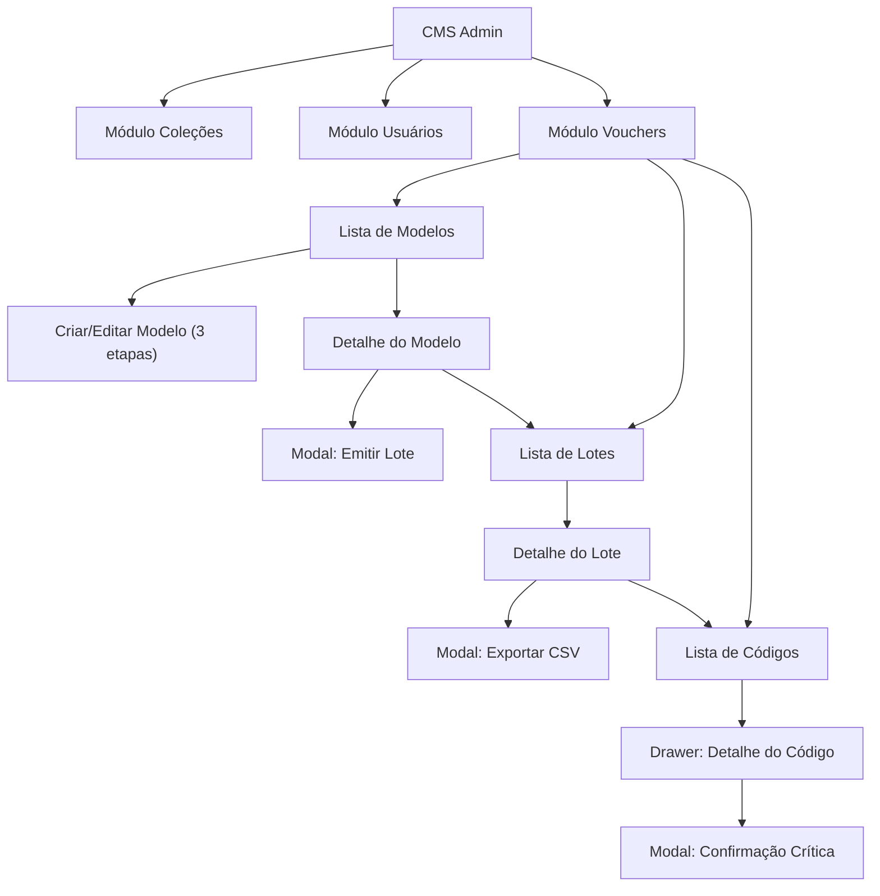

# Wireframe Textual — CMS Administrativo Mundo de Kaboo

Status: proposta de UX v1  
Data: 08/04/2026  
Documentos relacionados:
- [PRD de vouchers por conteúdo](./prd-vouchers-por-conteudo.md)
- [Benchmark do fluxo para gráfica](./benchmark-fluxo-vouchers-grafica.md)

Este documento descreve a estrutura de telas, componentes e interações do CMS administrativo unificado do app. Ele serve como referência textual para design e frontend, cobrindo navegação global, módulo de vouchers e evolução dos módulos existentes de coleções e usuários.

---

## 1. Navegação global do CMS

### Estrutura

O CMS deve ter uma navegação persistente à esquerda (desktop) ou menu hamburger (mobile), com os módulos administrativos do app.

```
┌─────────────────────────────────────────────────┐
│  LOGO  Mundo de Kaboo — Admin                   │
├──────────┬──────────────────────────────────────┤
│          │                                      │
│ Coleções │   [ Área de conteúdo do módulo ]     │
│ Usuários │                                      │
│ Vouchers │                                      │
│          │                                      │
│──────────│                                      │
│ Meu perfil                                      │
│ Sair     │                                      │
└──────────┴──────────────────────────────────────┘
```

### Regras de navegação

- Somente usuários com role `admin` veem a entrada do CMS.
- A navegação lateral é fixa em desktop e colapsa em mobile.
- O módulo ativo fica destacado visualmente.
- Cada módulo abre com sua listagem padrão.
- O botão "Sair" faz logout e volta para a tela de login do app.

---

## 2. Módulo Vouchers — Navegação interna

Dentro do módulo de Vouchers, há três sub-visões acessíveis por abas ou breadcrumb:

```
[ Modelos ]   [ Lotes ]   [ Códigos ]
```

A aba padrão ao entrar é **Modelos**.

---

## 3. Tela: Lista de Modelos

### Layout

```
┌──────────────────────────────────────────────────────────┐
│  Vouchers > Modelos                     [ + Novo modelo ]│
├──────────────────────────────────────────────────────────┤
│  Busca: [____________________]    Filtro status: [Todos▼]│
├──────────────────────────────────────────────────────────┤
│                                                          │
│  ┌─────────────────────────────────────────────────────┐ │
│  │ 📦 Kit Aventura Kaboo              Rascunho  ●      │ │
│  │ Kit · 4 itens · 6 meses · sem validade de código    │ │
│  │ Criado em 05/04/2026         [ Editar ] [ Emitir ]  │ │
│  └─────────────────────────────────────────────────────┘ │
│                                                          │
│  ┌─────────────────────────────────────────────────────┐ │
│  │ 📖 Livro Kaboo e o Jardim          Ativo  ●         │ │
│  │ Livro · 1 item · 3 meses · validade até 31/12/2026 │ │
│  │ Última emissão: 02/04/2026  [ Ver ] [ Emitir ]      │ │
│  └─────────────────────────────────────────────────────┘ │
│                                                          │
│  ┌─────────────────────────────────────────────────────┐ │
│  │ 📚 Coleção Educação Infantil      Arquivado  ●      │ │
│  │ Coleção · 8 itens · 12 meses                        │ │
│  │ Arquivado em 01/03/2026          [ Ver ]             │ │
│  └─────────────────────────────────────────────────────┘ │
│                                                          │
└──────────────────────────────────────────────────────────┘
```

### Elementos por card de modelo

| Elemento | Descrição |
| --- | --- |
| Ícone de tipo | 📖 Livro, 📚 Coleção, 📦 Kit, 🎁 Conjunto curado |
| Nome interno | Título operacional do modelo |
| Badge de status | Rascunho (amarelo), Ativo (verde), Arquivado (cinza) |
| Resumo | Tipo · contagem de itens · duração · validade |
| Última emissão | Data da emissão mais recente, se houver |
| Ações | Editar (rascunho), Emitir (ativo), Ver (todos), Duplicar, Arquivar |

### Estados da tela

- **Vazio**: ilustração + "Nenhum modelo criado. Crie o primeiro para começar a emitir vouchers."
- **Com resultados**: lista paginada.
- **Busca sem resultado**: mensagem + sugestão de limpar filtros.

---

## 4. Tela: Criar / Editar Modelo

### Layout — Etapa 1: Dados do modelo

```
┌──────────────────────────────────────────────────────────┐
│  Vouchers > Modelos > Novo modelo                        │
│                                                          │
│  Etapa 1 de 3: Dados do modelo                          │
│  ─────────────────────────────                           │
│                                                          │
│  Nome interno *         [_______________________________]│
│  Descrição              [_______________________________]│
│                                                          │
│  Tipo de pacote *       ( ) Livro                        │
│                         ( ) Coleção                      │
│                         (●) Kit                          │
│                         ( ) Conjunto curado              │
│                                                          │
│  Duração do acesso *    [ 6 meses ▼ ]                    │
│                                                          │
│  Validade do código     [ __ / __ / ____ ]  (opcional)   │
│  ℹ️ Data limite para o usuário resgatar o voucher.        │
│     Diferente da duração do acesso após resgate.         │
│                                                          │
│                          [ Cancelar ]  [ Próximo → ]     │
└──────────────────────────────────────────────────────────┘
```

### Layout — Etapa 2: Seleção de conteúdo

```
┌──────────────────────────────────────────────────────────┐
│  Vouchers > Modelos > Novo modelo                        │
│                                                          │
│  Etapa 2 de 3: Selecionar conteúdos                     │
│  ─────────────────────────────────                       │
│                                                          │
│  Busca: [____________________]   Nível: [Todos ▼]       │
│                                                          │
│  Catálogo disponível               Selecionados (3)     │
│  ┌──────────────────────┐         ┌──────────────────┐  │
│  │ ☐ Kaboo e o Jardim   │         │ ✓ Kaboo Marinho  │  │
│  │ ☐ Kaboo Musical      │         │ ✓ Kaboo Chef     │  │
│  │ ☐ Kaboo Cientista    │         │ ✓ Kaboo Artista  │  │
│  │ ☐ Kaboo Viajante     │         │                  │  │
│  └──────────────────────┘         └──────────────────┘  │
│                                                          │
│  ┌─────────────────────────────────────────────────────┐ │
│  │ RESUMO FIXO                                         │ │
│  │ Kit · 3 itens · 6 meses · sem validade de código    │ │
│  └─────────────────────────────────────────────────────┘ │
│                                                          │
│                       [ ← Voltar ]  [ Próximo → ]        │
└──────────────────────────────────────────────────────────┘
```

### Layout — Etapa 3: Revisão final

```
┌──────────────────────────────────────────────────────────┐
│  Vouchers > Modelos > Novo modelo                        │
│                                                          │
│  Etapa 3 de 3: Revisão final                            │
│  ────────────────────────                                │
│                                                          │
│  ┌─────────────────────────────────────────────────────┐ │
│  │                  PREVIEW DO MODELO                   │ │
│  │                                                     │ │
│  │  Nome:      Kit Aventura Kaboo                      │ │
│  │  Tipo:      📦 Kit                                  │ │
│  │  Itens:     3                                       │ │
│  │                                                     │ │
│  │  ┌────┐ ┌────┐ ┌────┐                              │ │
│  │  │capa│ │capa│ │capa│  Kaboo Marinho, Kaboo Chef,   │ │
│  │  └────┘ └────┘ └────┘  Kaboo Artista                │ │
│  │                                                     │ │
│  │  Duração:   6 meses após resgate                    │ │
│  │  Validade:  sem limite                              │ │
│  │                                                     │ │
│  │  ⚠️  Após emissão, estes campos ficam congelados     │ │
│  │     para os lotes gerados a partir deste modelo.    │ │
│  └─────────────────────────────────────────────────────┘ │
│                                                          │
│              [ ← Voltar ]  [ Salvar como rascunho ]      │
│                            [ Salvar e ativar modelo ]    │
└──────────────────────────────────────────────────────────┘
```

### Validações do formulário

| Campo | Regra |
| --- | --- |
| Nome interno | Obrigatório, mín. 3 caracteres |
| Tipo de pacote | Obrigatório |
| Duração do acesso | Obrigatório, uma das opções existentes |
| Validade do código | Opcional; se preenchida, deve ser data futura |
| Conteúdos | Mín. 1 item selecionado para ativar; rascunho aceita 0 |

---

## 5. Tela: Detalhe do Modelo

### Layout

```
┌──────────────────────────────────────────────────────────┐
│  Vouchers > Modelos > Kit Aventura Kaboo        Ativo ●  │
├──────────────────────────────────────────────────────────┤
│                                                          │
│  ┌─────────────────────────────────────────────────────┐ │
│  │ PREVIEW (idêntico à etapa 3 de criação)             │ │
│  └─────────────────────────────────────────────────────┘ │
│                                                          │
│  Ações:                                                  │
│  [ Emitir lote ]  [ Duplicar ]  [ Arquivar ]  [ Editar ] │
│                                                          │
│  Lotes emitidos a partir deste modelo                    │
│  ┌─────────────────────────────────────────────────────┐ │
│  │ Lote #L-0042 · 200 vouchers · Gerado 05/04/2026    │ │
│  │ Exportado em 05/04/2026 por admin@educacross.com    │ │
│  │ 12 resgatados · 188 disponíveis       [ Ver lote ]  │ │
│  └─────────────────────────────────────────────────────┘ │
│  ┌─────────────────────────────────────────────────────┐ │
│  │ Lote #L-0038 · 100 vouchers · Gerado 01/04/2026    │ │
│  │ Exportado em 01/04/2026 por admin@educacross.com    │ │
│  │ 100 resgatados · 0 disponíveis        [ Ver lote ]  │ │
│  └─────────────────────────────────────────────────────┘ │
│                                                          │
│  Histórico de auditoria                                  │
│  05/04 14:30 — admin@educacross.com gerou Lote #L-0042  │
│  05/04 14:32 — admin@educacross.com exportou Lote #L-42 │
│  01/04 09:00 — admin@educacross.com gerou Lote #L-0038  │
│  28/03 11:00 — admin@educacross.com ativou modelo       │
│  27/03 16:00 — admin@educacross.com criou modelo        │
│                                                          │
└──────────────────────────────────────────────────────────┘
```

### Regras de ação por status do modelo

| Status | Editar | Emitir | Duplicar | Arquivar |
| --- | --- | --- | --- | --- |
| Rascunho | ✅ livre | ❌ | ✅ | ✅ |
| Ativo | ⚠️ só campos não críticos | ✅ | ✅ | ✅ |
| Arquivado | ❌ | ❌ | ✅ | ❌ (já está) |

---

## 6. Modal: Emitir Lote

### Layout

```
┌──────────────────────────────────────────────────────────┐
│           Emitir lote de vouchers                        │
│                                                          │
│  Modelo:    Kit Aventura Kaboo                           │
│  Tipo:      📦 Kit · 3 itens                             │
│  Duração:   6 meses                                      │
│  Validade:  sem limite                                   │
│                                                          │
│  Quantidade de vouchers *  [ 200 ]                       │
│  Finalidade (nota interna) [_campanha abril/2026_______] │
│                                                          │
│  ┌─────────────────────────────────────────────────────┐ │
│  │ ⚠️  Ao confirmar, o sistema irá:                     │ │
│  │  · Gerar 200 códigos únicos                         │ │
│  │  · Congelar o snapshot deste modelo para o lote     │ │
│  │  · Registrar você como responsável pela emissão     │ │
│  │                                                     │ │
│  │  Esta ação não pode ser desfeita.                   │ │
│  └─────────────────────────────────────────────────────┘ │
│                                                          │
│                   [ Cancelar ]  [ Confirmar emissão ]    │
└──────────────────────────────────────────────────────────┘
```

---

## 7. Tela: Lista de Lotes

### Layout

```
┌──────────────────────────────────────────────────────────┐
│  Vouchers > Lotes                                        │
├──────────────────────────────────────────────────────────┤
│  Busca: [________________]  Status: [Todos▼]  Período: []│
├──────────────────────────────────────────────────────────┤
│                                                          │
│  ┌─────────────────────────────────────────────────────┐ │
│  │ Lote #L-0042         Gerado ● (não exportado)       │ │
│  │ Kit Aventura Kaboo · 200 vouchers · 6 meses         │ │
│  │ Gerado em 05/04/2026 por admin@educacross.com       │ │
│  │                      [ Exportar CSV ] [ Ver lote ]   │ │
│  └─────────────────────────────────────────────────────┘ │
│                                                          │
│  ┌─────────────────────────────────────────────────────┐ │
│  │ Lote #L-0038         Exportado ●                    │ │
│  │ Kit Aventura Kaboo · 100 vouchers · 6 meses         │ │
│  │ Exportado em 01/04/2026 por admin@educacross.com    │ │
│  │ 100/100 resgatados                   [ Ver lote ]   │ │
│  └─────────────────────────────────────────────────────┘ │
│                                                          │
└──────────────────────────────────────────────────────────┘
```

### Status operacional do lote

| Status | Badge | Ações disponíveis |
| --- | --- | --- |
| Gerado | 🔵 azul | Exportar CSV, Ver, Cancelar |
| Exportado | 🟢 verde | Re-exportar, Ver, Registrar envio |
| Enviado | 🟣 roxo | Ver, Registrar confirmação |
| Confirmado | ✅ cinza-verde | Ver |
| Cancelado | 🔴 vermelho | Ver |

---

## 8. Tela: Detalhe do Lote

### Layout

```
┌──────────────────────────────────────────────────────────┐
│  Vouchers > Lotes > Lote #L-0042          Gerado ●       │
├──────────────────────────────────────────────────────────┤
│                                                          │
│  Modelo de origem:  Kit Aventura Kaboo (snapshot v1)     │
│  Tipo:              📦 Kit · 3 itens                      │
│  Duração:           6 meses                              │
│  Validade código:   sem limite                           │
│  Finalidade:        campanha abril/2026                  │
│  Gerado em:         05/04/2026 14:30                     │
│  Gerado por:        admin@educacross.com                 │
│                                                          │
│  Resumo de consumo                                       │
│  ┌──────────┬──────────┬──────────┬──────────┐           │
│  │  Total   │Disponível│Resgatados│Desativados│          │
│  │   200    │   188    │    12    │     0    │           │
│  └──────────┴──────────┴──────────┴──────────┘           │
│                                                          │
│  Ações:                                                  │
│  [ Exportar CSV ] [ Registrar envio ] [ Cancelar lote ]  │
│                                                          │
│  Amostra de códigos (primeiros 10)                       │
│  ┌─────────────────────────────────────────────────────┐ │
│  │ #  │ Código         │ Status    │ Resgatado por     │ │
│  │ 1  │ KABOO-AX3K-01  │ active    │ —                 │ │
│  │ 2  │ KABOO-AX3K-02  │ redeemed  │ prof@escola.com   │ │
│  │ 3  │ KABOO-AX3K-03  │ active    │ —                 │ │
│  │ …  │                │           │                   │ │
│  └─────────────────────────────────────────────────────┘ │
│  [ Ver todos os códigos deste lote → ]                   │
│                                                          │
│  Histórico de auditoria                                  │
│  05/04 14:30 — Lote gerado por admin@educacross.com     │
│  05/04 14:32 — Exportação CSV v01                       │
│                                                          │
└──────────────────────────────────────────────────────────┘
```

---

## 9. Tela: Lista de Códigos (Vouchers Individuais)

### Layout

```
┌──────────────────────────────────────────────────────────┐
│  Vouchers > Códigos                                      │
├──────────────────────────────────────────────────────────┤
│  Busca código: [________________]                        │
│  Status: [Todos▼]  Lote: [Todos▼]  Exportado: [Todos▼]  │
│  Resgatado: [Todos▼]   Período: [__/__/____] a [__/__]   │
├──────────────────────────────────────────────────────────┤
│                                                          │
│  Mostrando 1-50 de 300                                   │
│  ┌───────────────┬──────────┬────────────┬─────────────┐ │
│  │ Código        │ Status   │ Lote       │ Modelo      │ │
│  │ KABOO-AX3K-01 │ active   │ #L-0042    │ Kit Advent. │ │
│  │ KABOO-AX3K-02 │ redeemed │ #L-0042    │ Kit Advent. │ │
│  │ KABOO-BZ7M-01 │ disabled │ #L-0038    │ Kit Advent. │ │
│  │ …             │          │            │             │ │
│  └───────────────┴──────────┴────────────┴─────────────┘ │
│                                                          │
│  [ ← Anterior ]  Página 1 de 6  [ Próxima → ]           │
│                                                          │
└──────────────────────────────────────────────────────────┘
```

Clicar em qualquer linha abre o **Detalhe do Código**.

---

## 10. Drawer: Detalhe do Código

### Layout (drawer lateral à direita)

```
┌──────────────────────────────────┐
│  Código: KABOO-AX3K-02           │
│  Status: redeemed ●              │
│                                  │
│  Modelo:  Kit Aventura Kaboo     │
│  Lote:    #L-0042                │
│  Tipo:    📦 Kit · 3 itens        │
│  Duração: 6 meses                │
│  Validade do código: sem limite  │
│                                  │
│  Snapshot do pacote              │
│  ┌────┐ ┌────┐ ┌────┐           │
│  │capa│ │capa│ │capa│           │
│  └────┘ └────┘ └────┘           │
│  Kaboo Marinho, Kaboo Chef,     │
│  Kaboo Artista                   │
│                                  │
│  Resgatado por                   │
│  prof@escola.com                 │
│  em 06/04/2026 10:15             │
│                                  │
│  Histórico                       │
│  05/04 14:30 — Gerado (L-0042)  │
│  05/04 14:32 — Exportado CSV v01│
│  06/04 10:15 — Resgatado        │
│                                  │
│  Ações:                          │
│  [ Desativar ] (só se active)    │
│                                  │
│                       [ Fechar ] │
└──────────────────────────────────┘
```

---

## 11. Modal: Exportar CSV

### Layout

```
┌──────────────────────────────────────────────────────────┐
│           Exportar vouchers para gráfica                 │
│                                                          │
│  Lote:        #L-0042                                    │
│  Modelo:      Kit Aventura Kaboo                         │
│  Vouchers:    200                                        │
│  Exportação:  versão 01                                  │
│                                                          │
│  Arquivo:     KABOO_VOUCHERS_L0042_kit-aventura_         │
│               20260405_v01.csv                           │
│                                                          │
│  Colunas incluídas:                                      │
│  ✓ batch_id, batch_name, export_version, row_number,     │
│    voucher_code, model_name, artwork_id, package_type,   │
│    content_summary, content_count, duration_months,      │
│    redeem_by_date, generated_at, generated_by            │
│                                                          │
│  ⚠️  A exportação será registrada na trilha de auditoria. │
│                                                          │
│                   [ Cancelar ]  [ Baixar CSV ]           │
└──────────────────────────────────────────────────────────┘
```

---

## 12. Modal: Confirmação Crítica (padrão reutilizável)

Usado para desativar voucher, arquivar modelo e cancelar lote.

```
┌──────────────────────────────────────────────────────────┐
│           ⚠️  Confirmar ação                              │
│                                                          │
│  Você está prestes a:                                    │
│  [ Desativar o voucher KABOO-AX3K-01 ]                   │
│                                                          │
│  Esta ação:                                              │
│  · Impede que o código seja resgatado                    │
│  · Será registrada na trilha de auditoria                │
│  · Não pode ser revertida                                │
│                                                          │
│  Motivo (obrigatório): [_____________________________]   │
│                                                          │
│                   [ Cancelar ]  [ Confirmar ]             │
└──────────────────────────────────────────────────────────┘
```

---

## 13. Módulos existentes — Evolução para o CMS

A tela atual `AdminCollectionsScreen` já possui abas de Coleções e Usuários. Para o CMS unificado:

| Módulo atual | Mudança no v1 |
| --- | --- |
| Coleções | Migra para sidebar como módulo independente. Mantém funcionalidade atual. |
| Usuários | Migra para sidebar como módulo independente. Mantém funcionalidade atual. |
| Vouchers | Módulo novo com as telas descritas acima. |

A migração da navegação por abas para sidebar deve ser feita de forma incremental: a sidebar aparece e os módulos antigos continuam funcionando como estão, apenas reposicionados na nova estrutura.

---

## 14. Responsividade

| Componente | Desktop | Mobile |
| --- | --- | --- |
| Sidebar | Fixa à esquerda, 220px | Hamburger com overlay |
| Abas de sub-visão | Horizontal | Horizontal com scroll |
| Listas | Tabela com colunas | Cards empilhados |
| Drawer de detalhe | Lateral direita, 400px | Full-screen |
| Modais | Centralizados, max-width 560px | Full-screen |
| Seleção de conteúdo | Duas colunas lado a lado | Empilhadas |
| Preview do modelo | Embutido na etapa | Accordion ou full-width |

---

## 15. Mapa de telas e transições



---

## 16. Inventário de componentes reutilizáveis

Componentes que já existem no projeto e podem ser reaproveitados:

| Componente existente | Uso no CMS |
| --- | --- |
| `Tabs` | Sub-visões do módulo Vouchers |
| `Button` | CTAs de emitir, exportar, salvar |
| `ConfirmationModal` | Confirmações críticas (desativar, arquivar, cancelar) |
| `Toast` | Feedback de sucesso/erro |
| `PageHeader` | Cabeçalho de cada módulo |
| `TagInput` | Tags de itens selecionados no modelo (se aplicável) |
| `FileUpload` | Eventual upload de artwork (v2) |

Componentes novos necessários:

| Componente | Função |
| --- | --- |
| `AdminSidebar` | Navegação lateral do CMS |
| `VoucherModelCard` | Card de modelo na listagem |
| `VoucherBatchCard` | Card de lote na listagem |
| `VoucherCodeRow` | Linha da tabela de códigos |
| `VoucherDetailDrawer` | Drawer lateral de detalhe do código |
| `ModelPreview` | Preview operacional do modelo (reutilizado em criação, detalhe e emissão) |
| `ContentPicker` | Seletor dual-pane de conteúdos do catálogo |
| `StepWizard` | Wrapper de formulário em etapas (modelo) |
| `StatusBadge` | Badge padronizado para status de modelo, lote e voucher |
| `AuditTimeline` | Timeline de eventos de auditoria |
| `ExportModal` | Modal de exportação CSV |
| `SummaryBar` | Resumo fixo com contadores (usado na criação e no detalhe) |
